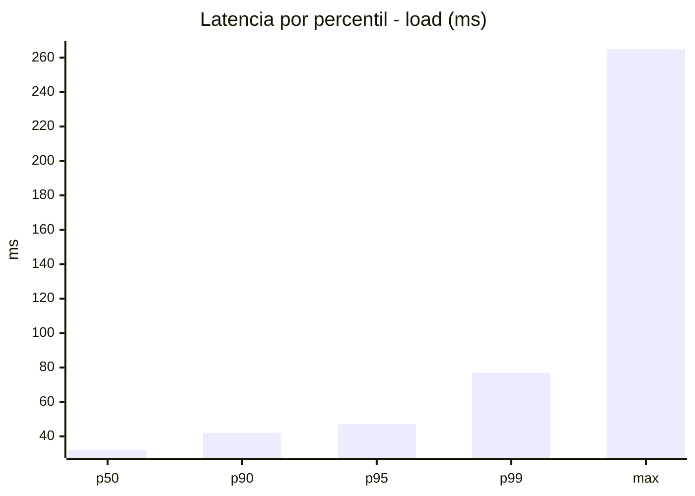
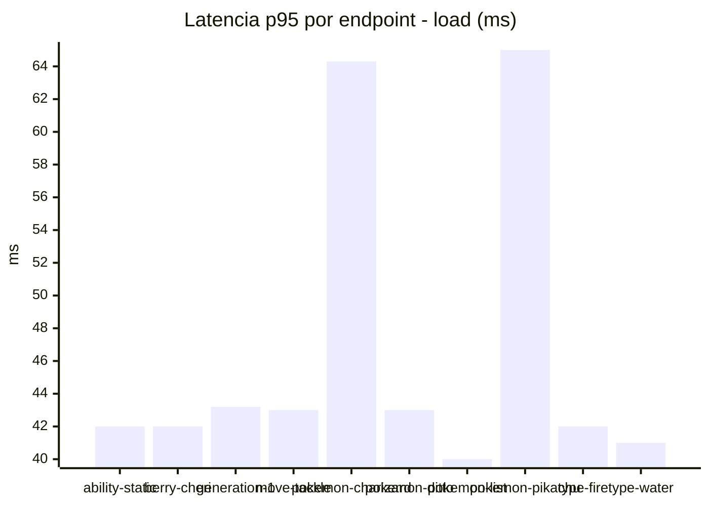
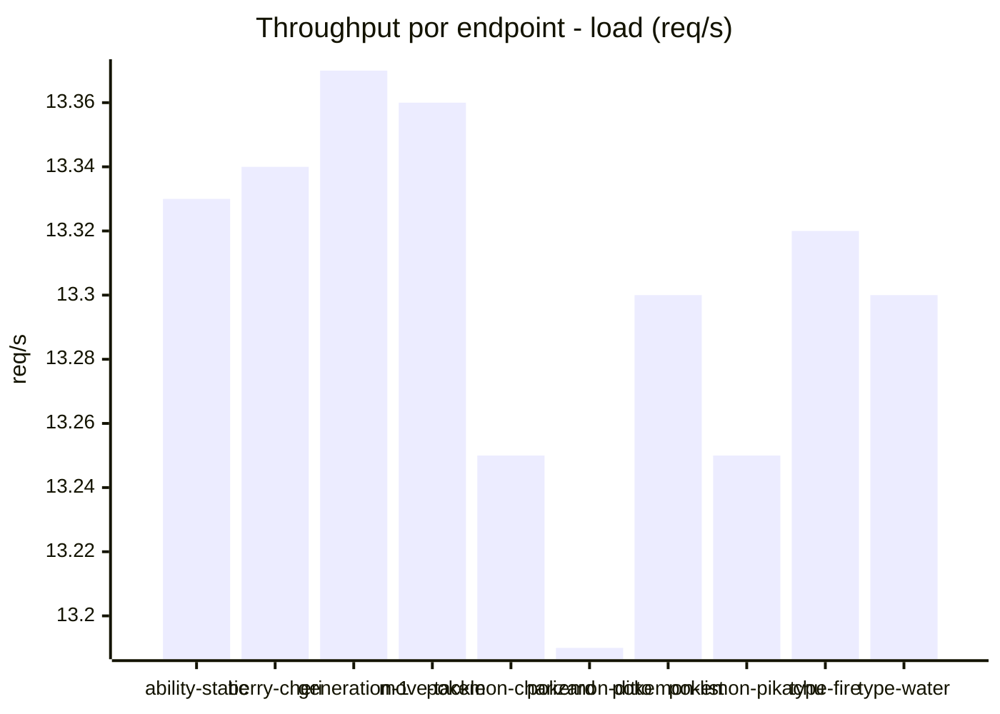
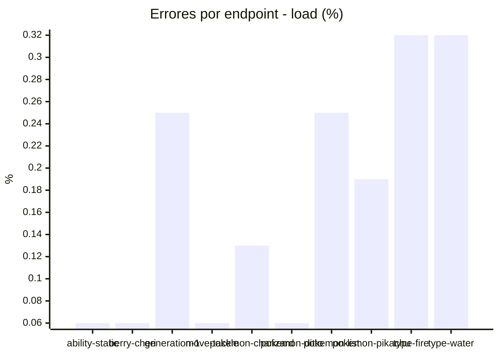
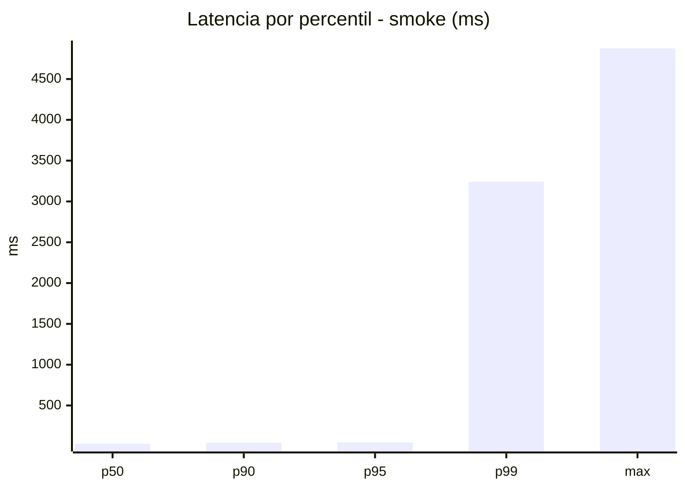
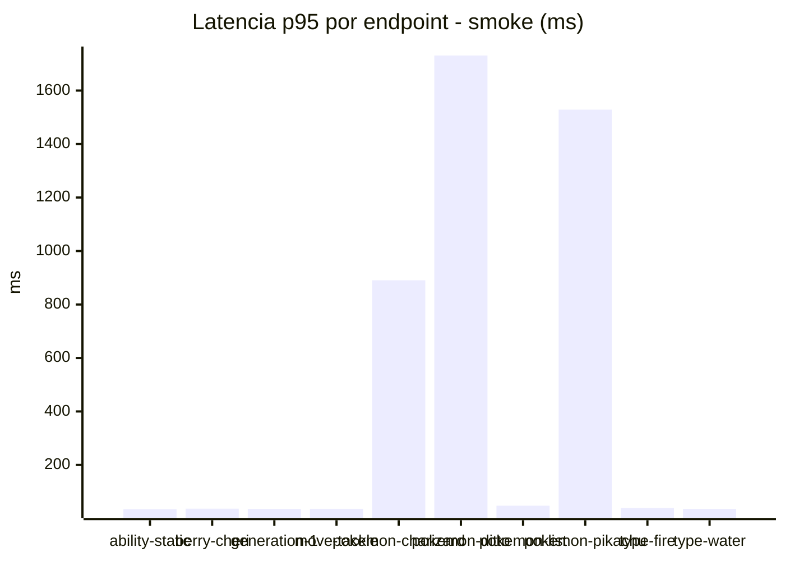
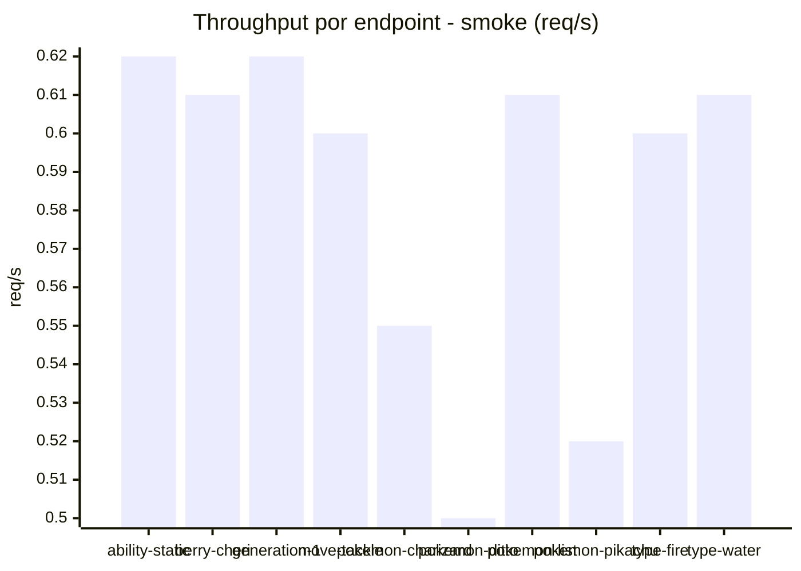
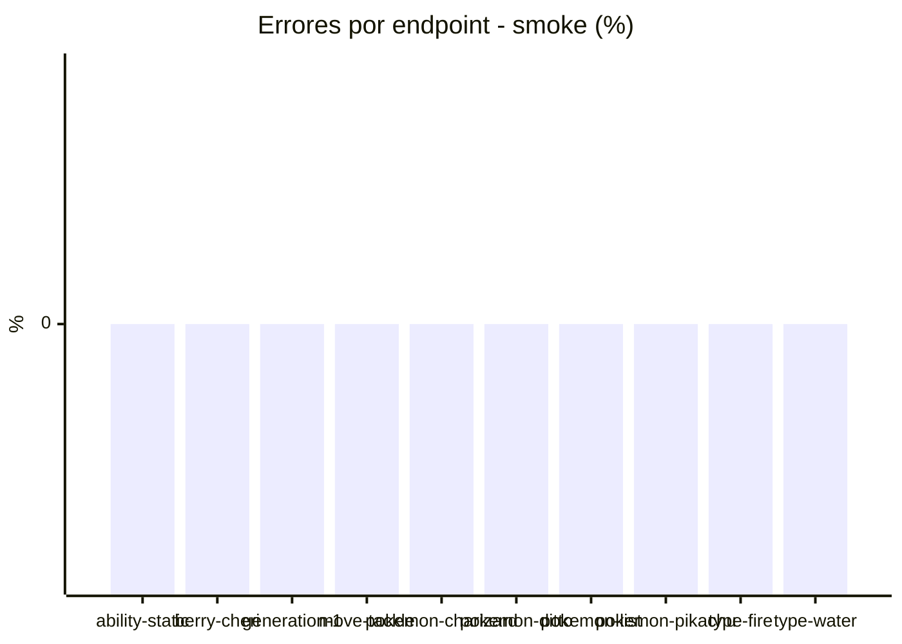

# Reporte de performance - PokeAPI

**Fecha:** 2026-09-11 16:55 UTC  
**Veredicto del agente:** `WARN`  
**Corrida:** [ver en GitHub Actions](https://github.com/lrbg/jmeter-pokeapi-lab/actions/runs/34624490473)  

## Validacion del agente de IA

WARN (fallback por umbrales)

- Error maximo: 0.17%
- p95 maximo: 47.0 ms

## Resultados

### Escenario: `load`

| Metrica | Valor |
| --- | --- |
| Muestras | 15778 |
| Errores | 27 (0.17%) |
| Latencia media | 33.0 ms |
| p50 / p90 / p95 / p99 | 32.0 / 42.0 / 47.0 / 77.0 ms |
| Min / Max | 0 / 265 ms |
| Throughput | 131.87 req/s |
| Duracion | 119.6 s |

Detalle por endpoint

| Endpoint | Muestras | Error % | avg | p95 | p99 | req/s |
| --- | --- | --- | --- | --- | --- | --- |
| ability-static | 1578 | 0.06% | 31.9 | 42.0 | 53.9 | 13.33 |
| berry-cheri | 1578 | 0.06% | 31.3 | 42.0 | 59.5 | 13.34 |
| generation-1 | 1577 | 0.25% | 32.3 | 43.2 | 57.5 | 13.37 |
| move-tackle | 1577 | 0.06% | 32.7 | 43.0 | 55.2 | 13.36 |
| pokemon-charizard | 1578 | 0.13% | 40.7 | 64.3 | 114.5 | 13.25 |
| pokemon-ditto | 1578 | 0.06% | 31.5 | 43.0 | 66.2 | 13.19 |
| pokemon-list | 1578 | 0.25% | 29.4 | 40.0 | 54.5 | 13.3 |
| pokemon-pikachu | 1578 | 0.19% | 37.9 | 65.0 | 105.5 | 13.25 |
| type-fire | 1578 | 0.32% | 31.7 | 42.0 | 62.5 | 13.32 |
| type-water | 1578 | 0.32% | 30.6 | 41.0 | 50.2 | 13.3 |

### Escenario: `smoke`

| Metrica | Valor |
| --- | --- |
| Muestras | 131 |
| Errores | 0 (0.0%) |
| Latencia media | 112.5 ms |
| p50 / p90 / p95 / p99 | 31.0 / 44.0 / 47.0 / 3241.6 ms |
| Min / Max | 22 / 4876 ms |
| Throughput | 4.71 req/s |
| Duracion | 27.8 s |

Detalle por endpoint

| Endpoint | Muestras | Error % | avg | p95 | p99 | req/s |
| --- | --- | --- | --- | --- | --- | --- |
| ability-static | 13 | 0.0% | 30 | 34.8 | 35.8 | 0.62 |
| berry-cheri | 13 | 0.0% | 28.2 | 36.4 | 36.9 | 0.61 |
| generation-1 | 13 | 0.0% | 28.8 | 35.8 | 36.8 | 0.62 |
| move-tackle | 13 | 0.0% | 30.9 | 36.0 | 36.0 | 0.6 |
| pokemon-charizard | 13 | 0.0% | 201 | 890.6 | 1859.7 | 0.55 |
| pokemon-ditto | 14 | 0.0% | 375.6 | 1731.3 | 4247.1 | 0.5 |
| pokemon-list | 13 | 0.0% | 31.7 | 47.4 | 50.3 | 0.61 |
| pokemon-pikachu | 13 | 0.0% | 320.8 | 1528.6 | 3289.7 | 0.52 |
| type-fire | 13 | 0.0% | 29.9 | 39.0 | 41.4 | 0.6 |
| type-water | 13 | 0.0% | 28.1 | 35.8 | 39.2 | 0.61 |

