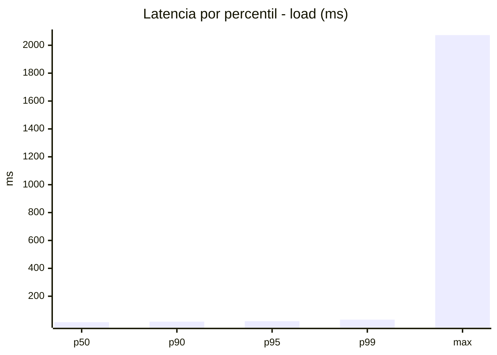
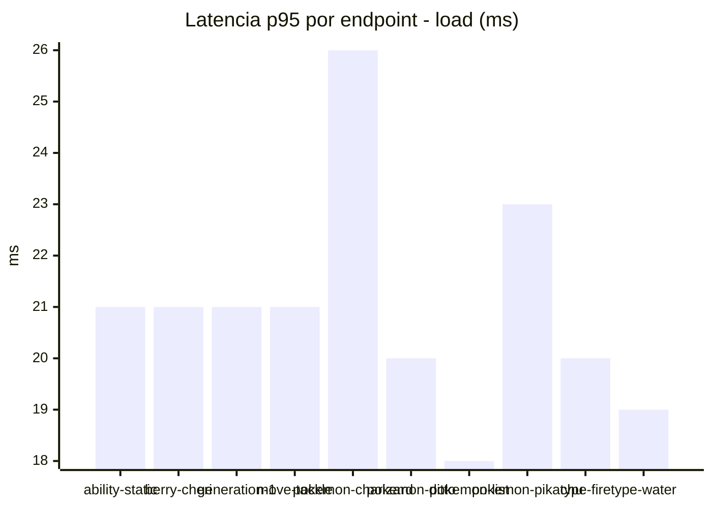
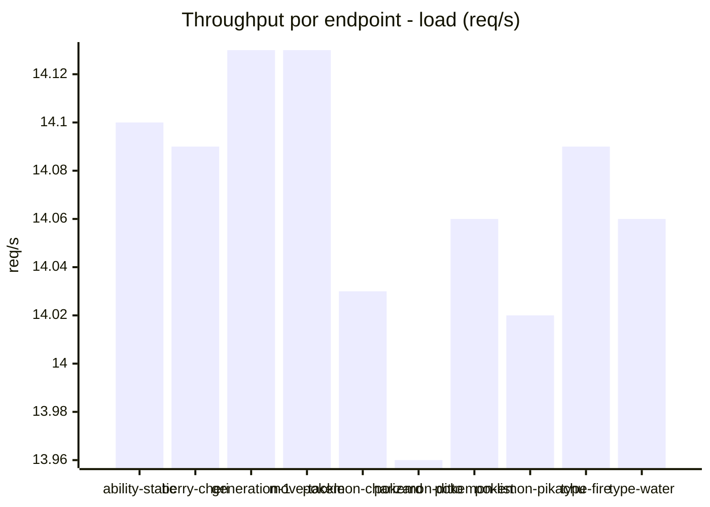
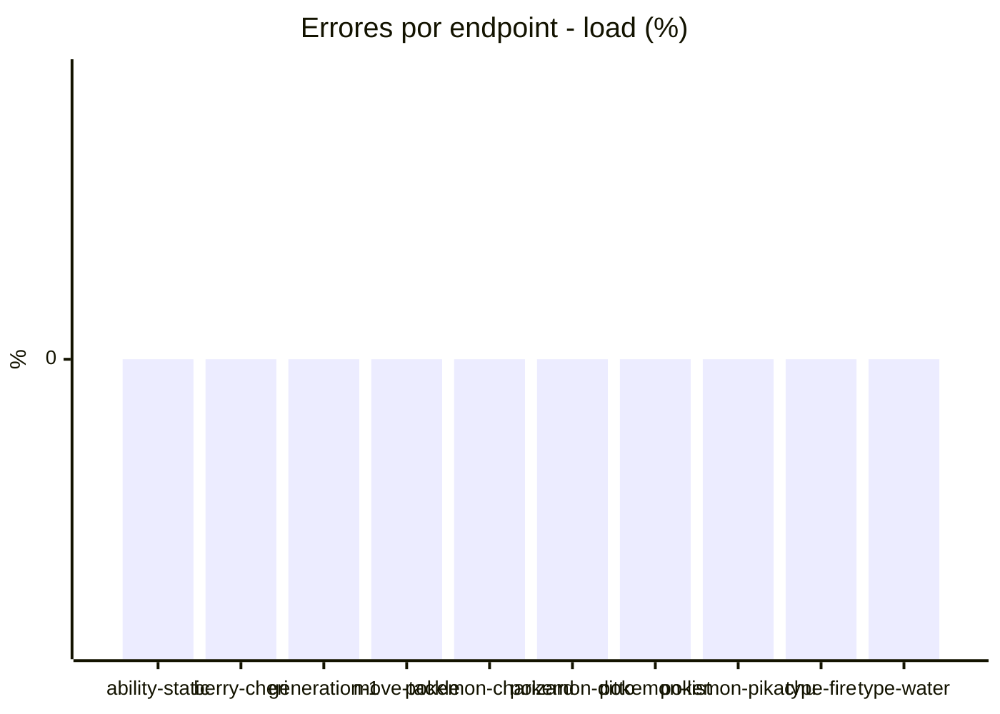
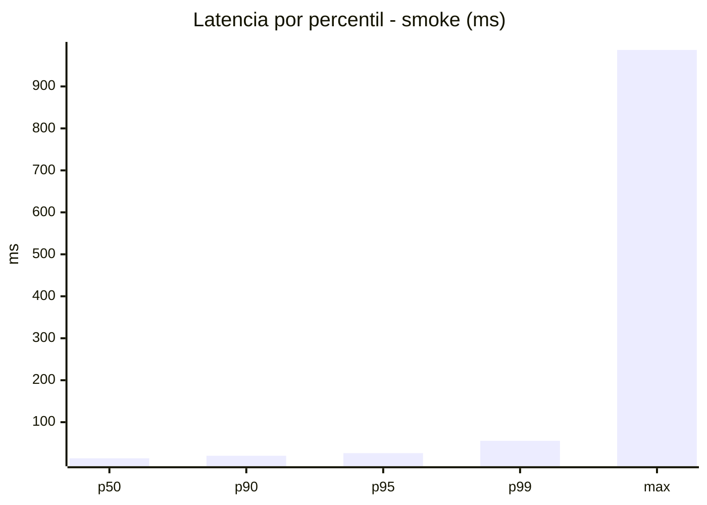
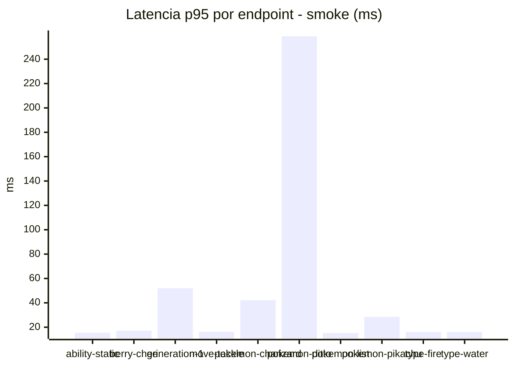
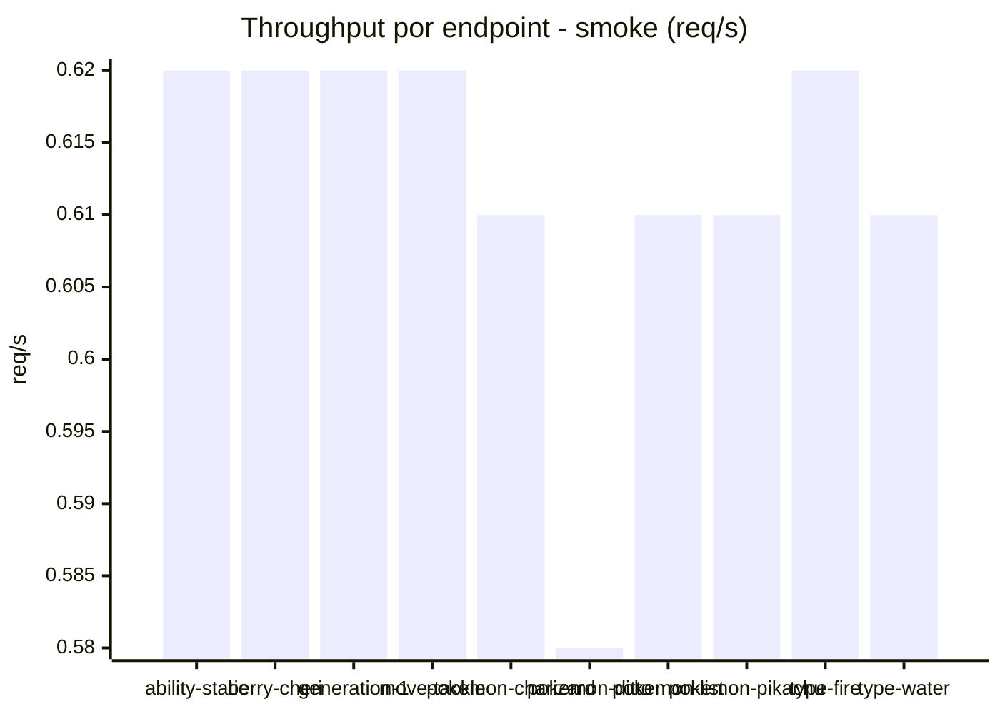

# Reporte de performance - PokeAPI

**Fecha:** 2026-09-12 16:01 UTC  
**Veredicto del agente:** `PASS`  
**Corrida:** [ver en GitHub Actions](https://github.com/lrbg/jmeter-pokeapi-lab/actions/runs/34703815048)  

## Validacion del agente de IA

PASS (fallback por umbrales)

- Error maximo: 0.0%
- p95 maximo: 26.2 ms

## Resultados

### Escenario: `load`

| Metrica | Valor |
| --- | --- |
| Muestras | 16687 |
| Errores | 0 (0.0%) |
| Latencia media | 14.9 ms |
| p50 / p90 / p95 / p99 | 14.0 / 18.0 / 21.0 / 32.0 ms |
| Min / Max | 10 / 2073 ms |
| Throughput | 139.5 req/s |
| Duracion | 119.6 s |

Detalle por endpoint

| Endpoint | Muestras | Error % | avg | p95 | p99 | req/s |
| --- | --- | --- | --- | --- | --- | --- |
| ability-static | 1668 | 0.0% | 14.1 | 21.0 | 30.0 | 14.1 |
| berry-cheri | 1668 | 0.0% | 15.3 | 21.0 | 32.3 | 14.09 |
| generation-1 | 1668 | 0.0% | 14.4 | 21.0 | 30.3 | 14.13 |
| move-tackle | 1668 | 0.0% | 14.6 | 21.0 | 33.0 | 14.13 |
| pokemon-charizard | 1670 | 0.0% | 16.9 | 26.0 | 37.3 | 14.03 |
| pokemon-ditto | 1669 | 0.0% | 14.2 | 20.0 | 29.0 | 13.96 |
| pokemon-list | 1669 | 0.0% | 14.3 | 18.0 | 30.3 | 14.06 |
| pokemon-pikachu | 1669 | 0.0% | 16.2 | 23.0 | 42.0 | 14.02 |
| type-fire | 1669 | 0.0% | 14.0 | 20.0 | 32.3 | 14.09 |
| type-water | 1669 | 0.0% | 15.1 | 19.0 | 27.0 | 14.06 |

### Escenario: `smoke`

| Metrica | Valor |
| --- | --- |
| Muestras | 160 |
| Errores | 0 (0.0%) |
| Latencia media | 22.2 ms |
| p50 / p90 / p95 / p99 | 14.0 / 20.0 / 26.2 / 55.7 ms |
| Min / Max | 11 / 987 ms |
| Throughput | 5.49 req/s |
| Duracion | 29.1 s |

Detalle por endpoint

| Endpoint | Muestras | Error % | avg | p95 | p99 | req/s |
| --- | --- | --- | --- | --- | --- | --- |
| ability-static | 16 | 0.0% | 13.8 | 15.5 | 16.7 | 0.62 |
| berry-cheri | 16 | 0.0% | 13.6 | 17.2 | 17.9 | 0.62 |
| generation-1 | 16 | 0.0% | 18.6 | 52.0 | 52.0 | 0.62 |
| move-tackle | 16 | 0.0% | 14.1 | 16.2 | 16.9 | 0.62 |
| pokemon-charizard | 16 | 0.0% | 25.2 | 42.2 | 57.2 | 0.61 |
| pokemon-ditto | 16 | 0.0% | 74.7 | 258.8 | 841.3 | 0.58 |
| pokemon-list | 16 | 0.0% | 13.6 | 15.2 | 15.8 | 0.61 |
| pokemon-pikachu | 16 | 0.0% | 20.4 | 28.5 | 36.9 | 0.61 |
| type-fire | 16 | 0.0% | 14.1 | 16.0 | 16.0 | 0.62 |
| type-water | 16 | 0.0% | 13.8 | 16.0 | 16.0 | 0.61 |

