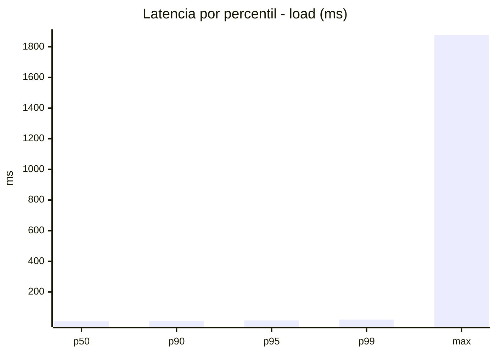
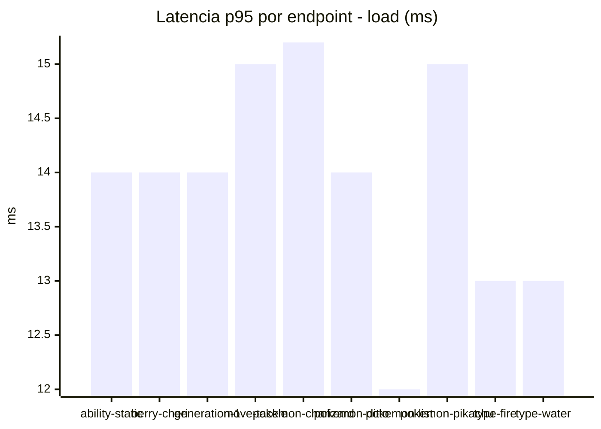
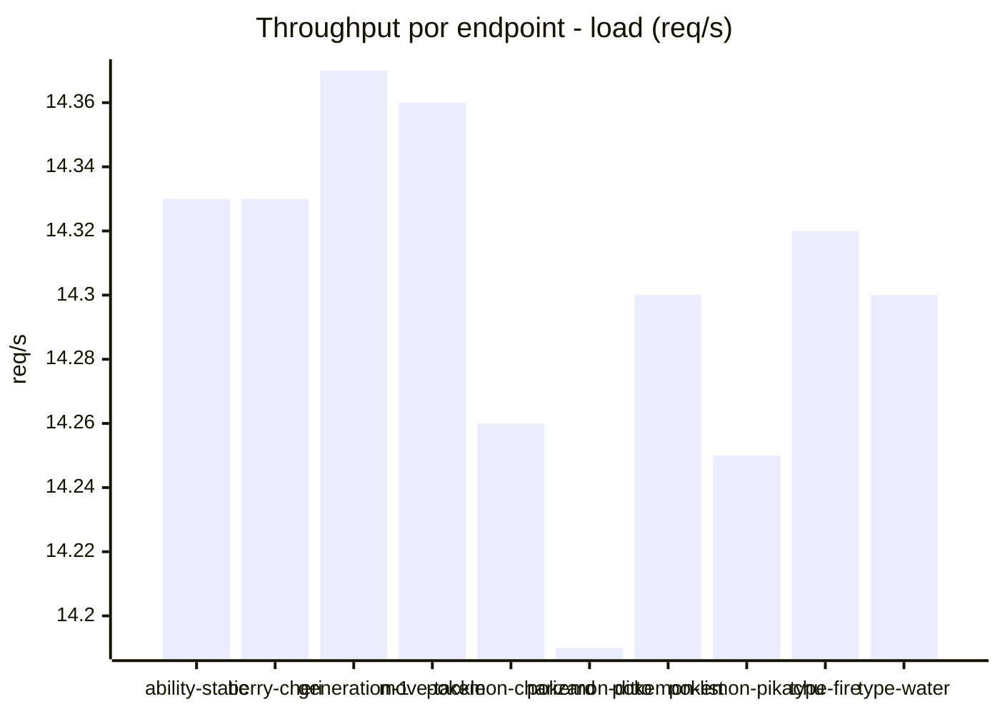
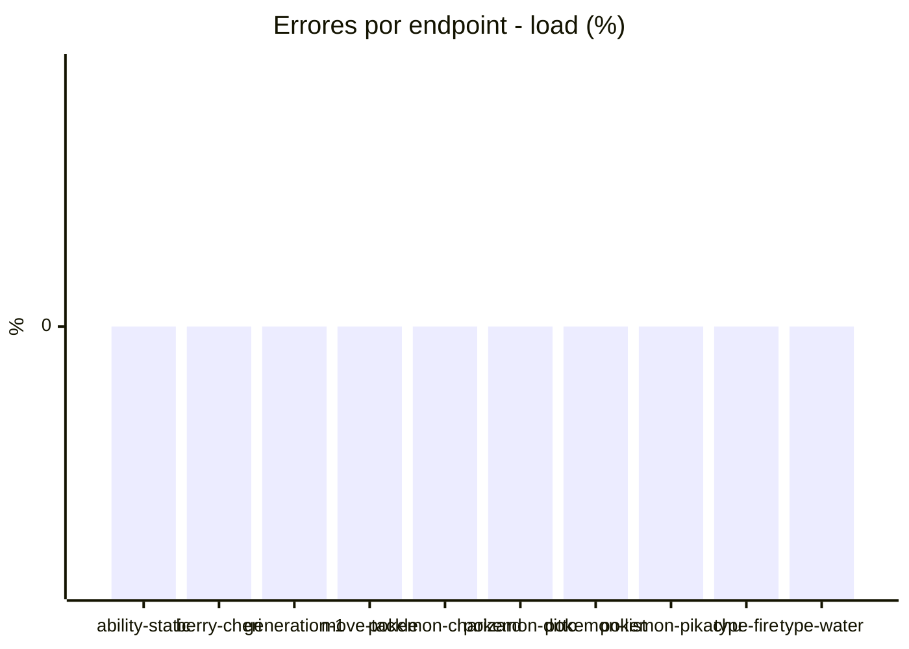
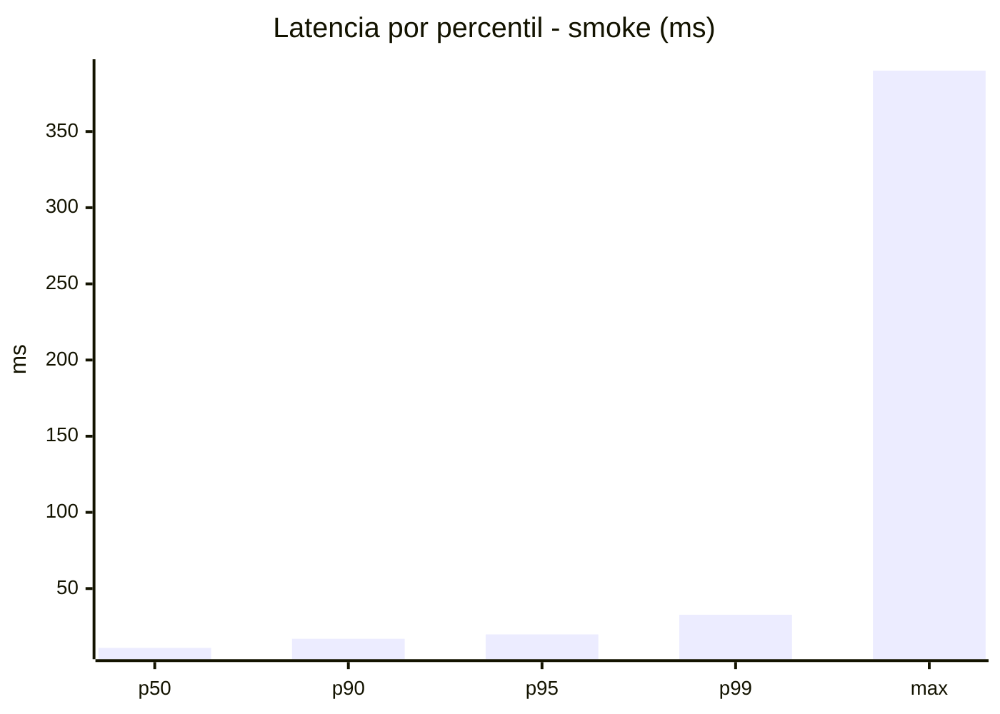
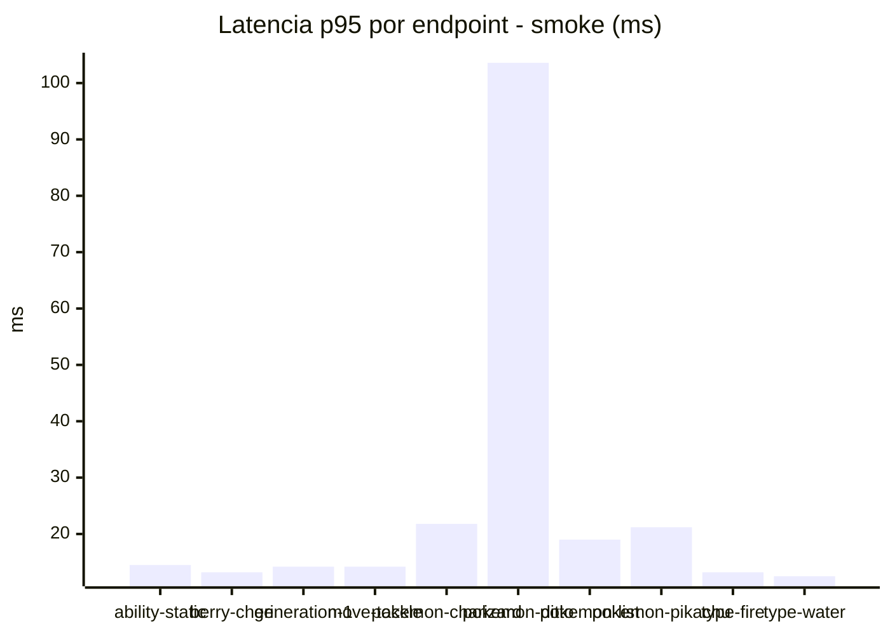
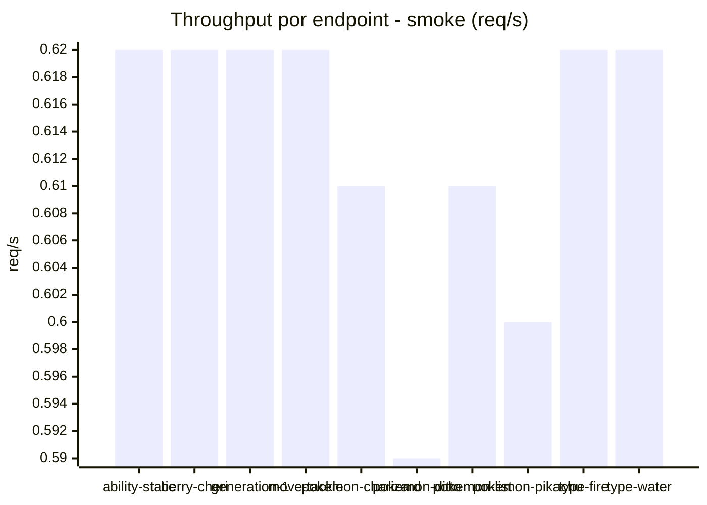

# Reporte de performance - PokeAPI

**Fecha:** 2026-09-13 16:50 UTC  
**Veredicto del agente:** `PASS`  
**Corrida:** [ver en GitHub Actions](https://github.com/lrbg/jmeter-pokeapi-lab/actions/runs/34769661699)  

## Validacion del agente de IA

PASS (fallback por umbrales)

- Error maximo: 0.0%
- p95 maximo: 19.9 ms

## Resultados

### Escenario: `load`

| Metrica | Valor |
| --- | --- |
| Muestras | 16961 |
| Errores | 0 (0.0%) |
| Latencia media | 9.6 ms |
| p50 / p90 / p95 / p99 | 9.0 / 12.0 / 14.0 / 20.0 ms |
| Min / Max | 6 / 1877 ms |
| Throughput | 141.86 req/s |
| Duracion | 119.6 s |

Detalle por endpoint

| Endpoint | Muestras | Error % | avg | p95 | p99 | req/s |
| --- | --- | --- | --- | --- | --- | --- |
| ability-static | 1696 | 0.0% | 10.3 | 14.0 | 18.0 | 14.33 |
| berry-cheri | 1696 | 0.0% | 9.1 | 14.0 | 18.0 | 14.33 |
| generation-1 | 1696 | 0.0% | 9.4 | 14.0 | 20.0 | 14.37 |
| move-tackle | 1696 | 0.0% | 9.6 | 15.0 | 19.0 | 14.36 |
| pokemon-charizard | 1696 | 0.0% | 10.8 | 15.2 | 23.0 | 14.26 |
| pokemon-ditto | 1697 | 0.0% | 9.4 | 14.0 | 17.0 | 14.19 |
| pokemon-list | 1696 | 0.0% | 8.6 | 12.0 | 17.0 | 14.3 |
| pokemon-pikachu | 1696 | 0.0% | 10.3 | 15.0 | 24.0 | 14.25 |
| type-fire | 1696 | 0.0% | 9.3 | 13.0 | 18.0 | 14.32 |
| type-water | 1696 | 0.0% | 9.2 | 13.0 | 19.0 | 14.3 |

### Escenario: `smoke`

| Metrica | Valor |
| --- | --- |
| Muestras | 162 |
| Errores | 0 (0.0%) |
| Latencia media | 14.3 ms |
| p50 / p90 / p95 / p99 | 11.0 / 17.0 / 19.9 / 32.8 ms |
| Min / Max | 8 / 390 ms |
| Throughput | 5.56 req/s |
| Duracion | 29.1 s |

Detalle por endpoint

| Endpoint | Muestras | Error % | avg | p95 | p99 | req/s |
| --- | --- | --- | --- | --- | --- | --- |
| ability-static | 16 | 0.0% | 10.5 | 14.5 | 18.1 | 0.62 |
| berry-cheri | 16 | 0.0% | 10.5 | 13.2 | 13.8 | 0.62 |
| generation-1 | 16 | 0.0% | 10.6 | 14.2 | 14.8 | 0.62 |
| move-tackle | 16 | 0.0% | 10.9 | 14.2 | 14.8 | 0.62 |
| pokemon-charizard | 16 | 0.0% | 17.6 | 21.8 | 23.5 | 0.61 |
| pokemon-ditto | 17 | 0.0% | 33.8 | 103.6 | 332.7 | 0.59 |
| pokemon-list | 16 | 0.0% | 11.2 | 19.0 | 31.0 | 0.61 |
| pokemon-pikachu | 17 | 0.0% | 15.8 | 21.2 | 28.2 | 0.6 |
| type-fire | 16 | 0.0% | 10.4 | 13.2 | 13.8 | 0.62 |
| type-water | 16 | 0.0% | 10.7 | 12.5 | 13.7 | 0.62 |

