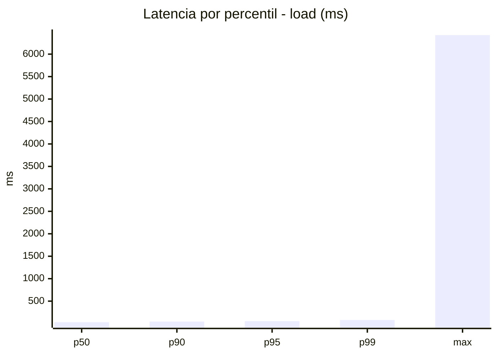
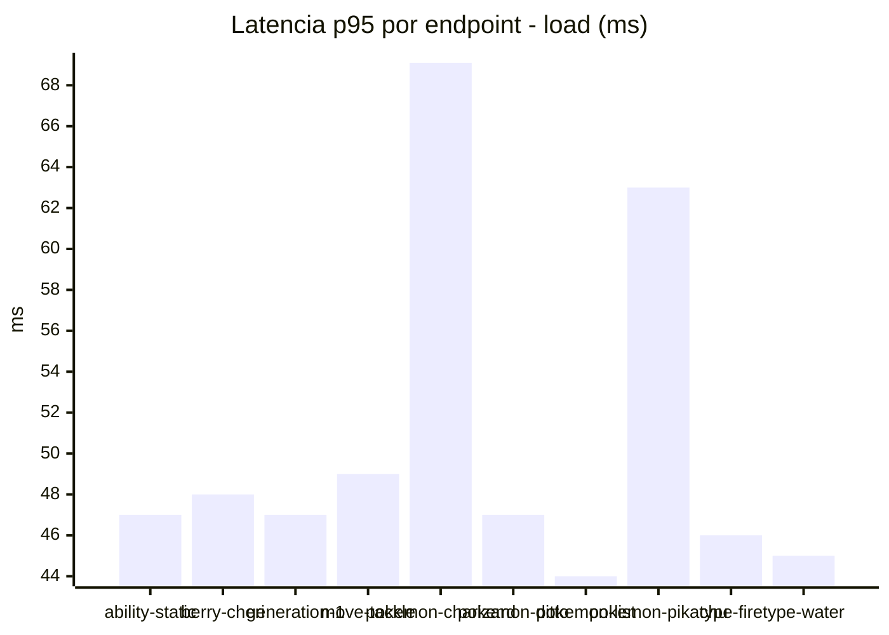
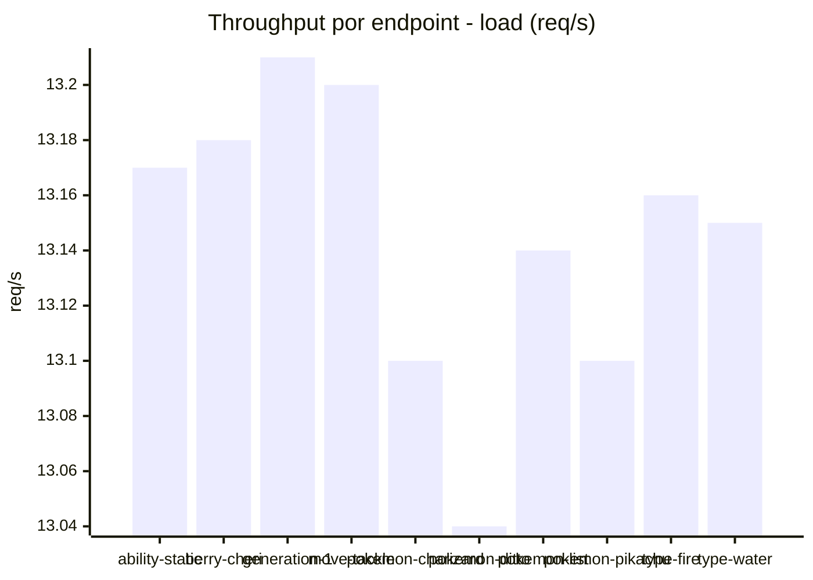
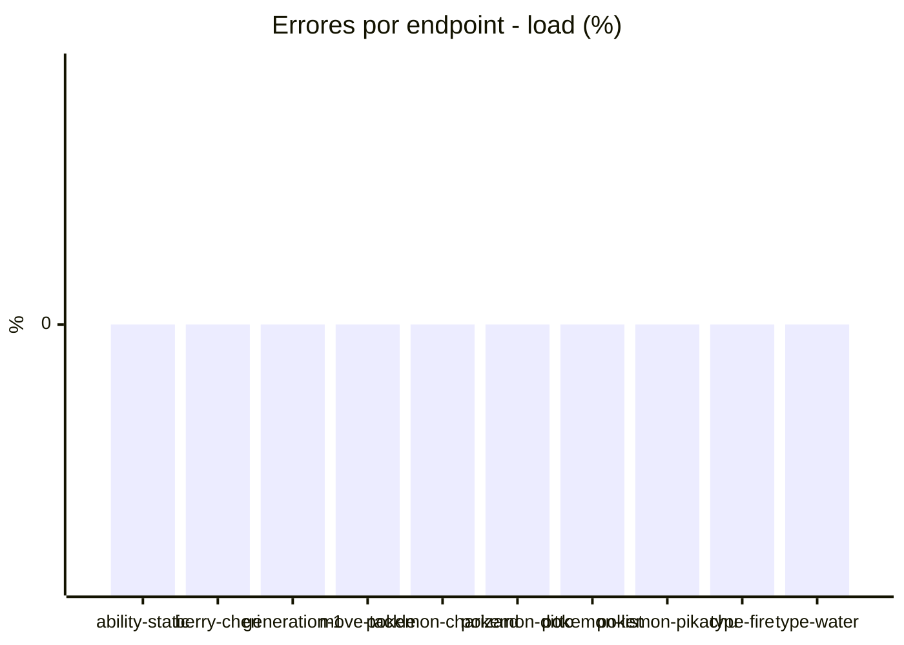
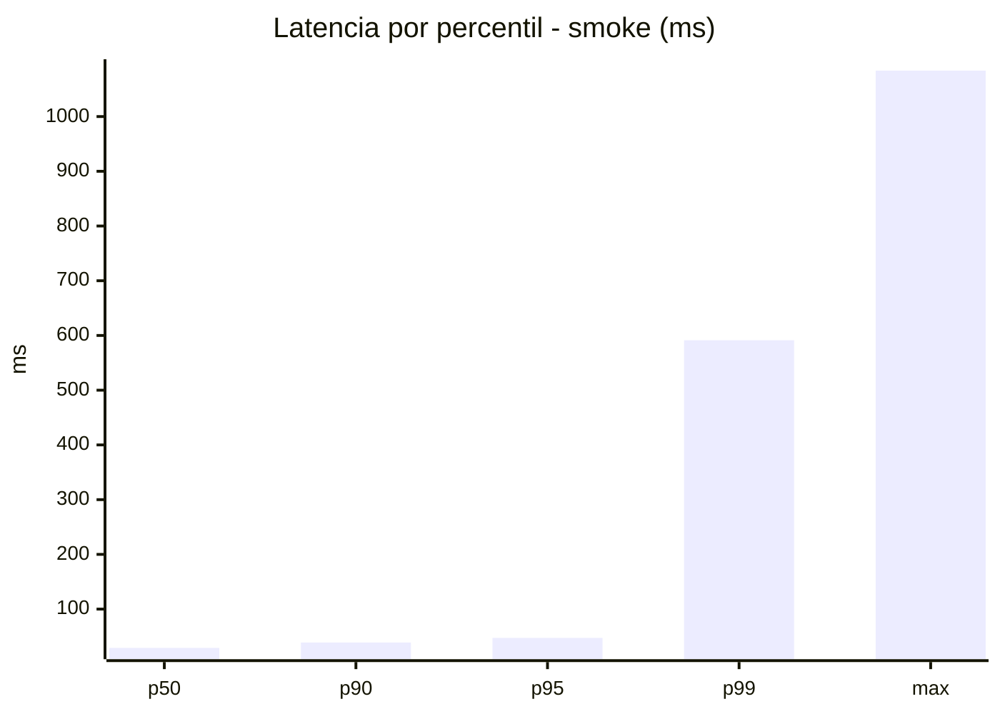
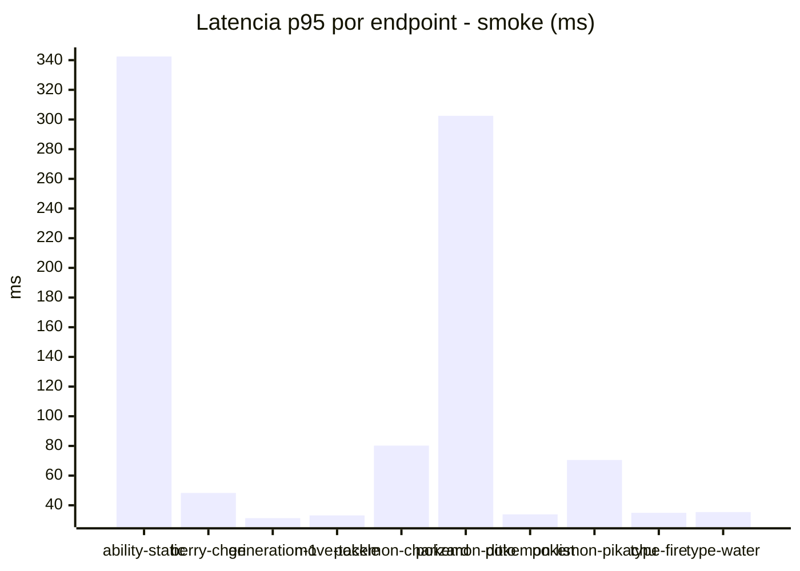
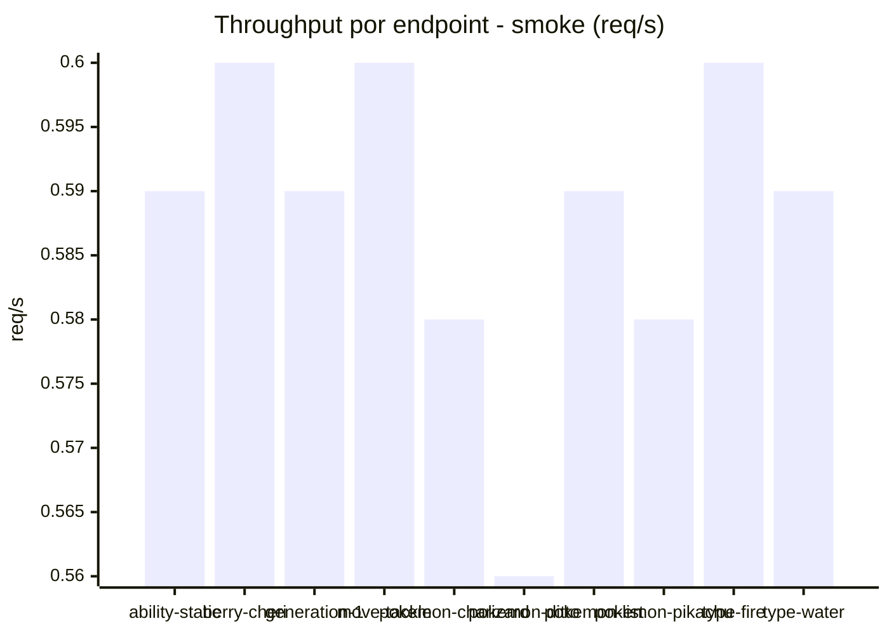

# Reporte de performance - PokeAPI

**Fecha:** 2026-09-14 18:22 UTC  
**Veredicto del agente:** `PASS`  
**Corrida:** [ver en GitHub Actions](https://github.com/lrbg/jmeter-pokeapi-lab/actions/runs/34880084048)  

## Validacion del agente de IA

PASS (fallback por umbrales)

- Error maximo: 0.0%
- p95 maximo: 55.0 ms

## Resultados

### Escenario: `load`

| Metrica | Valor |
| --- | --- |
| Muestras | 15595 |
| Errores | 0 (0.0%) |
| Latencia media | 37.0 ms |
| p50 / p90 / p95 / p99 | 32.0 / 46.0 / 55.0 / 80.0 ms |
| Min / Max | 21 / 6424 ms |
| Throughput | 130.31 req/s |
| Duracion | 119.7 s |

Detalle por endpoint

| Endpoint | Muestras | Error % | avg | p95 | p99 | req/s |
| --- | --- | --- | --- | --- | --- | --- |
| ability-static | 1560 | 0.0% | 42.9 | 47.0 | 78.4 | 13.17 |
| berry-cheri | 1559 | 0.0% | 34.3 | 48.0 | 68.0 | 13.18 |
| generation-1 | 1559 | 0.0% | 35.3 | 47.0 | 65.4 | 13.21 |
| move-tackle | 1559 | 0.0% | 35.2 | 49.0 | 57.4 | 13.2 |
| pokemon-charizard | 1559 | 0.0% | 48.0 | 69.1 | 133.4 | 13.1 |
| pokemon-ditto | 1560 | 0.0% | 34.3 | 47.0 | 66.8 | 13.04 |
| pokemon-list | 1560 | 0.0% | 31.7 | 44.0 | 57.0 | 13.14 |
| pokemon-pikachu | 1560 | 0.0% | 41.2 | 63.0 | 123.4 | 13.1 |
| type-fire | 1560 | 0.0% | 33.8 | 46.0 | 66.4 | 13.16 |
| type-water | 1559 | 0.0% | 33.1 | 45.0 | 59.0 | 13.15 |

### Escenario: `smoke`

| Metrica | Valor |
| --- | --- |
| Muestras | 152 |
| Errores | 0 (0.0%) |
| Latencia media | 46.1 ms |
| p50 / p90 / p95 / p99 | 29.0 / 39.0 / 47.4 / 591.3 ms |
| Min / Max | 24 / 1084 ms |
| Throughput | 5.26 req/s |
| Duracion | 28.9 s |

Detalle por endpoint

| Endpoint | Muestras | Error % | avg | p95 | p99 | req/s |
| --- | --- | --- | --- | --- | --- | --- |
| ability-static | 15 | 0.0% | 98.3 | 342.5 | 916.5 | 0.59 |
| berry-cheri | 15 | 0.0% | 31.4 | 48.3 | 76.9 | 0.6 |
| generation-1 | 15 | 0.0% | 28.5 | 31.3 | 31.9 | 0.59 |
| move-tackle | 15 | 0.0% | 28.9 | 33.2 | 35.4 | 0.6 |
| pokemon-charizard | 15 | 0.0% | 44.8 | 80.2 | 82.4 | 0.58 |
| pokemon-ditto | 16 | 0.0% | 96.1 | 302.5 | 927.7 | 0.56 |
| pokemon-list | 15 | 0.0% | 27.9 | 33.9 | 35.6 | 0.59 |
| pokemon-pikachu | 16 | 0.0% | 43.2 | 70.5 | 126.9 | 0.58 |
| type-fire | 15 | 0.0% | 28.7 | 34.9 | 36.6 | 0.6 |
| type-water | 15 | 0.0% | 29.5 | 35.4 | 39.9 | 0.59 |

