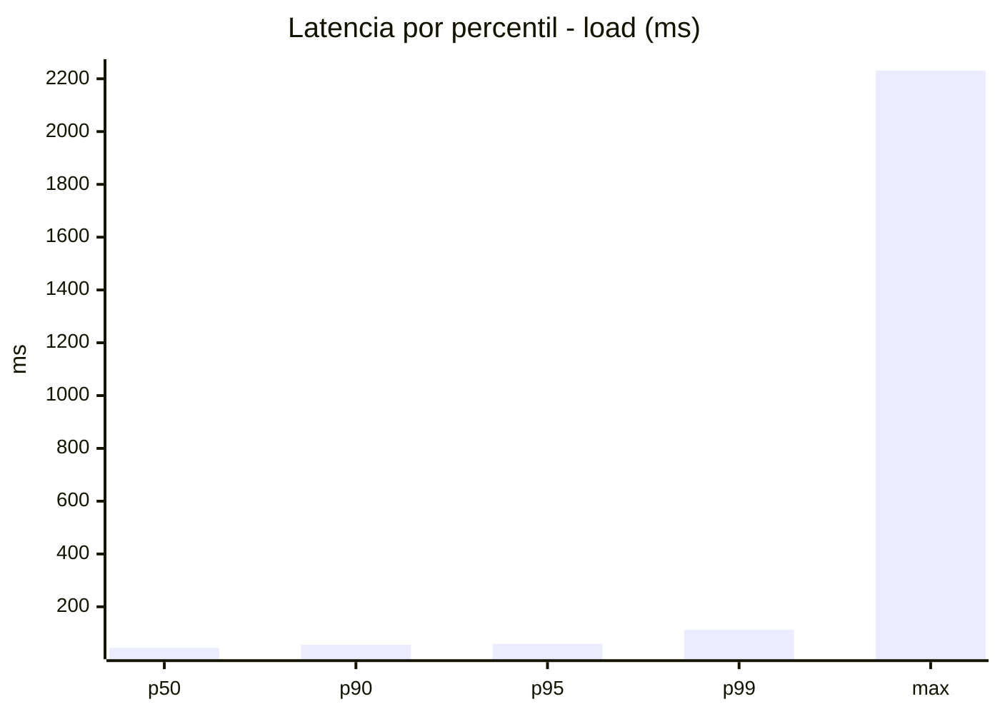
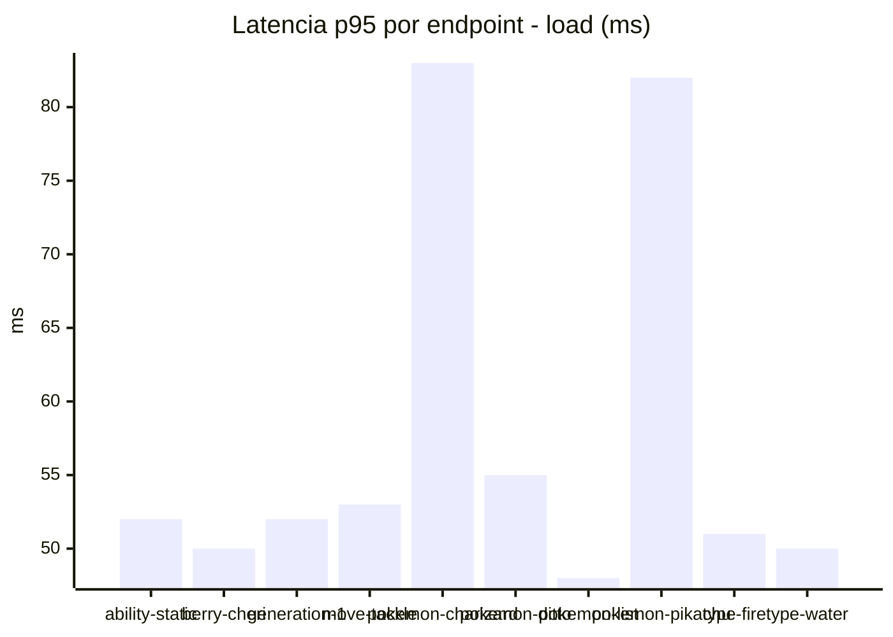
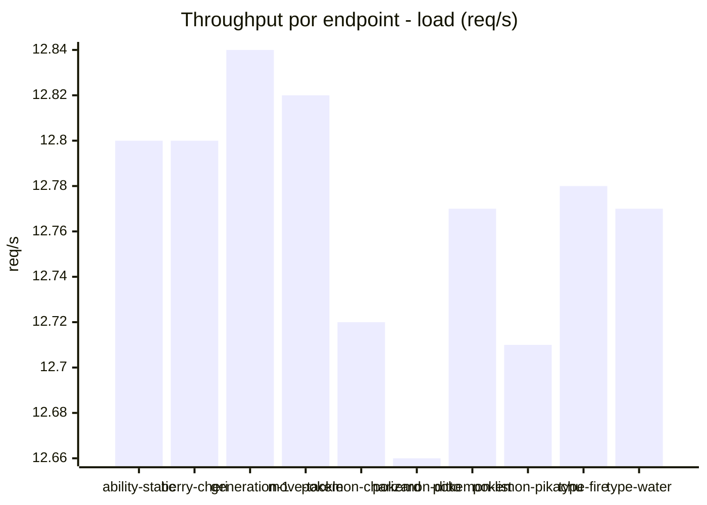
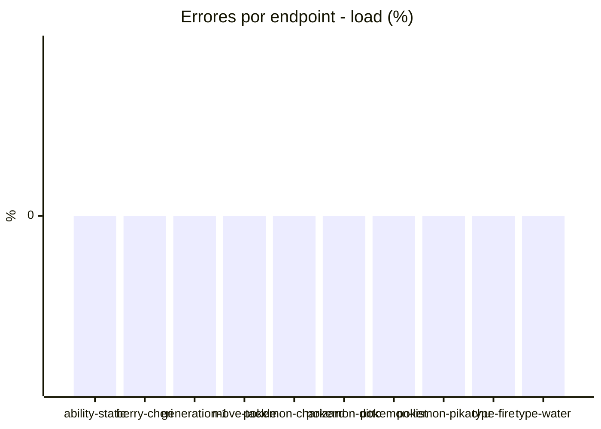
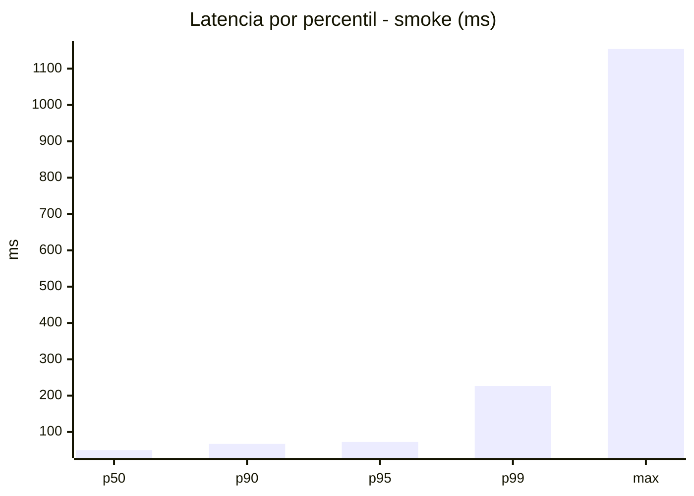
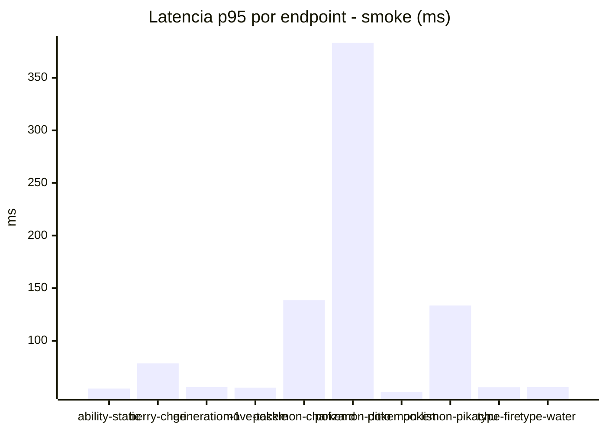
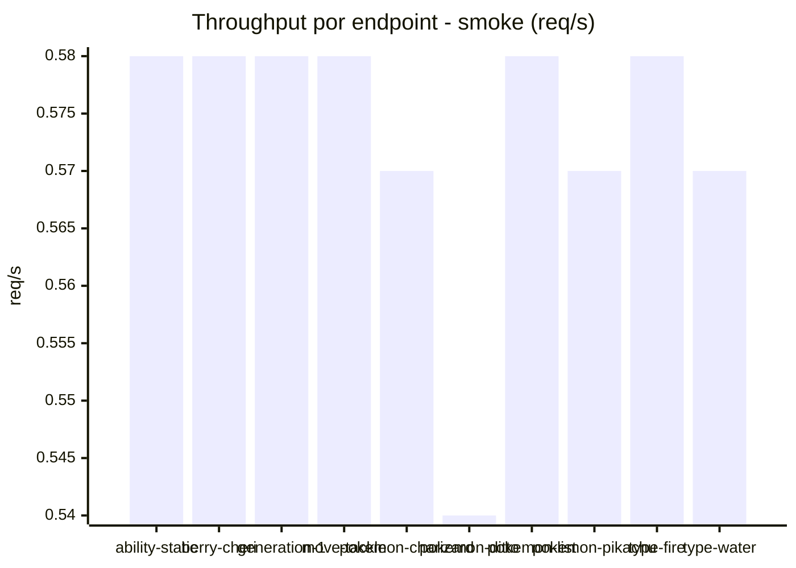

# Reporte de performance - PokeAPI

**Fecha:** 2026-09-15 17:29 UTC  
**Veredicto del agente:** `PASS`  
**Corrida:** [ver en GitHub Actions](https://github.com/lrbg/jmeter-pokeapi-lab/actions/runs/35001338507)  

## Validacion del agente de IA

PASS (fallback por umbrales)

- Error maximo: 0.0%
- p95 maximo: 72.7 ms

## Resultados

### Escenario: `load`

| Metrica | Valor |
| --- | --- |
| Muestras | 15138 |
| Errores | 0 (0.0%) |
| Latencia media | 47.0 ms |
| p50 / p90 / p95 / p99 | 44.0 / 56.0 / 60.0 / 112.6 ms |
| Min / Max | 32 / 2231 ms |
| Throughput | 126.56 req/s |
| Duracion | 119.6 s |

Detalle por endpoint

| Endpoint | Muestras | Error % | avg | p95 | p99 | req/s |
| --- | --- | --- | --- | --- | --- | --- |
| ability-static | 1514 | 0.0% | 44.3 | 52.0 | 60.9 | 12.8 |
| berry-cheri | 1514 | 0.0% | 43.0 | 50.0 | 61.9 | 12.8 |
| generation-1 | 1513 | 0.0% | 44.1 | 52.0 | 57.0 | 12.84 |
| move-tackle | 1513 | 0.0% | 45.7 | 53.0 | 60.0 | 12.82 |
| pokemon-charizard | 1514 | 0.0% | 60.6 | 83.0 | 152.6 | 12.72 |
| pokemon-ditto | 1514 | 0.0% | 46.8 | 55.0 | 74.9 | 12.66 |
| pokemon-list | 1514 | 0.0% | 41.7 | 48.0 | 70.5 | 12.77 |
| pokemon-pikachu | 1514 | 0.0% | 56.7 | 82.0 | 141.9 | 12.71 |
| type-fire | 1514 | 0.0% | 44.0 | 51.0 | 59.9 | 12.78 |
| type-water | 1514 | 0.0% | 43.5 | 50.0 | 100.5 | 12.77 |

### Escenario: `smoke`

| Metrica | Valor |
| --- | --- |
| Muestras | 148 |
| Errores | 0 (0.0%) |
| Latencia media | 61.8 ms |
| p50 / p90 / p95 / p99 | 50.0 / 67.3 / 72.7 / 226.7 ms |
| Min / Max | 37 / 1154 ms |
| Throughput | 5.1 req/s |
| Duracion | 29.0 s |

Detalle por endpoint

| Endpoint | Muestras | Error % | avg | p95 | p99 | req/s |
| --- | --- | --- | --- | --- | --- | --- |
| ability-static | 15 | 0.0% | 47.2 | 54.6 | 55.7 | 0.58 |
| berry-cheri | 15 | 0.0% | 51.1 | 78.5 | 109.3 | 0.58 |
| generation-1 | 14 | 0.0% | 47.5 | 56.0 | 57.6 | 0.58 |
| move-tackle | 14 | 0.0% | 49.5 | 55.4 | 55.9 | 0.58 |
| pokemon-charizard | 15 | 0.0% | 80.4 | 138.5 | 163.7 | 0.57 |
| pokemon-ditto | 15 | 0.0% | 121.7 | 383.3 | 999.9 | 0.54 |
| pokemon-list | 15 | 0.0% | 45.5 | 51.3 | 51.9 | 0.58 |
| pokemon-pikachu | 15 | 0.0% | 75.8 | 133.5 | 248.3 | 0.57 |
| type-fire | 15 | 0.0% | 48.4 | 55.9 | 57.6 | 0.58 |
| type-water | 15 | 0.0% | 48.8 | 56.0 | 56.0 | 0.57 |

