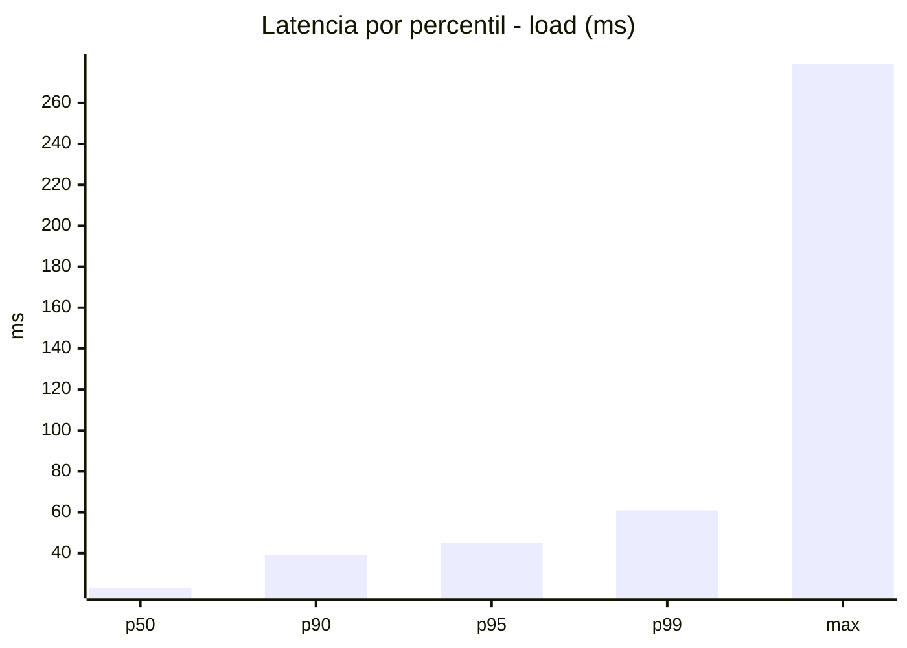
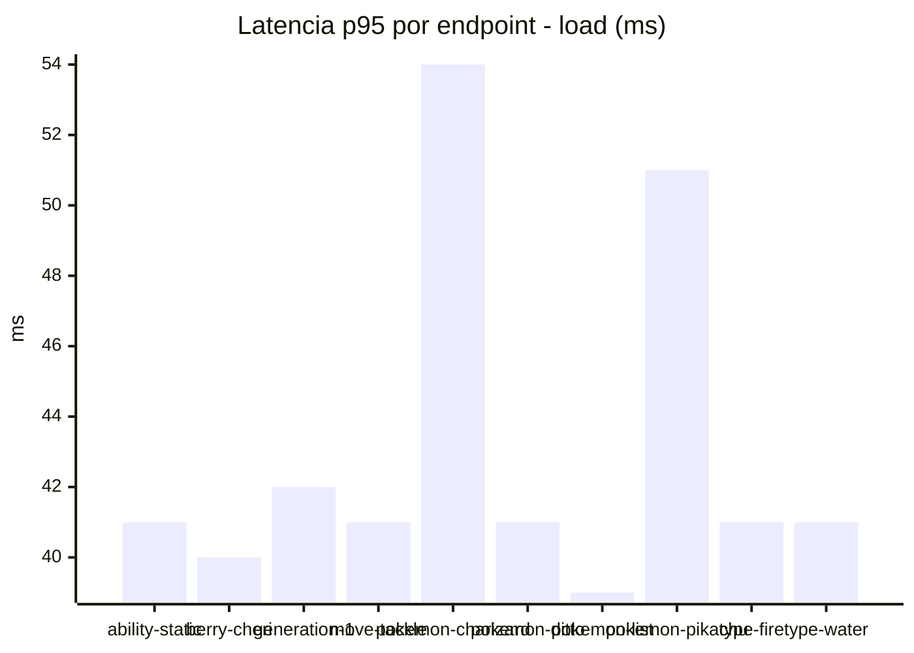
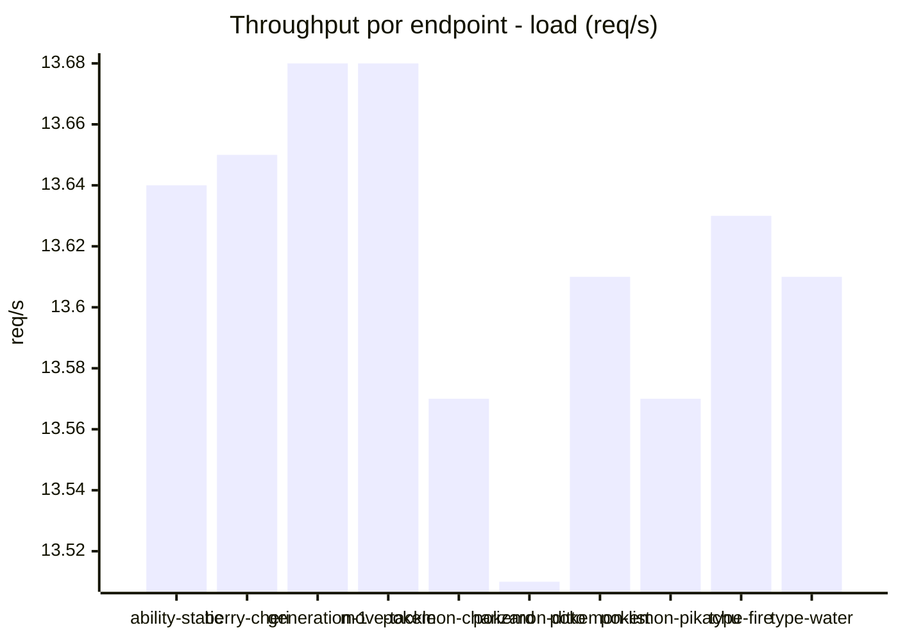
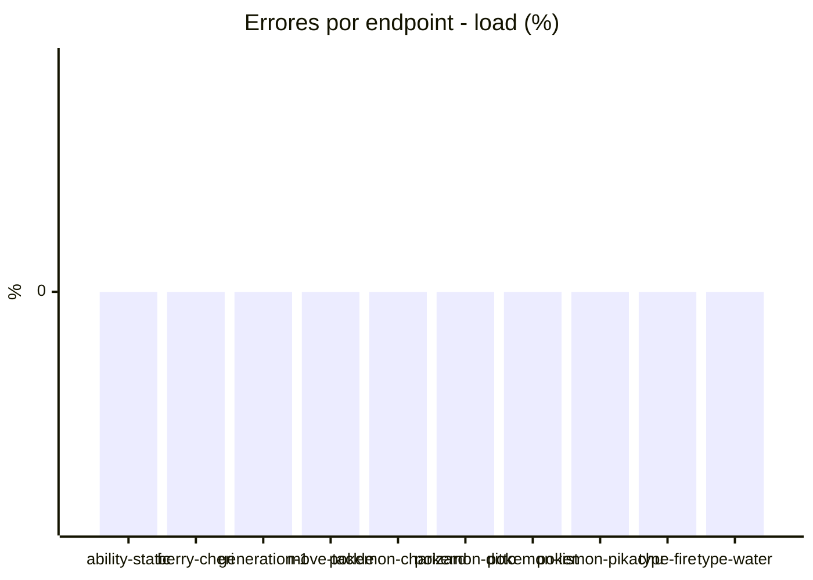
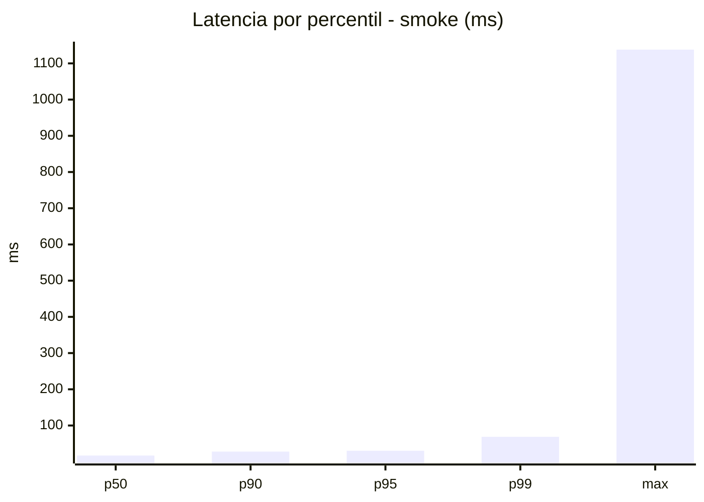
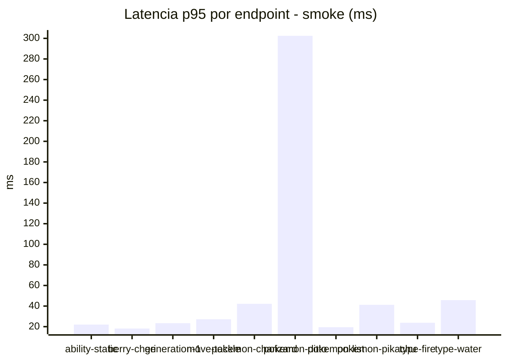
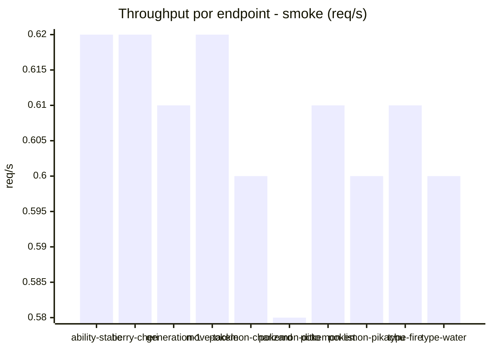

# Reporte de performance - PokeAPI

**Fecha:** 2026-09-16 17:29 UTC  
**Veredicto del agente:** `PASS`  
**Corrida:** [ver en GitHub Actions](https://github.com/lrbg/jmeter-pokeapi-lab/actions/runs/35128188336)  

## Validacion del agente de IA

PASS (fallback por umbrales)

- Error maximo: 0.0%
- p95 maximo: 45.0 ms

## Resultados

### Escenario: `load`

| Metrica | Valor |
| --- | --- |
| Muestras | 16143 |
| Errores | 0 (0.0%) |
| Latencia media | 25.4 ms |
| p50 / p90 / p95 / p99 | 23.0 / 39.0 / 45.0 / 61.0 ms |
| Min / Max | 10 / 279 ms |
| Throughput | 135.0 req/s |
| Duracion | 119.6 s |

Detalle por endpoint

| Endpoint | Muestras | Error % | avg | p95 | p99 | req/s |
| --- | --- | --- | --- | --- | --- | --- |
| ability-static | 1615 | 0.0% | 25.1 | 41.0 | 57.7 | 13.64 |
| berry-cheri | 1614 | 0.0% | 24.6 | 40.0 | 53.9 | 13.65 |
| generation-1 | 1614 | 0.0% | 25.2 | 42.0 | 51.0 | 13.68 |
| move-tackle | 1614 | 0.0% | 24.6 | 41.0 | 52.0 | 13.68 |
| pokemon-charizard | 1614 | 0.0% | 29.8 | 54.0 | 96.7 | 13.57 |
| pokemon-ditto | 1615 | 0.0% | 24.4 | 41.0 | 52.9 | 13.51 |
| pokemon-list | 1614 | 0.0% | 23.0 | 39.0 | 54.0 | 13.61 |
| pokemon-pikachu | 1615 | 0.0% | 28.0 | 51.0 | 78.0 | 13.57 |
| type-fire | 1614 | 0.0% | 24.5 | 41.0 | 48.9 | 13.63 |
| type-water | 1614 | 0.0% | 24.6 | 41.0 | 49.0 | 13.61 |

### Escenario: `smoke`

| Metrica | Valor |
| --- | --- |
| Muestras | 158 |
| Errores | 0 (0.0%) |
| Latencia media | 26.2 ms |
| p50 / p90 / p95 / p99 | 17.0 / 28.0 / 30.3 / 68.7 ms |
| Min / Max | 11 / 1138 ms |
| Throughput | 5.42 req/s |
| Duracion | 29.2 s |

Detalle por endpoint

| Endpoint | Muestras | Error % | avg | p95 | p99 | req/s |
| --- | --- | --- | --- | --- | --- | --- |
| ability-static | 16 | 0.0% | 16.8 | 22.0 | 26.8 | 0.62 |
| berry-cheri | 16 | 0.0% | 15.6 | 18.2 | 18.9 | 0.62 |
| generation-1 | 15 | 0.0% | 17.5 | 23.4 | 27.9 | 0.61 |
| move-tackle | 15 | 0.0% | 17.6 | 27.2 | 40.6 | 0.62 |
| pokemon-charizard | 16 | 0.0% | 29.1 | 42.2 | 59.6 | 0.6 |
| pokemon-ditto | 16 | 0.0% | 86.4 | 302.5 | 970.9 | 0.58 |
| pokemon-list | 16 | 0.0% | 15.6 | 19.5 | 20.7 | 0.61 |
| pokemon-pikachu | 16 | 0.0% | 24.8 | 41.2 | 68.2 | 0.6 |
| type-fire | 16 | 0.0% | 17 | 23.8 | 27.9 | 0.61 |
| type-water | 16 | 0.0% | 20.2 | 45.8 | 59.5 | 0.6 |

