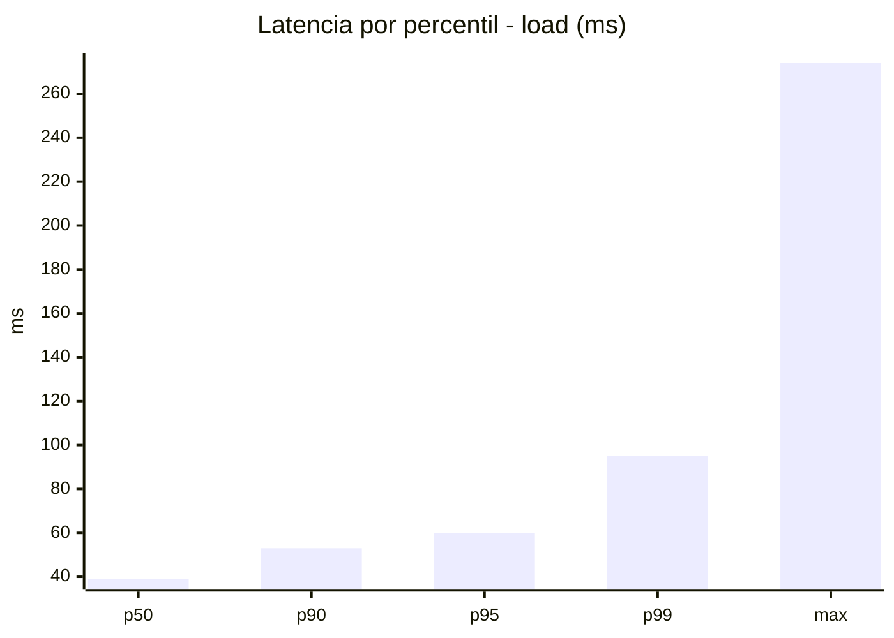
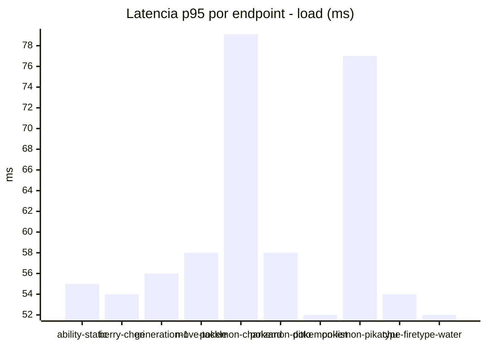
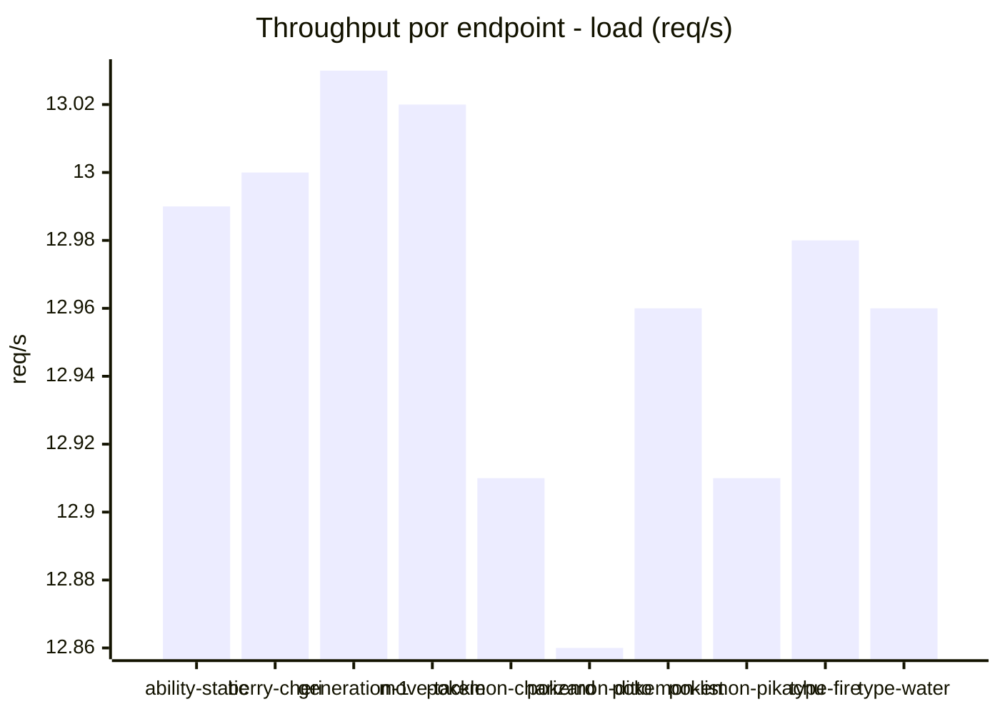
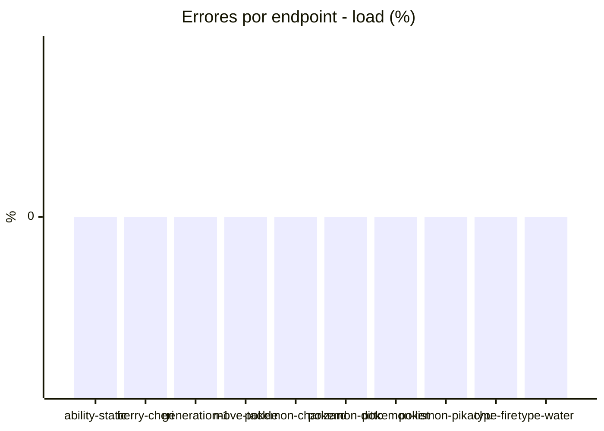
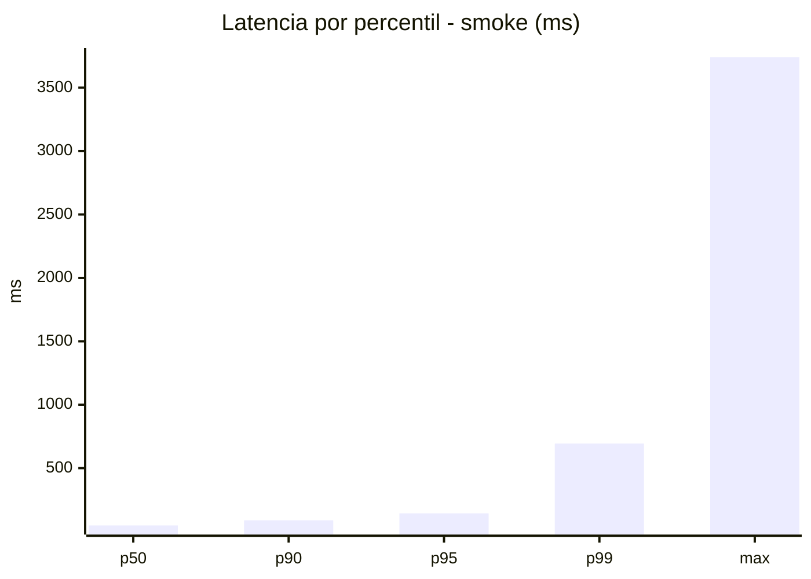
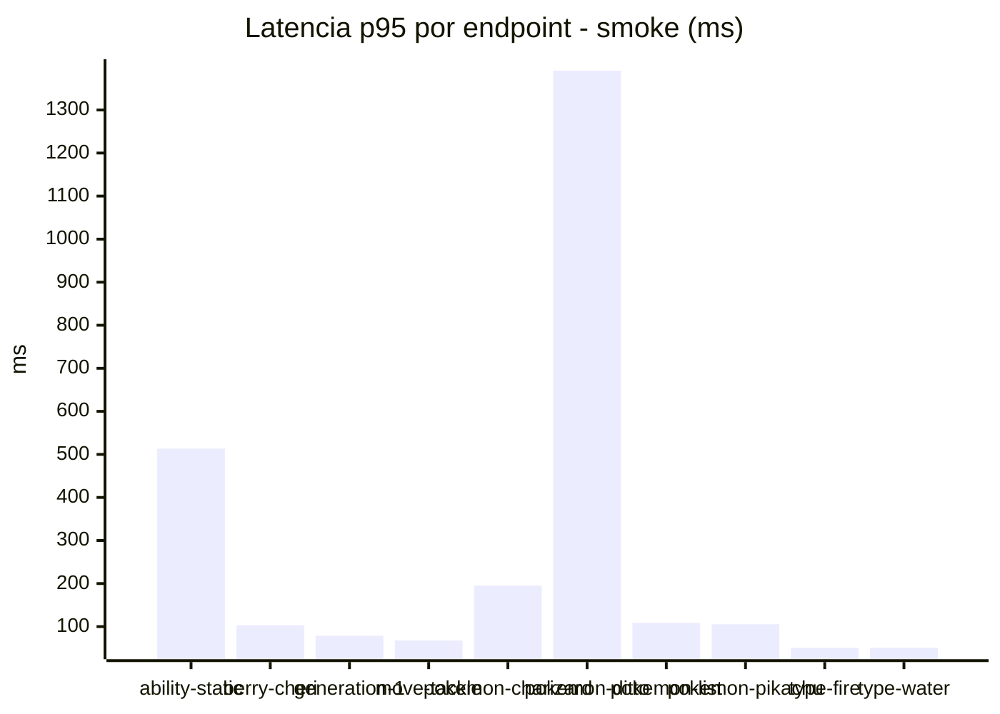
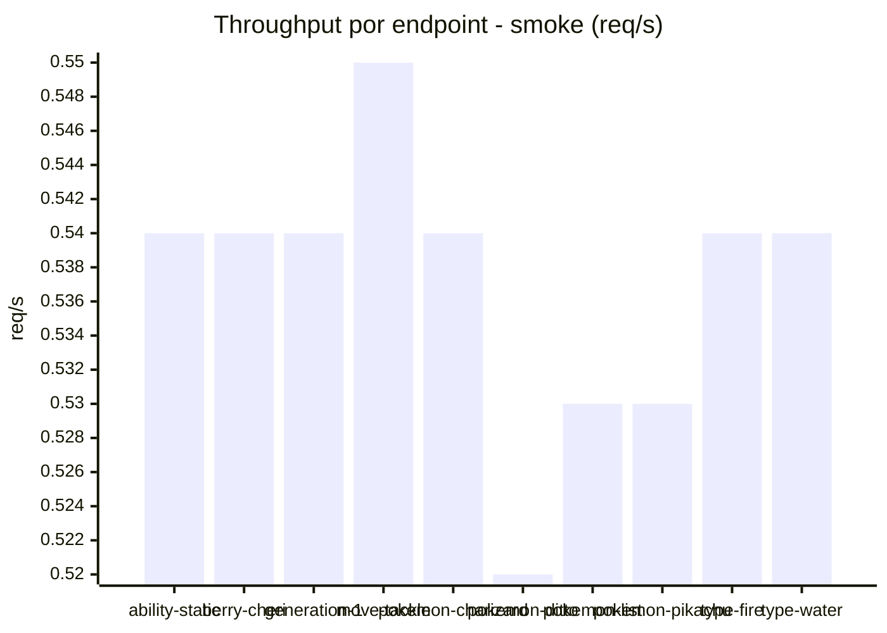

# Reporte de performance - PokeAPI

**Fecha:** 2026-09-17 17:29 UTC  
**Veredicto del agente:** `PASS`  
**Corrida:** [ver en GitHub Actions](https://github.com/lrbg/jmeter-pokeapi-lab/actions/runs/35252742650)  

## Validacion del agente de IA

PASS (fallback por umbrales)

- Error maximo: 0.0%
- p95 maximo: 143.6 ms

## Resultados

### Escenario: `load`

| Metrica | Valor |
| --- | --- |
| Muestras | 15377 |
| Errores | 0 (0.0%) |
| Latencia media | 41.8 ms |
| p50 / p90 / p95 / p99 | 39.0 / 53.0 / 60.0 / 95.2 ms |
| Min / Max | 26 / 274 ms |
| Throughput | 128.47 req/s |
| Duracion | 119.7 s |

Detalle por endpoint

| Endpoint | Muestras | Error % | avg | p95 | p99 | req/s |
| --- | --- | --- | --- | --- | --- | --- |
| ability-static | 1538 | 0.0% | 40.2 | 55.0 | 70.3 | 12.99 |
| berry-cheri | 1537 | 0.0% | 39.1 | 54.0 | 65.6 | 13.0 |
| generation-1 | 1537 | 0.0% | 40.3 | 56.0 | 72.3 | 13.03 |
| move-tackle | 1537 | 0.0% | 41.2 | 58.0 | 66.0 | 13.02 |
| pokemon-charizard | 1538 | 0.0% | 52.3 | 79.1 | 126.0 | 12.91 |
| pokemon-ditto | 1538 | 0.0% | 40.5 | 58.0 | 68.6 | 12.86 |
| pokemon-list | 1538 | 0.0% | 37.4 | 52.0 | 89.9 | 12.96 |
| pokemon-pikachu | 1538 | 0.0% | 49.3 | 77.0 | 152.0 | 12.91 |
| type-fire | 1538 | 0.0% | 39.1 | 54.0 | 65.6 | 12.98 |
| type-water | 1538 | 0.0% | 38.6 | 52.0 | 65.6 | 12.96 |

### Escenario: `smoke`

| Metrica | Valor |
| --- | --- |
| Muestras | 142 |
| Errores | 0 (0.0%) |
| Latencia media | 90.0 ms |
| p50 / p90 / p95 / p99 | 48.0 / 88.5 / 143.6 / 693.6 ms |
| Min / Max | 29 / 3740 ms |
| Throughput | 4.88 req/s |
| Duracion | 29.1 s |

Detalle por endpoint

| Endpoint | Muestras | Error % | avg | p95 | p99 | req/s |
| --- | --- | --- | --- | --- | --- | --- |
| ability-static | 14 | 0.0% | 127.1 | 513.4 | 829.1 | 0.54 |
| berry-cheri | 14 | 0.0% | 51.9 | 103.2 | 121.4 | 0.54 |
| generation-1 | 14 | 0.0% | 47.7 | 78.7 | 121.3 | 0.54 |
| move-tackle | 14 | 0.0% | 49.1 | 67.8 | 73.6 | 0.55 |
| pokemon-charizard | 14 | 0.0% | 84.8 | 195.1 | 283.0 | 0.54 |
| pokemon-ditto | 15 | 0.0% | 323.6 | 1391.5 | 3270.3 | 0.52 |
| pokemon-list | 14 | 0.0% | 53.1 | 108.6 | 137.7 | 0.53 |
| pokemon-pikachu | 15 | 0.0% | 62.5 | 105.5 | 136.3 | 0.53 |
| type-fire | 14 | 0.0% | 43.6 | 50.4 | 50.9 | 0.54 |
| type-water | 14 | 0.0% | 42.4 | 50.7 | 51.7 | 0.54 |

