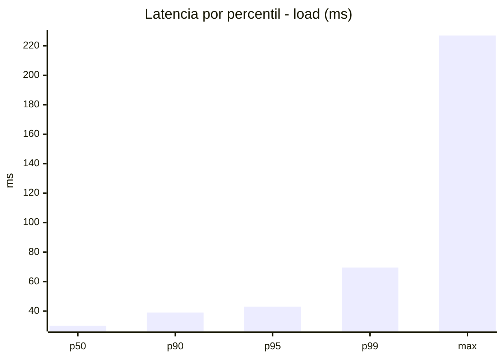
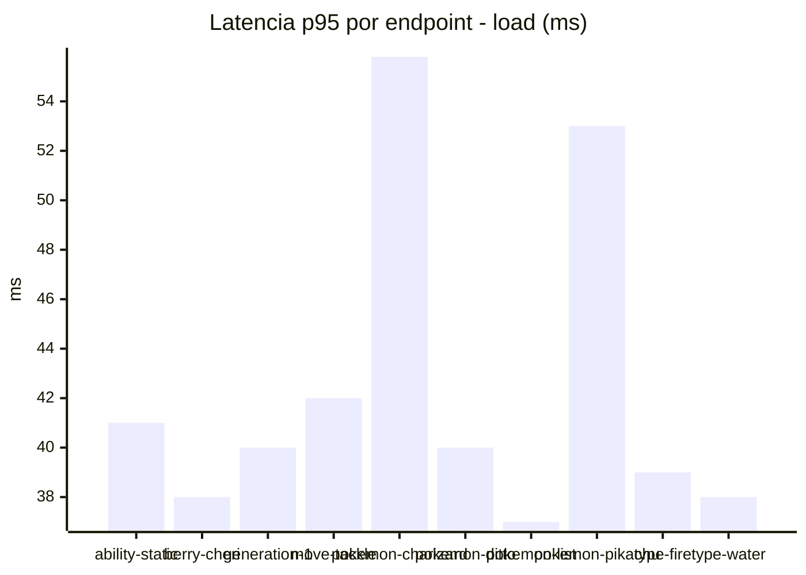
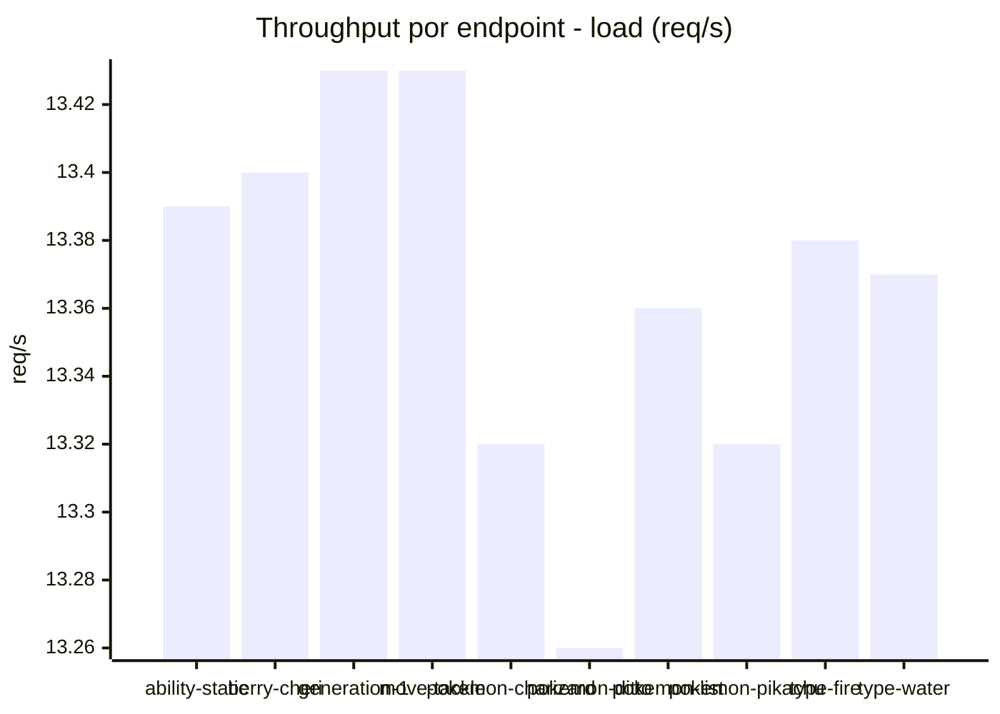
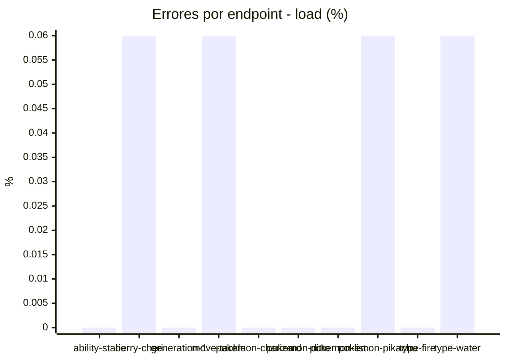
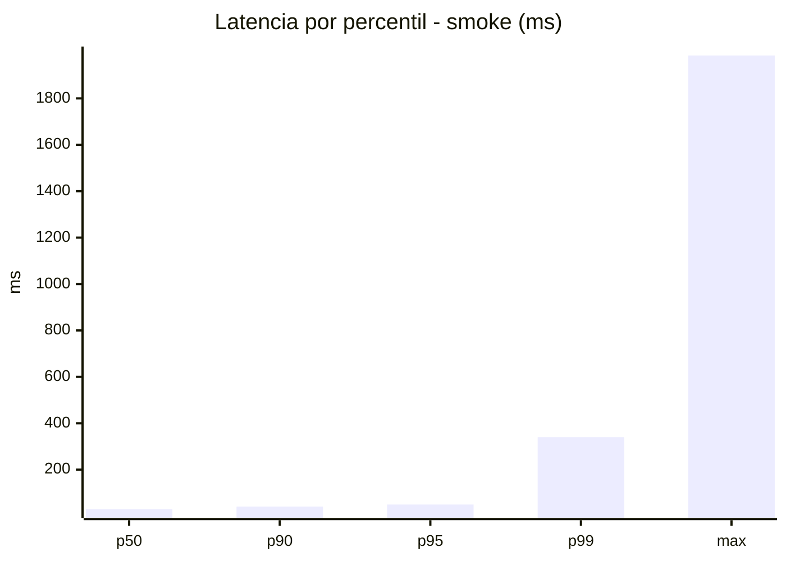
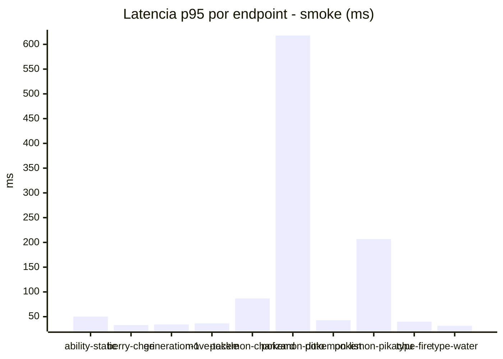
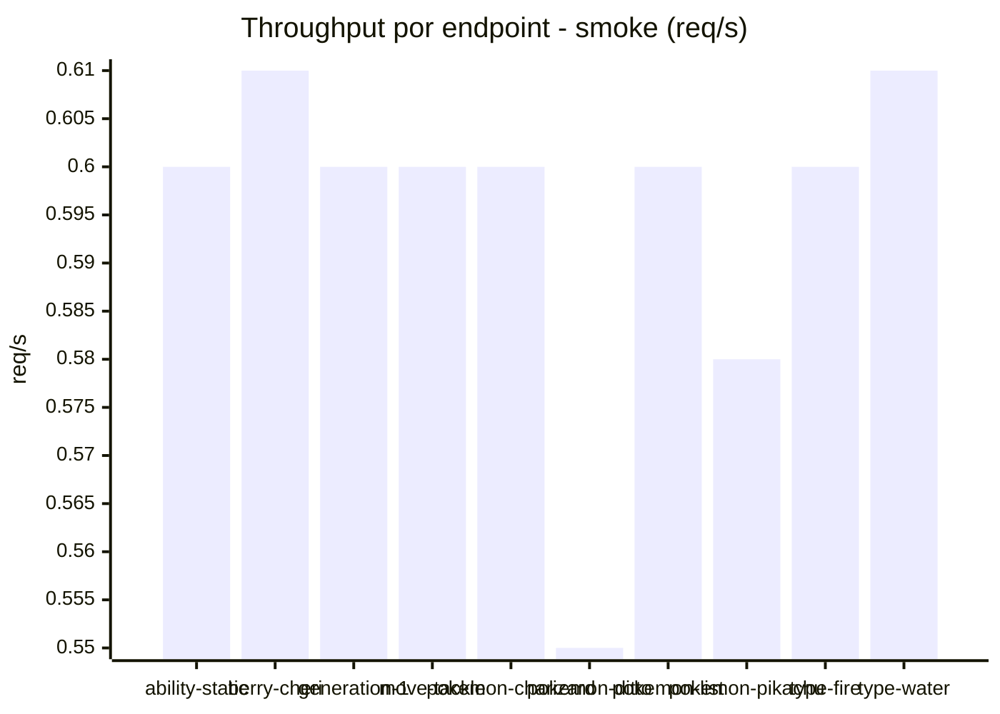
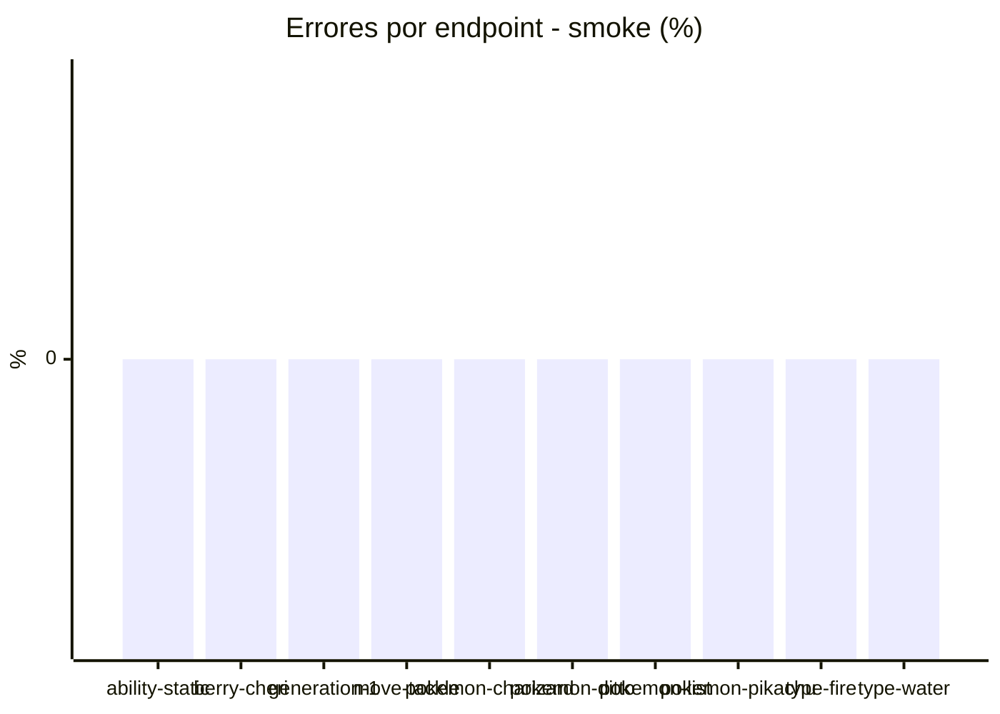

# Reporte de performance - PokeAPI

**Fecha:** 2026-09-18 16:57 UTC  
**Veredicto del agente:** `PASS`  
**Corrida:** [ver en GitHub Actions](https://github.com/lrbg/jmeter-pokeapi-lab/actions/runs/35371264262)  

## Validacion del agente de IA

PASS (fallback por umbrales)

- Error maximo: 0.03%
- p95 maximo: 49.8 ms

## Resultados

### Escenario: `load`

| Metrica | Valor |
| --- | --- |
| Muestras | 15854 |
| Errores | 4 (0.03%) |
| Latencia media | 31.4 ms |
| p50 / p90 / p95 / p99 | 30.0 / 39.0 / 43.0 / 69.5 ms |
| Min / Max | 17 / 227 ms |
| Throughput | 132.5 req/s |
| Duracion | 119.6 s |

Detalle por endpoint

| Endpoint | Muestras | Error % | avg | p95 | p99 | req/s |
| --- | --- | --- | --- | --- | --- | --- |
| ability-static | 1585 | 0.0% | 30.5 | 41.0 | 50.0 | 13.39 |
| berry-cheri | 1585 | 0.06% | 29.9 | 38.0 | 47.5 | 13.4 |
| generation-1 | 1586 | 0.0% | 30.5 | 40.0 | 47.0 | 13.43 |
| move-tackle | 1586 | 0.06% | 31.2 | 42.0 | 48.2 | 13.43 |
| pokemon-charizard | 1585 | 0.0% | 38.6 | 55.8 | 99.2 | 13.32 |
| pokemon-ditto | 1586 | 0.0% | 30.4 | 40.0 | 58.3 | 13.26 |
| pokemon-list | 1585 | 0.0% | 27.9 | 37.0 | 45.0 | 13.36 |
| pokemon-pikachu | 1585 | 0.06% | 36.1 | 53.0 | 97.0 | 13.32 |
| type-fire | 1586 | 0.0% | 29.6 | 39.0 | 47.0 | 13.38 |
| type-water | 1585 | 0.06% | 29.2 | 38.0 | 45.2 | 13.37 |

### Escenario: `smoke`

| Metrica | Valor |
| --- | --- |
| Muestras | 149 |
| Errores | 0 (0.0%) |
| Latencia media | 49.3 ms |
| p50 / p90 / p95 / p99 | 30.0 / 41.0 / 49.8 / 340.1 ms |
| Min / Max | 24 / 1985 ms |
| Throughput | 5.21 req/s |
| Duracion | 28.6 s |

Detalle por endpoint

| Endpoint | Muestras | Error % | avg | p95 | p99 | req/s |
| --- | --- | --- | --- | --- | --- | --- |
| ability-static | 15 | 0.0% | 33.8 | 50.1 | 76.4 | 0.6 |
| berry-cheri | 15 | 0.0% | 29.1 | 33.0 | 33.0 | 0.61 |
| generation-1 | 14 | 0.0% | 28.9 | 34.4 | 34.9 | 0.6 |
| move-tackle | 15 | 0.0% | 31.8 | 36.4 | 40.9 | 0.6 |
| pokemon-charizard | 15 | 0.0% | 47.7 | 86.8 | 90.2 | 0.6 |
| pokemon-ditto | 15 | 0.0% | 159.1 | 617.9 | 1711.6 | 0.55 |
| pokemon-list | 15 | 0.0% | 30.9 | 42.8 | 46.2 | 0.6 |
| pokemon-pikachu | 15 | 0.0% | 73 | 206.7 | 497.3 | 0.58 |
| type-fire | 15 | 0.0% | 29.1 | 40.0 | 40.0 | 0.6 |
| type-water | 15 | 0.0% | 28.3 | 31.6 | 32.7 | 0.61 |

