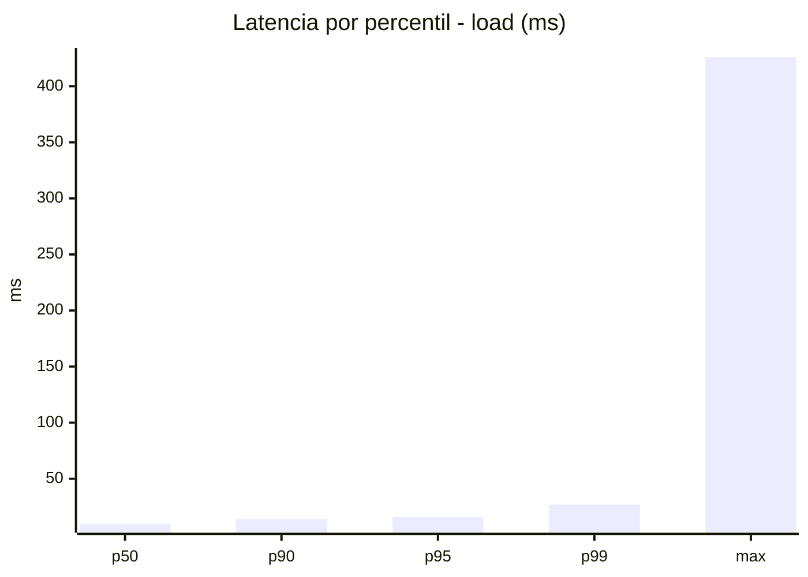
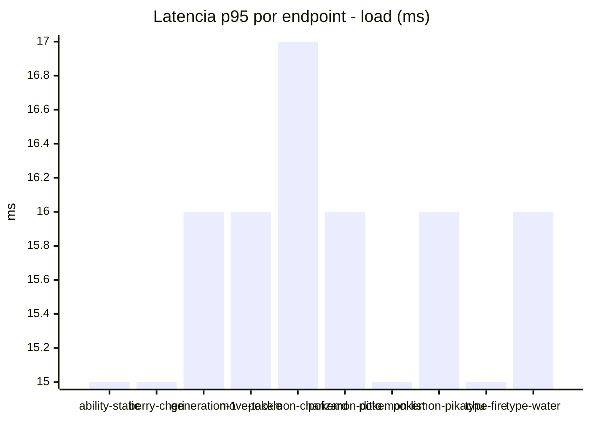
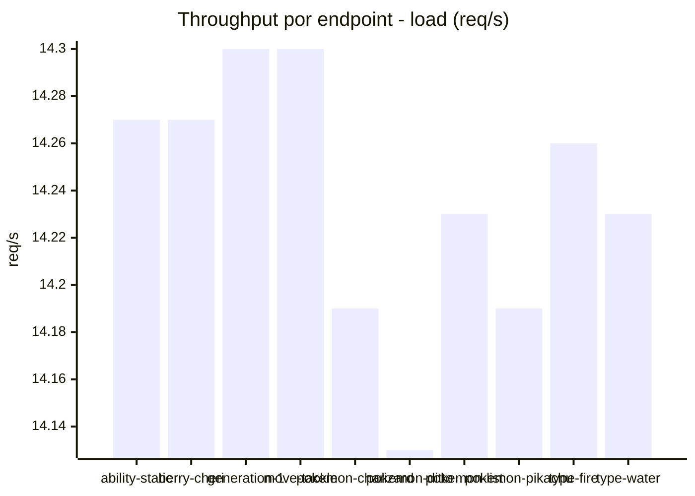
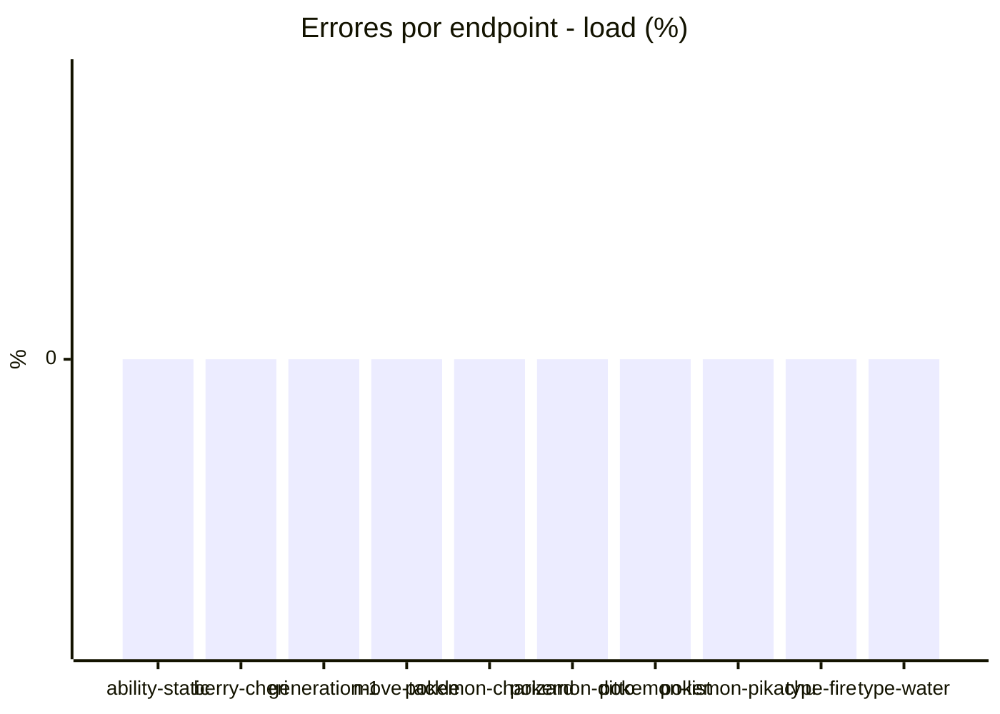
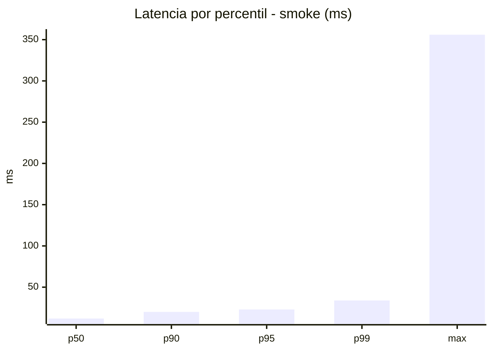
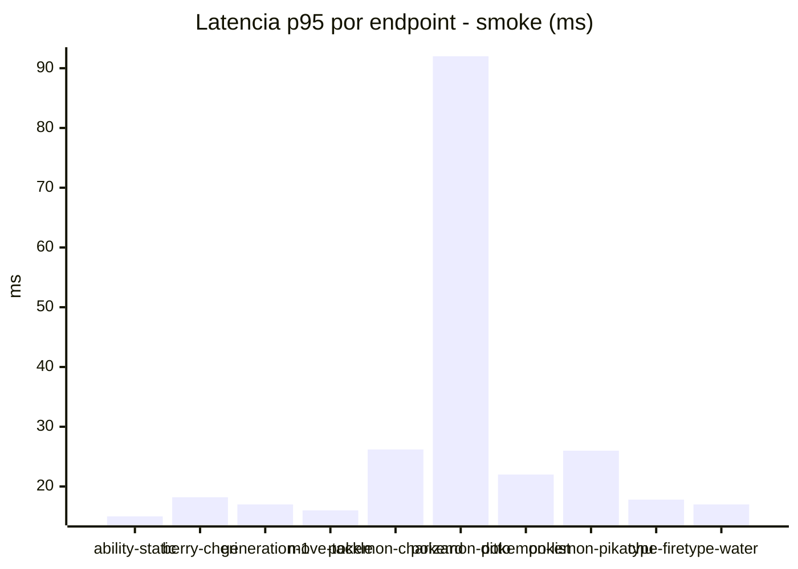
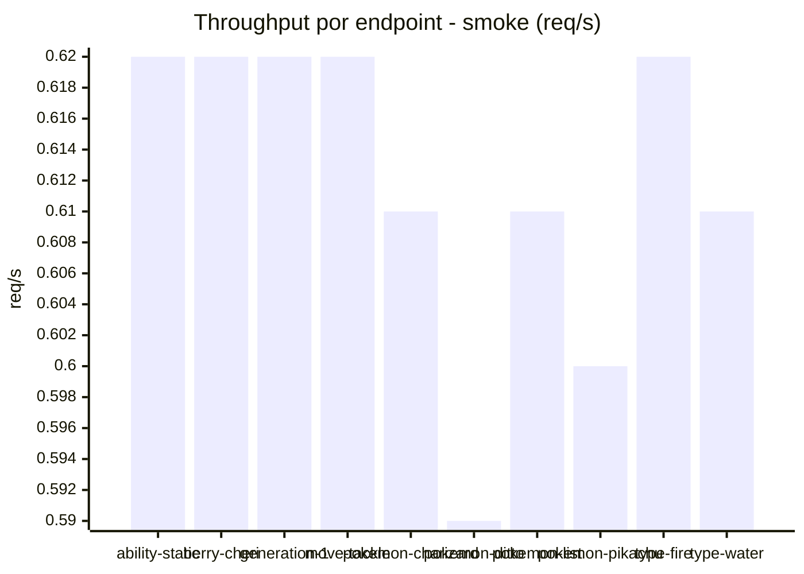

# Reporte de performance - PokeAPI

**Fecha:** 2026-09-19 16:14 UTC  
**Veredicto del agente:** `PASS`  
**Corrida:** [ver en GitHub Actions](https://github.com/lrbg/jmeter-pokeapi-lab/actions/runs/35454194230)  

## Validacion del agente de IA

PASS (fallback por umbrales)

- Error maximo: 0.0%
- p95 maximo: 23.0 ms

## Resultados

### Escenario: `load`

| Metrica | Valor |
| --- | --- |
| Muestras | 16891 |
| Errores | 0 (0.0%) |
| Latencia media | 11.0 ms |
| p50 / p90 / p95 / p99 | 10.0 / 14.0 / 16.0 / 27.0 ms |
| Min / Max | 6 / 426 ms |
| Throughput | 141.23 req/s |
| Duracion | 119.6 s |

Detalle por endpoint

| Endpoint | Muestras | Error % | avg | p95 | p99 | req/s |
| --- | --- | --- | --- | --- | --- | --- |
| ability-static | 1690 | 0.0% | 10.8 | 15.0 | 33.1 | 14.27 |
| berry-cheri | 1689 | 0.0% | 10.3 | 15.0 | 21.0 | 14.27 |
| generation-1 | 1688 | 0.0% | 10.5 | 16.0 | 27.0 | 14.3 |
| move-tackle | 1689 | 0.0% | 11.0 | 16.0 | 44.1 | 14.3 |
| pokemon-charizard | 1689 | 0.0% | 13.1 | 17.0 | 31.6 | 14.19 |
| pokemon-ditto | 1689 | 0.0% | 10.9 | 16.0 | 25.0 | 14.13 |
| pokemon-list | 1689 | 0.0% | 10.0 | 15.0 | 20.0 | 14.23 |
| pokemon-pikachu | 1690 | 0.0% | 12.6 | 16.0 | 35.4 | 14.19 |
| type-fire | 1689 | 0.0% | 10.3 | 15.0 | 27.0 | 14.26 |
| type-water | 1689 | 0.0% | 10.8 | 16.0 | 25.5 | 14.23 |

### Escenario: `smoke`

| Metrica | Valor |
| --- | --- |
| Muestras | 162 |
| Errores | 0 (0.0%) |
| Latencia media | 15.7 ms |
| p50 / p90 / p95 / p99 | 12.0 / 20.0 / 23.0 / 33.9 ms |
| Min / Max | 8 / 356 ms |
| Throughput | 5.56 req/s |
| Duracion | 29.1 s |

Detalle por endpoint

| Endpoint | Muestras | Error % | avg | p95 | p99 | req/s |
| --- | --- | --- | --- | --- | --- | --- |
| ability-static | 16 | 0.0% | 11.7 | 15.0 | 15.0 | 0.62 |
| berry-cheri | 16 | 0.0% | 11.9 | 18.2 | 21.2 | 0.62 |
| generation-1 | 16 | 0.0% | 11.4 | 17.0 | 19.4 | 0.62 |
| move-tackle | 16 | 0.0% | 11.7 | 16.0 | 16.0 | 0.62 |
| pokemon-charizard | 16 | 0.0% | 19.2 | 26.2 | 26.9 | 0.61 |
| pokemon-ditto | 17 | 0.0% | 33.9 | 92.0 | 303.2 | 0.59 |
| pokemon-list | 16 | 0.0% | 12.6 | 22.0 | 36.4 | 0.61 |
| pokemon-pikachu | 17 | 0.0% | 17.5 | 26.0 | 29.2 | 0.6 |
| type-fire | 16 | 0.0% | 12.4 | 17.8 | 21.9 | 0.62 |
| type-water | 16 | 0.0% | 13.4 | 17.0 | 17.0 | 0.61 |

