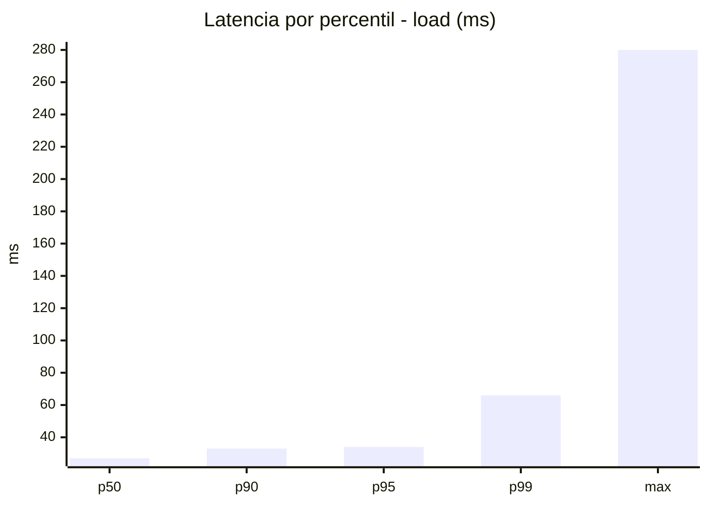
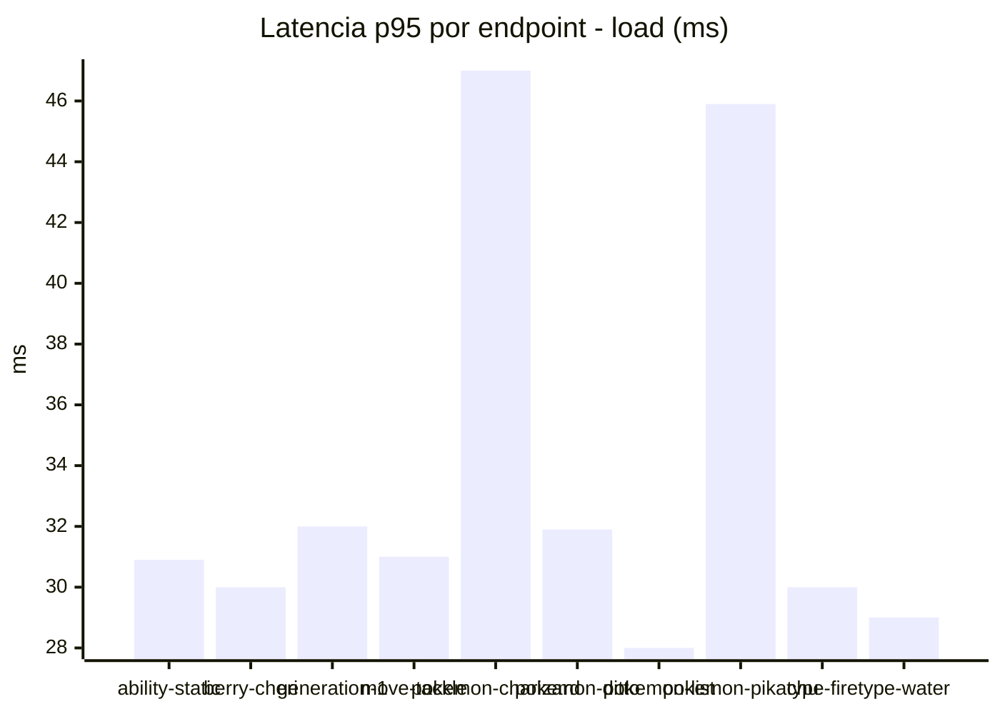
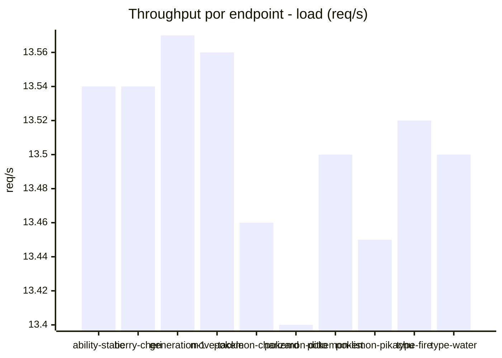
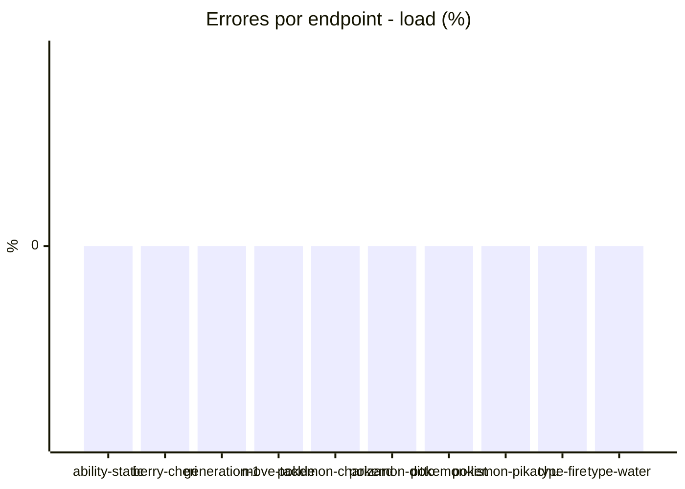
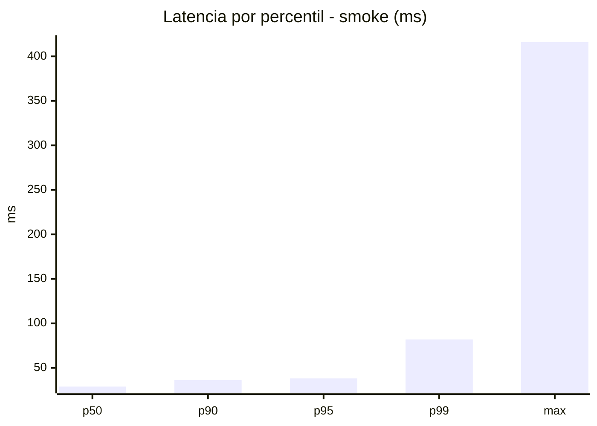
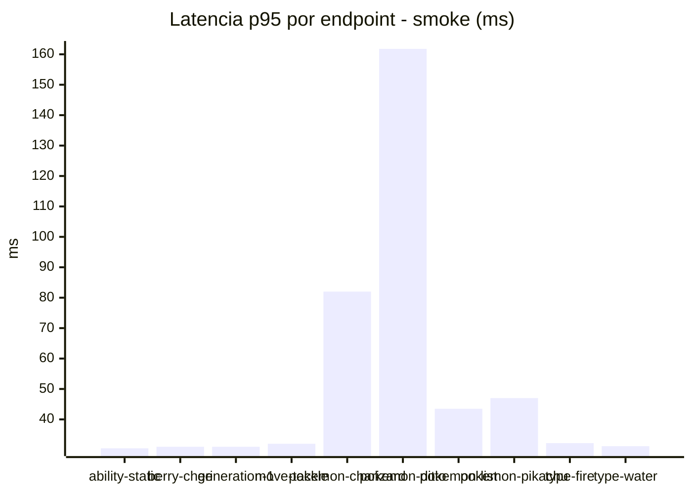
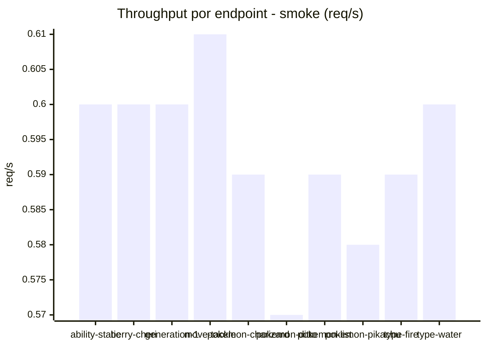

# Reporte de performance - PokeAPI

**Fecha:** 2026-09-20 16:42 UTC  
**Veredicto del agente:** `PASS`  
**Corrida:** [ver en GitHub Actions](https://github.com/lrbg/jmeter-pokeapi-lab/actions/runs/35523424642)  

## Validacion del agente de IA

PASS (fallback por umbrales)

- Error maximo: 0.0%
- p95 maximo: 38.2 ms

## Resultados

### Escenario: `load`

| Metrica | Valor |
| --- | --- |
| Muestras | 16016 |
| Errores | 0 (0.0%) |
| Latencia media | 28.1 ms |
| p50 / p90 / p95 / p99 | 27.0 / 33.0 / 34.0 / 66.0 ms |
| Min / Max | 21 / 280 ms |
| Throughput | 133.9 req/s |
| Duracion | 119.6 s |

Detalle por endpoint

| Endpoint | Muestras | Error % | avg | p95 | p99 | req/s |
| --- | --- | --- | --- | --- | --- | --- |
| ability-static | 1602 | 0.0% | 26.8 | 30.9 | 36.0 | 13.54 |
| berry-cheri | 1602 | 0.0% | 26.4 | 30.0 | 36.0 | 13.54 |
| generation-1 | 1601 | 0.0% | 27.1 | 32.0 | 42.0 | 13.57 |
| move-tackle | 1601 | 0.0% | 27.6 | 31.0 | 39.0 | 13.56 |
| pokemon-charizard | 1602 | 0.0% | 34.9 | 47.0 | 78.0 | 13.46 |
| pokemon-ditto | 1602 | 0.0% | 27.2 | 31.9 | 39.0 | 13.4 |
| pokemon-list | 1601 | 0.0% | 25.3 | 28.0 | 37.0 | 13.5 |
| pokemon-pikachu | 1602 | 0.0% | 33.3 | 45.9 | 115.0 | 13.45 |
| type-fire | 1602 | 0.0% | 26.7 | 30.0 | 41.0 | 13.52 |
| type-water | 1601 | 0.0% | 26.0 | 29.0 | 62.0 | 13.5 |

### Escenario: `smoke`

| Metrica | Valor |
| --- | --- |
| Muestras | 157 |
| Errores | 0 (0.0%) |
| Latencia media | 33.8 ms |
| p50 / p90 / p95 / p99 | 29.0 / 36.4 / 38.2 / 82.0 ms |
| Min / Max | 24 / 416 ms |
| Throughput | 5.37 req/s |
| Duracion | 29.2 s |

Detalle por endpoint

| Endpoint | Muestras | Error % | avg | p95 | p99 | req/s |
| --- | --- | --- | --- | --- | --- | --- |
| ability-static | 16 | 0.0% | 28.1 | 30.5 | 31.7 | 0.6 |
| berry-cheri | 15 | 0.0% | 28.3 | 31.0 | 31.0 | 0.6 |
| generation-1 | 15 | 0.0% | 28.1 | 31.0 | 31.0 | 0.6 |
| move-tackle | 15 | 0.0% | 28.6 | 32.0 | 32.0 | 0.61 |
| pokemon-charizard | 16 | 0.0% | 44.1 | 82.0 | 82.0 | 0.59 |
| pokemon-ditto | 16 | 0.0% | 55.4 | 161.8 | 365.1 | 0.57 |
| pokemon-list | 16 | 0.0% | 30.9 | 43.5 | 73.5 | 0.59 |
| pokemon-pikachu | 16 | 0.0% | 36.6 | 47.0 | 71.0 | 0.58 |
| type-fire | 16 | 0.0% | 29 | 32.2 | 32.9 | 0.59 |
| type-water | 16 | 0.0% | 28.1 | 31.2 | 31.9 | 0.6 |

