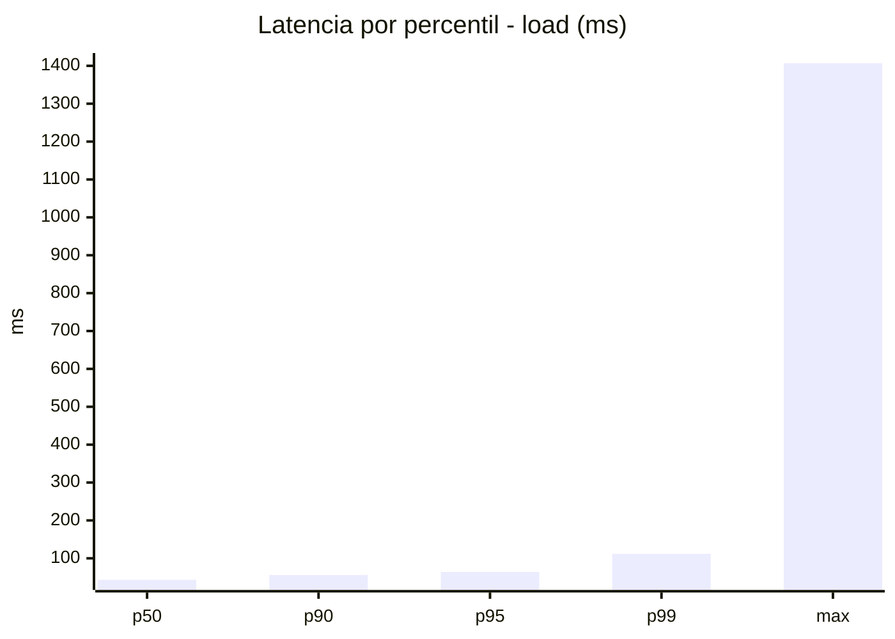
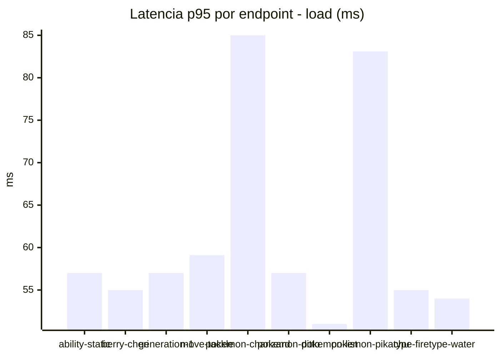
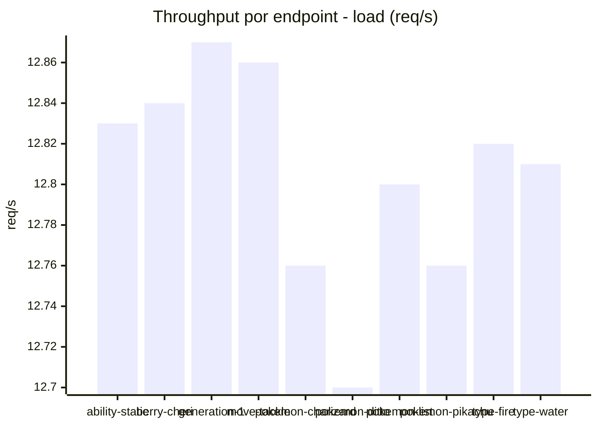
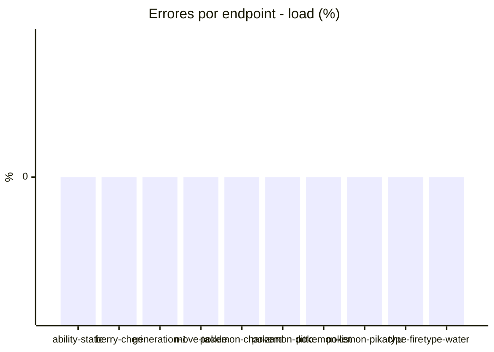
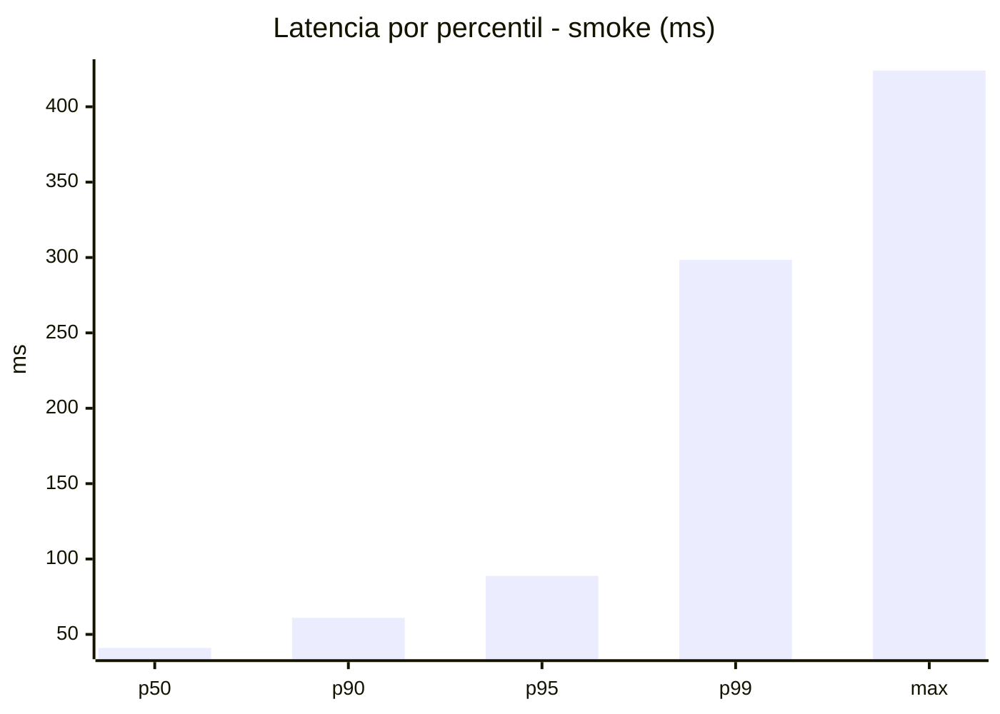
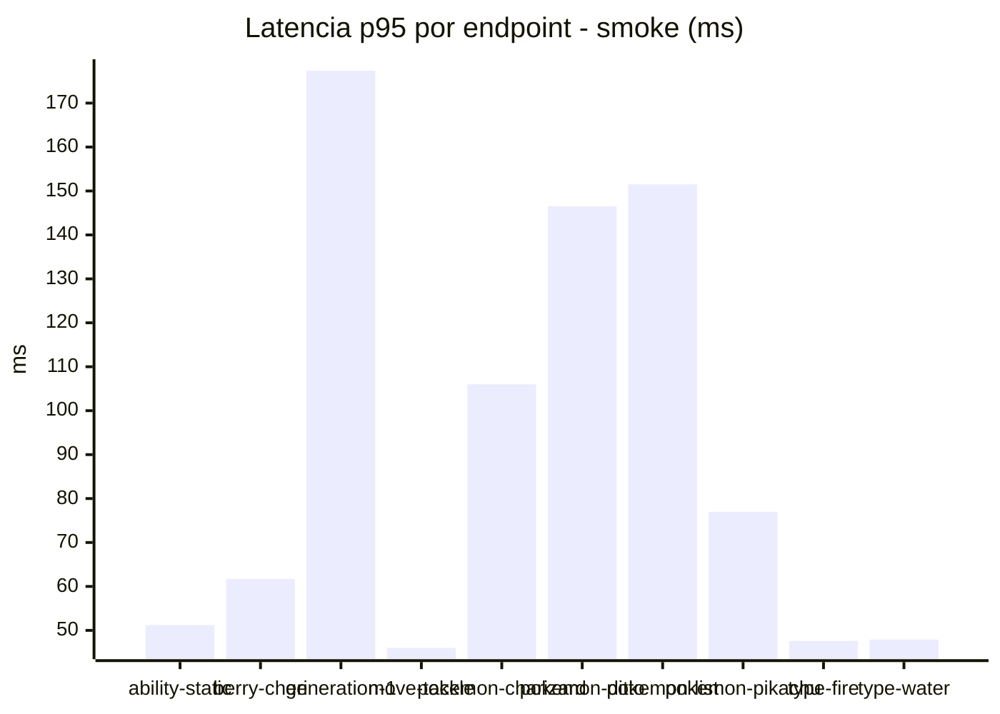
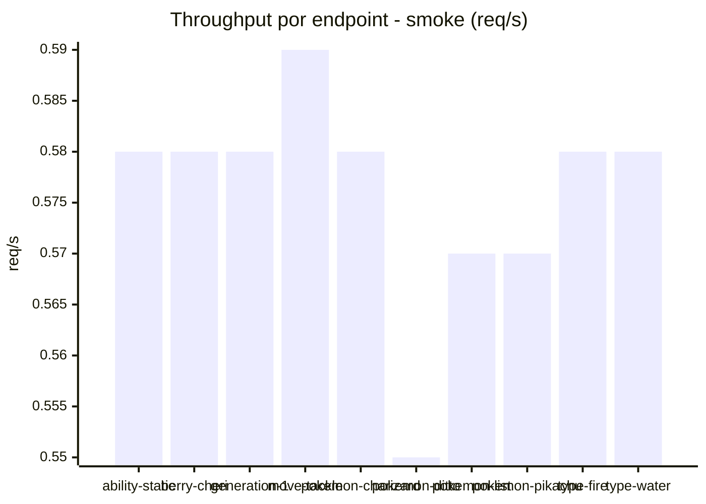

# Reporte de performance - PokeAPI

**Fecha:** 2026-09-21 18:29 UTC  
**Veredicto del agente:** `PASS`  
**Corrida:** [ver en GitHub Actions](https://github.com/lrbg/jmeter-pokeapi-lab/actions/runs/35638403843)  

## Validacion del agente de IA

PASS (fallback por umbrales)

- Error maximo: 0.0%
- p95 maximo: 88.8 ms

## Resultados

### Escenario: `load`

| Metrica | Valor |
| --- | --- |
| Muestras | 15189 |
| Errores | 0 (0.0%) |
| Latencia media | 46.1 ms |
| p50 / p90 / p95 / p99 | 43.0 / 56.0 / 64.0 / 112.0 ms |
| Min / Max | 26 / 1407 ms |
| Throughput | 126.93 req/s |
| Duracion | 119.7 s |

Detalle por endpoint

| Endpoint | Muestras | Error % | avg | p95 | p99 | req/s |
| --- | --- | --- | --- | --- | --- | --- |
| ability-static | 1519 | 0.0% | 44.5 | 57.0 | 89.8 | 12.83 |
| berry-cheri | 1519 | 0.0% | 43.8 | 55.0 | 97.6 | 12.84 |
| generation-1 | 1518 | 0.0% | 44.6 | 57.0 | 89.8 | 12.87 |
| move-tackle | 1519 | 0.0% | 45.0 | 59.1 | 92.5 | 12.86 |
| pokemon-charizard | 1519 | 0.0% | 57.2 | 85.0 | 155.0 | 12.76 |
| pokemon-ditto | 1519 | 0.0% | 43.4 | 57.0 | 81.8 | 12.7 |
| pokemon-list | 1519 | 0.0% | 41.3 | 51.0 | 90.6 | 12.8 |
| pokemon-pikachu | 1519 | 0.0% | 55.2 | 83.1 | 149.8 | 12.76 |
| type-fire | 1519 | 0.0% | 43.0 | 55.0 | 80.8 | 12.82 |
| type-water | 1519 | 0.0% | 42.9 | 54.0 | 91.8 | 12.81 |

### Escenario: `smoke`

| Metrica | Valor |
| --- | --- |
| Muestras | 152 |
| Errores | 0 (0.0%) |
| Latencia media | 50.4 ms |
| p50 / p90 / p95 / p99 | 41.0 / 61.0 / 88.8 / 298.4 ms |
| Min / Max | 28 / 424 ms |
| Throughput | 5.22 req/s |
| Duracion | 29.1 s |

Detalle por endpoint

| Endpoint | Muestras | Error % | avg | p95 | p99 | req/s |
| --- | --- | --- | --- | --- | --- | --- |
| ability-static | 15 | 0.0% | 40.8 | 51.2 | 53.4 | 0.58 |
| berry-cheri | 15 | 0.0% | 39.9 | 61.7 | 72.3 | 0.58 |
| generation-1 | 15 | 0.0% | 66.4 | 177.4 | 271.5 | 0.58 |
| move-tackle | 15 | 0.0% | 38 | 46.0 | 46.0 | 0.59 |
| pokemon-charizard | 15 | 0.0% | 63.4 | 106.0 | 117.2 | 0.58 |
| pokemon-ditto | 16 | 0.0% | 62.2 | 146.5 | 368.5 | 0.55 |
| pokemon-list | 15 | 0.0% | 59.8 | 151.5 | 271.9 | 0.57 |
| pokemon-pikachu | 16 | 0.0% | 54.5 | 77.0 | 113.0 | 0.57 |
| type-fire | 15 | 0.0% | 38.1 | 47.6 | 48.7 | 0.58 |
| type-water | 15 | 0.0% | 39.5 | 47.9 | 49.6 | 0.58 |

