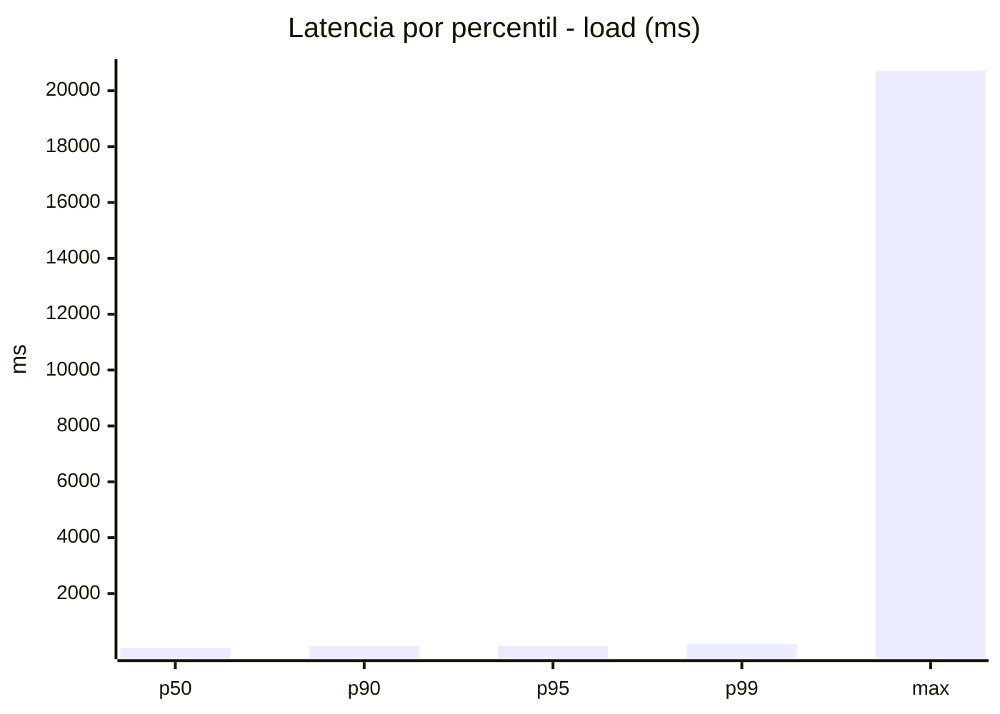
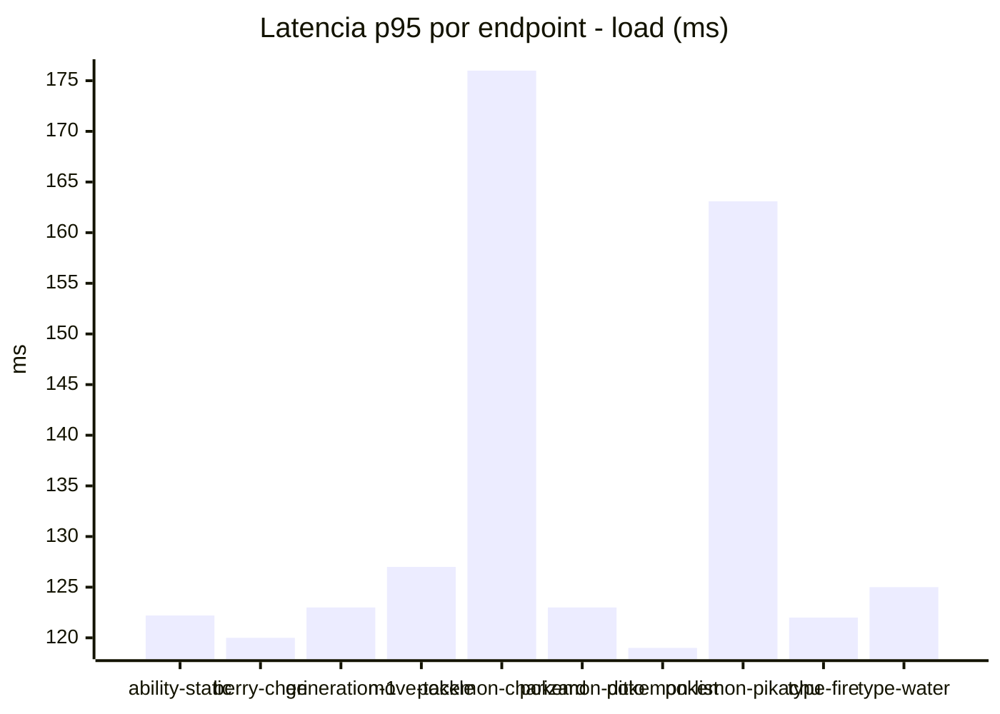
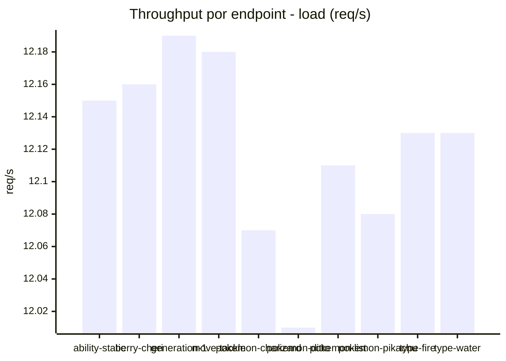
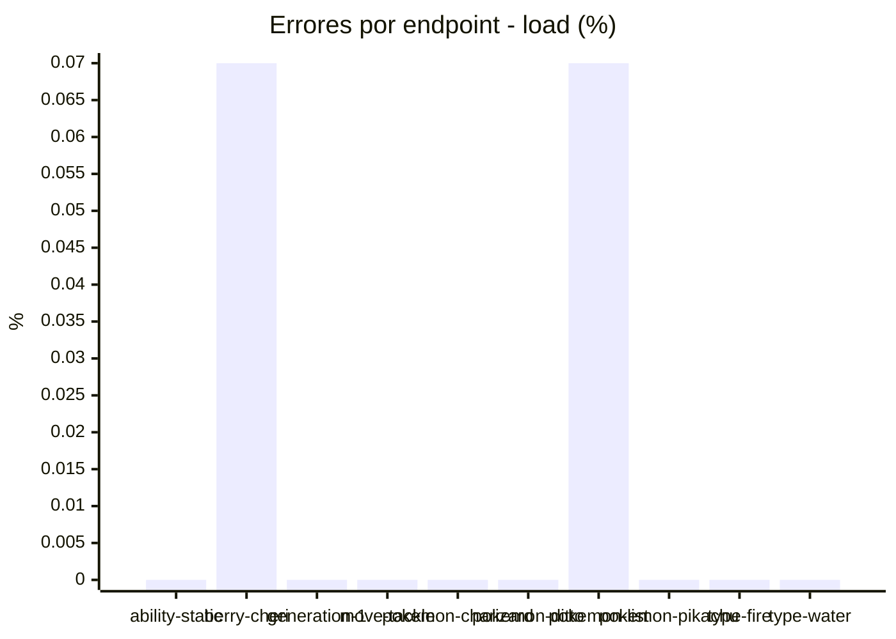
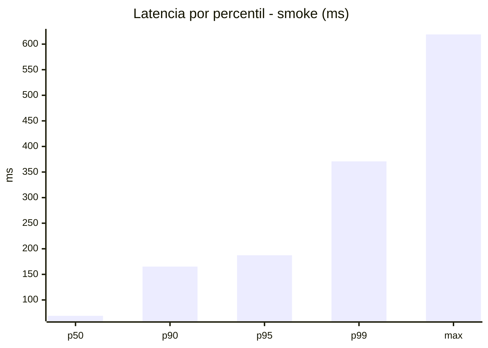
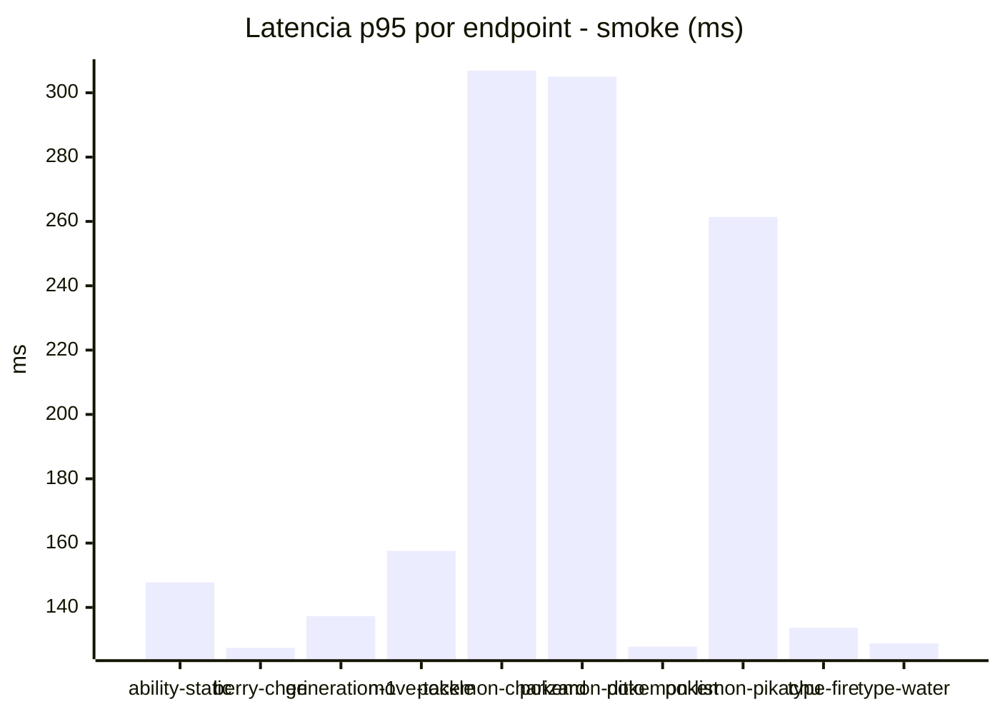
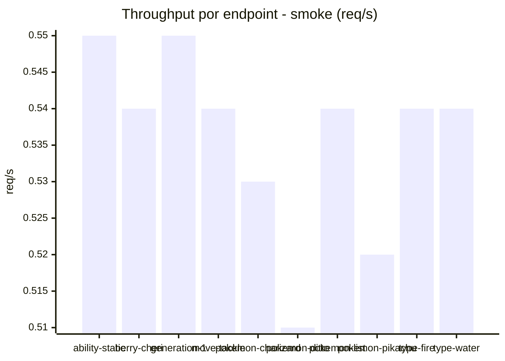
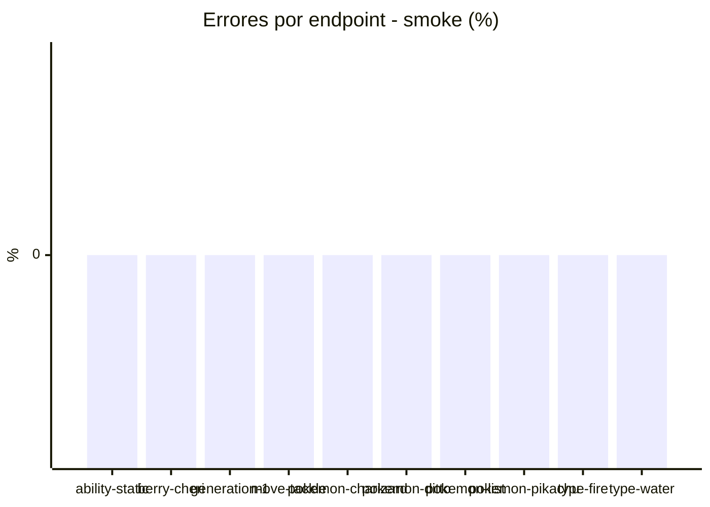

# Reporte de performance - PokeAPI

**Fecha:** 2026-09-22 17:32 UTC  
**Veredicto del agente:** `PASS`  
**Corrida:** [ver en GitHub Actions](https://github.com/lrbg/jmeter-pokeapi-lab/actions/runs/35761097860)  

## Validacion del agente de IA

PASS (fallback por umbrales)

- Error maximo: 0.01%
- p95 maximo: 187.4 ms

## Resultados

### Escenario: `load`

| Metrica | Valor |
| --- | --- |
| Muestras | 14375 |
| Errores | 2 (0.01%) |
| Latencia media | 65.7 ms |
| p50 / p90 / p95 / p99 | 51.0 / 114.0 / 125.0 / 186.0 ms |
| Min / Max | 28 / 20723 ms |
| Throughput | 120.07 req/s |
| Duracion | 119.7 s |

Detalle por endpoint

| Endpoint | Muestras | Error % | avg | p95 | p99 | req/s |
| --- | --- | --- | --- | --- | --- | --- |
| ability-static | 1437 | 0.0% | 58.8 | 122.2 | 138.0 | 12.15 |
| berry-cheri | 1437 | 0.07% | 59.2 | 120.0 | 132.0 | 12.16 |
| generation-1 | 1437 | 0.0% | 58.4 | 123.0 | 137.6 | 12.19 |
| move-tackle | 1437 | 0.0% | 60.3 | 127.0 | 164.0 | 12.18 |
| pokemon-charizard | 1438 | 0.0% | 85.9 | 176.0 | 365.9 | 12.07 |
| pokemon-ditto | 1438 | 0.0% | 56.0 | 123.0 | 140.8 | 12.01 |
| pokemon-list | 1438 | 0.07% | 58.5 | 119.0 | 152.5 | 12.11 |
| pokemon-pikachu | 1438 | 0.0% | 79.4 | 163.1 | 228.5 | 12.08 |
| type-fire | 1437 | 0.0% | 65.7 | 122.0 | 153.8 | 12.13 |
| type-water | 1438 | 0.0% | 74.6 | 125.0 | 139.3 | 12.13 |

### Escenario: `smoke`

| Metrica | Valor |
| --- | --- |
| Muestras | 140 |
| Errores | 0 (0.0%) |
| Latencia media | 101.7 ms |
| p50 / p90 / p95 / p99 | 69.0 / 165.2 / 187.4 / 370.9 ms |
| Min / Max | 58 / 619 ms |
| Throughput | 4.78 req/s |
| Duracion | 29.3 s |

Detalle por endpoint

| Endpoint | Muestras | Error % | avg | p95 | p99 | req/s |
| --- | --- | --- | --- | --- | --- | --- |
| ability-static | 14 | 0.0% | 99.3 | 147.8 | 160.7 | 0.55 |
| berry-cheri | 14 | 0.0% | 77.1 | 127.4 | 129.5 | 0.54 |
| generation-1 | 14 | 0.0% | 89.9 | 137.3 | 146.7 | 0.55 |
| move-tackle | 14 | 0.0% | 94.6 | 157.6 | 188.3 | 0.54 |
| pokemon-charizard | 14 | 0.0% | 161.2 | 306.9 | 345.4 | 0.53 |
| pokemon-ditto | 14 | 0.0% | 118 | 305.0 | 556.2 | 0.51 |
| pokemon-list | 14 | 0.0% | 83.5 | 127.8 | 130.3 | 0.54 |
| pokemon-pikachu | 14 | 0.0% | 133.1 | 261.4 | 357.1 | 0.52 |
| type-fire | 14 | 0.0% | 87.9 | 133.7 | 134.7 | 0.54 |
| type-water | 14 | 0.0% | 72.6 | 128.8 | 131.3 | 0.54 |

