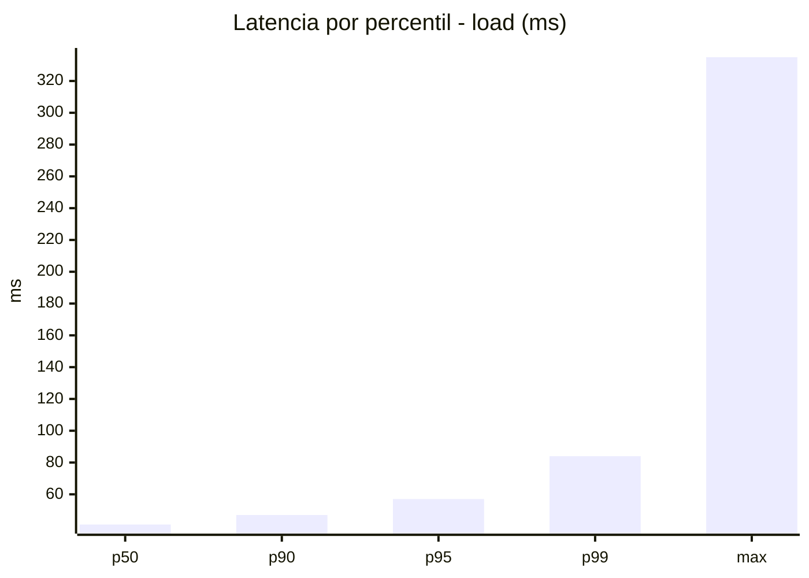
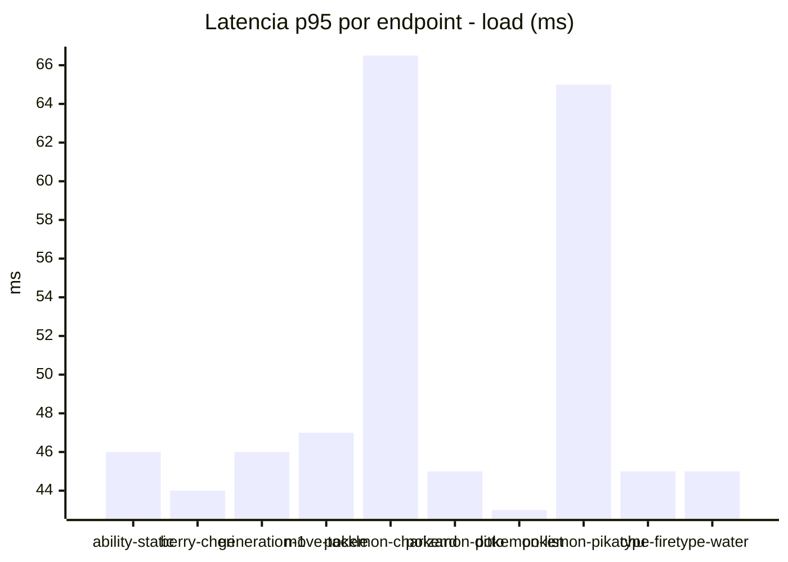
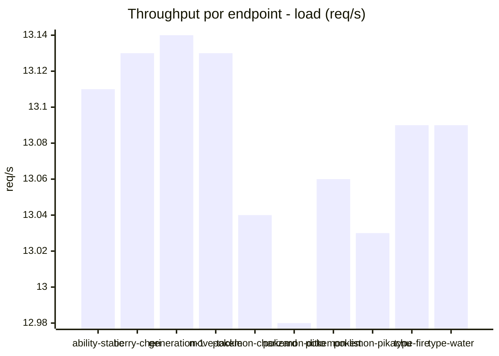
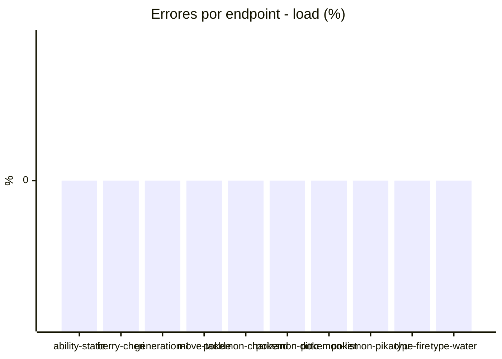
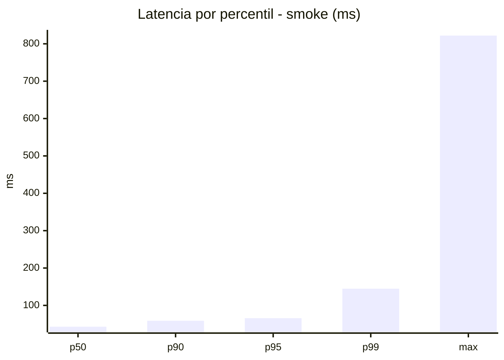
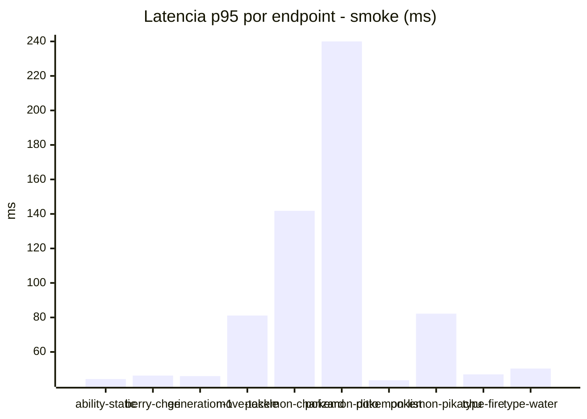
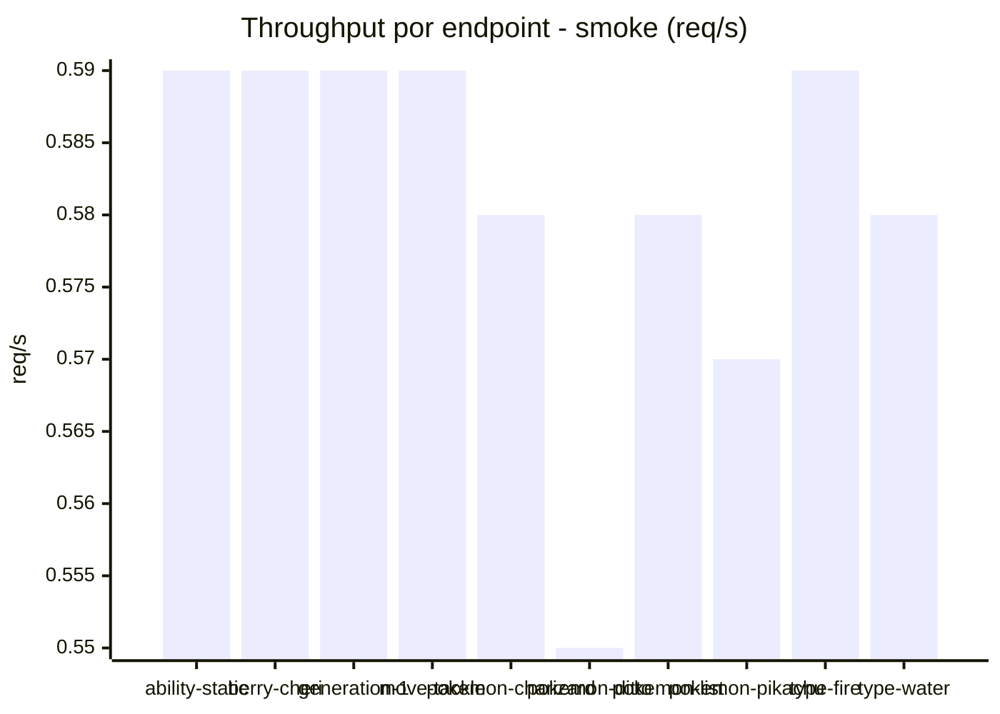

# Reporte de performance - PokeAPI

**Fecha:** 2026-09-23 17:43 UTC  
**Veredicto del agente:** `PASS`  
**Corrida:** [ver en GitHub Actions](https://github.com/lrbg/jmeter-pokeapi-lab/actions/runs/35897225224)  

## Validacion del agente de IA

PASS (fallback por umbrales)

- Error maximo: 0.0%
- p95 maximo: 65.9 ms

## Resultados

### Escenario: `load`

| Metrica | Valor |
| --- | --- |
| Muestras | 15513 |
| Errores | 0 (0.0%) |
| Latencia media | 38.9 ms |
| p50 / p90 / p95 / p99 | 41.0 / 47.0 / 57.0 / 84.0 ms |
| Min / Max | 20 / 335 ms |
| Throughput | 129.57 req/s |
| Duracion | 119.7 s |

Detalle por endpoint

| Endpoint | Muestras | Error % | avg | p95 | p99 | req/s |
| --- | --- | --- | --- | --- | --- | --- |
| ability-static | 1551 | 0.0% | 38.0 | 46.0 | 59.5 | 13.11 |
| berry-cheri | 1551 | 0.0% | 37.1 | 44.0 | 47.0 | 13.13 |
| generation-1 | 1551 | 0.0% | 37.5 | 46.0 | 57.5 | 13.14 |
| move-tackle | 1551 | 0.0% | 39.3 | 47.0 | 75.5 | 13.13 |
| pokemon-charizard | 1551 | 0.0% | 47.7 | 66.5 | 144.5 | 13.04 |
| pokemon-ditto | 1552 | 0.0% | 37.3 | 45.0 | 54.0 | 12.98 |
| pokemon-list | 1551 | 0.0% | 34.3 | 43.0 | 63.0 | 13.06 |
| pokemon-pikachu | 1552 | 0.0% | 44.2 | 65.0 | 126.5 | 13.03 |
| type-fire | 1551 | 0.0% | 37.0 | 45.0 | 49.5 | 13.09 |
| type-water | 1552 | 0.0% | 36.4 | 45.0 | 52.0 | 13.09 |

### Escenario: `smoke`

| Metrica | Valor |
| --- | --- |
| Muestras | 152 |
| Errores | 0 (0.0%) |
| Latencia media | 51.1 ms |
| p50 / p90 / p95 / p99 | 43.0 / 58.9 / 65.9 / 144.8 ms |
| Min / Max | 29 / 822 ms |
| Throughput | 5.2 req/s |
| Duracion | 29.2 s |

Detalle por endpoint

| Endpoint | Muestras | Error % | avg | p95 | p99 | req/s |
| --- | --- | --- | --- | --- | --- | --- |
| ability-static | 15 | 0.0% | 39.1 | 44.3 | 44.9 | 0.59 |
| berry-cheri | 15 | 0.0% | 39.4 | 46.3 | 46.9 | 0.59 |
| generation-1 | 15 | 0.0% | 41.5 | 46.0 | 46.0 | 0.59 |
| move-tackle | 15 | 0.0% | 49.3 | 81.1 | 124.2 | 0.59 |
| pokemon-charizard | 15 | 0.0% | 70.1 | 141.8 | 150.8 | 0.58 |
| pokemon-ditto | 16 | 0.0% | 88.6 | 240.0 | 705.6 | 0.55 |
| pokemon-list | 15 | 0.0% | 40.5 | 43.6 | 44.7 | 0.58 |
| pokemon-pikachu | 16 | 0.0% | 57.6 | 82.2 | 123.6 | 0.57 |
| type-fire | 15 | 0.0% | 41.9 | 47.0 | 47.0 | 0.59 |
| type-water | 15 | 0.0% | 40.2 | 50.4 | 54.9 | 0.58 |

