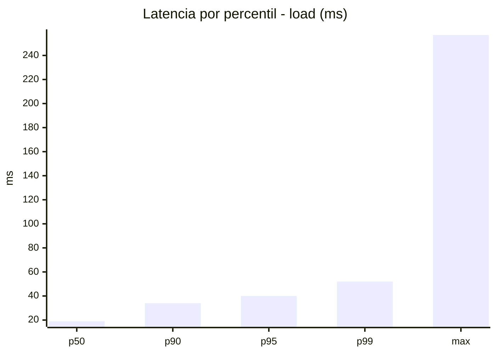
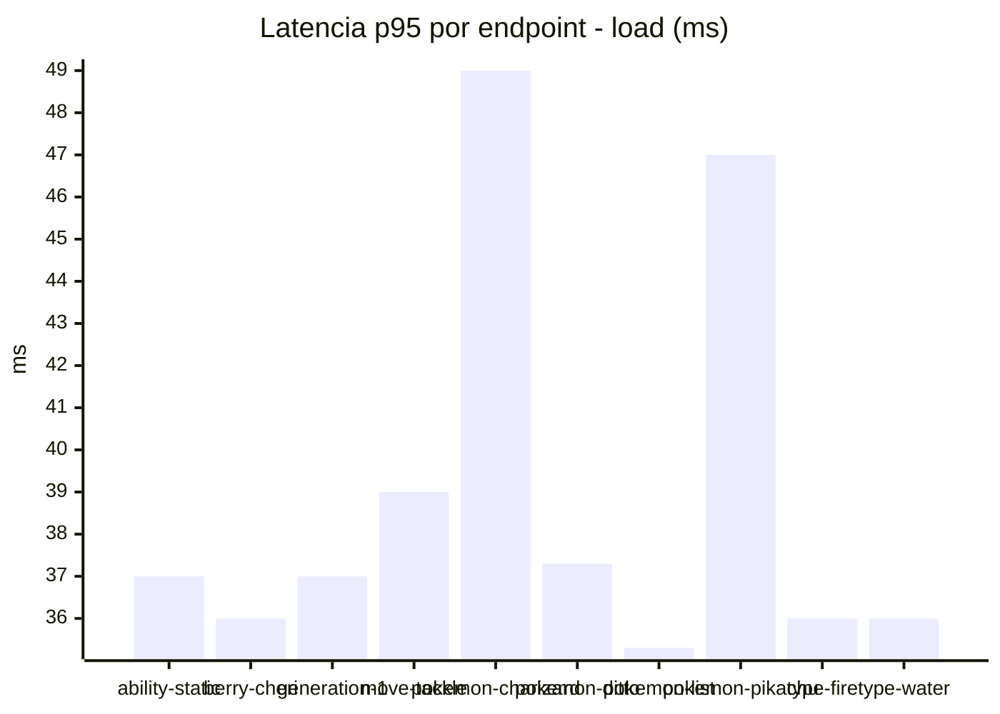
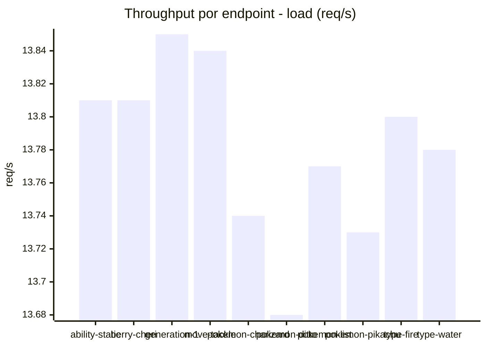
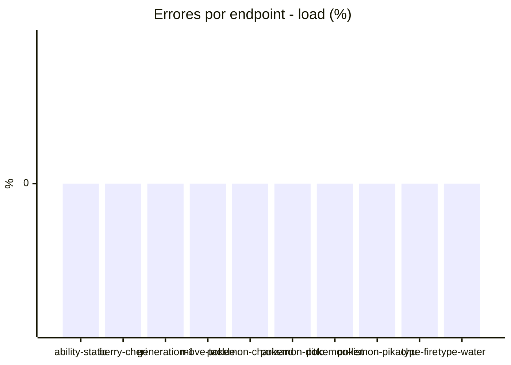
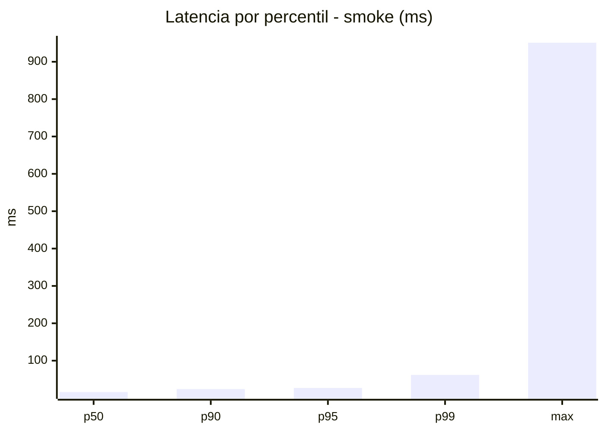
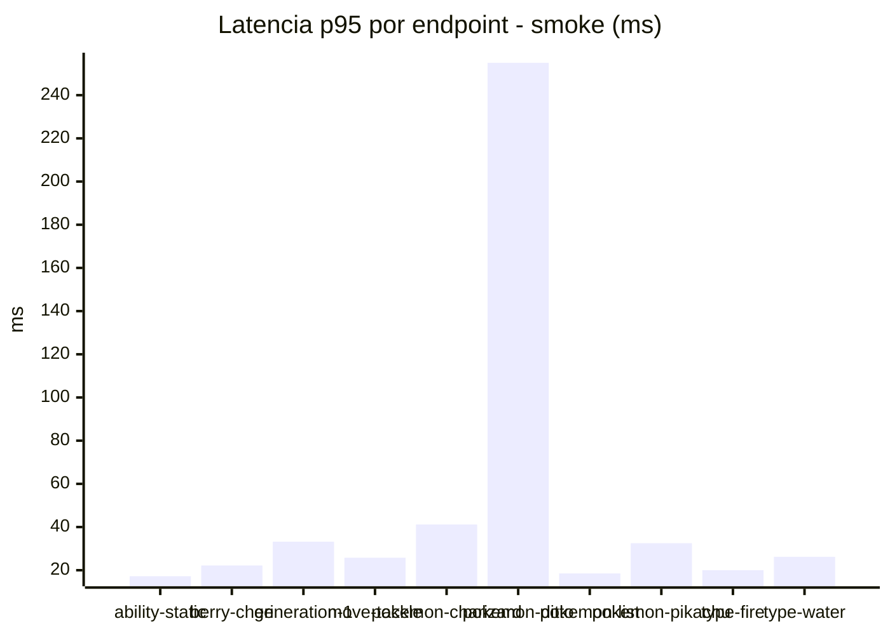
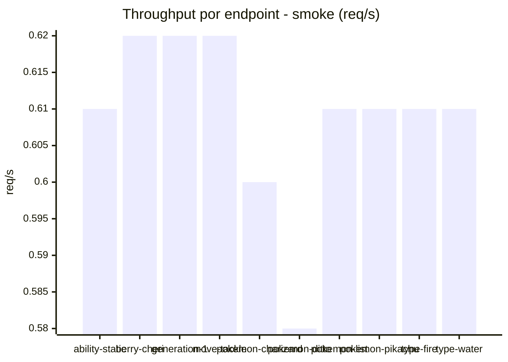

# Reporte de performance - PokeAPI

**Fecha:** 2026-09-24 17:46 UTC  
**Veredicto del agente:** `PASS`  
**Corrida:** [ver en GitHub Actions](https://github.com/lrbg/jmeter-pokeapi-lab/actions/runs/36036262825)  

## Validacion del agente de IA

PASS (fallback por umbrales)

- Error maximo: 0.0%
- p95 maximo: 40.0 ms

## Resultados

### Escenario: `load`

| Metrica | Valor |
| --- | --- |
| Muestras | 16346 |
| Errores | 0 (0.0%) |
| Latencia media | 21.4 ms |
| p50 / p90 / p95 / p99 | 19.0 / 34.0 / 40.0 / 52.0 ms |
| Min / Max | 10 / 257 ms |
| Throughput | 136.67 req/s |
| Duracion | 119.6 s |

Detalle por endpoint

| Endpoint | Muestras | Error % | avg | p95 | p99 | req/s |
| --- | --- | --- | --- | --- | --- | --- |
| ability-static | 1635 | 0.0% | 20.8 | 37.0 | 46.0 | 13.81 |
| berry-cheri | 1635 | 0.0% | 20.8 | 36.0 | 43.0 | 13.81 |
| generation-1 | 1634 | 0.0% | 20.8 | 37.0 | 44.0 | 13.85 |
| move-tackle | 1634 | 0.0% | 21.2 | 39.0 | 47.0 | 13.84 |
| pokemon-charizard | 1635 | 0.0% | 24.8 | 49.0 | 68.0 | 13.74 |
| pokemon-ditto | 1635 | 0.0% | 20.7 | 37.3 | 48.3 | 13.68 |
| pokemon-list | 1635 | 0.0% | 19.5 | 35.3 | 42.0 | 13.77 |
| pokemon-pikachu | 1635 | 0.0% | 23.9 | 47.0 | 70.7 | 13.73 |
| type-fire | 1634 | 0.0% | 20.5 | 36.0 | 44.0 | 13.8 |
| type-water | 1634 | 0.0% | 21.2 | 36.0 | 47.3 | 13.78 |

### Escenario: `smoke`

| Metrica | Valor |
| --- | --- |
| Muestras | 159 |
| Errores | 0 (0.0%) |
| Latencia media | 23.8 ms |
| p50 / p90 / p95 / p99 | 16.0 / 24.0 / 27.0 / 62.0 ms |
| Min / Max | 12 / 951 ms |
| Throughput | 5.47 req/s |
| Duracion | 29.1 s |

Detalle por endpoint

| Endpoint | Muestras | Error % | avg | p95 | p99 | req/s |
| --- | --- | --- | --- | --- | --- | --- |
| ability-static | 16 | 0.0% | 14.8 | 17.2 | 17.9 | 0.61 |
| berry-cheri | 16 | 0.0% | 15.8 | 22.2 | 34.8 | 0.62 |
| generation-1 | 15 | 0.0% | 18.7 | 33.2 | 52.2 | 0.62 |
| move-tackle | 16 | 0.0% | 17.1 | 25.8 | 27.5 | 0.62 |
| pokemon-charizard | 16 | 0.0% | 25.4 | 41.2 | 63.4 | 0.6 |
| pokemon-ditto | 16 | 0.0% | 75.3 | 255.0 | 811.8 | 0.58 |
| pokemon-list | 16 | 0.0% | 14.9 | 18.5 | 19.7 | 0.61 |
| pokemon-pikachu | 16 | 0.0% | 22.2 | 32.5 | 50.5 | 0.61 |
| type-fire | 16 | 0.0% | 15.6 | 20.0 | 22.4 | 0.61 |
| type-water | 16 | 0.0% | 17.8 | 26.2 | 26.9 | 0.61 |

