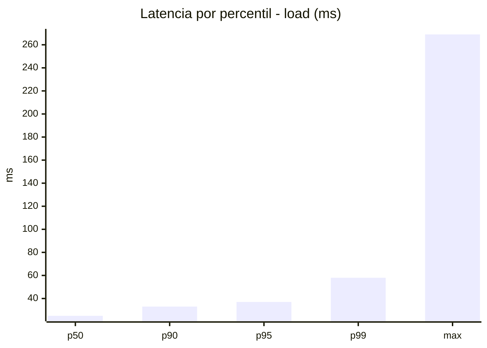
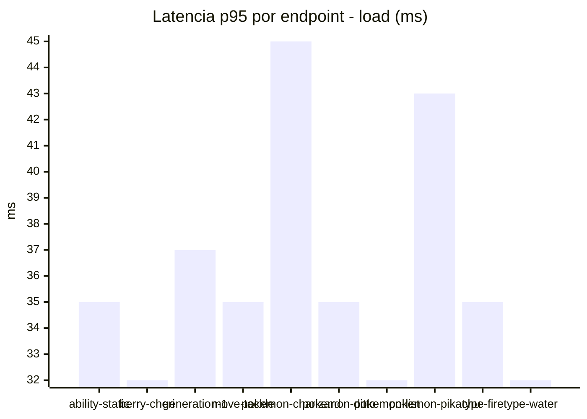
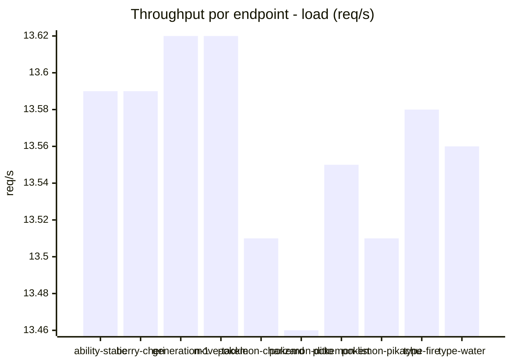
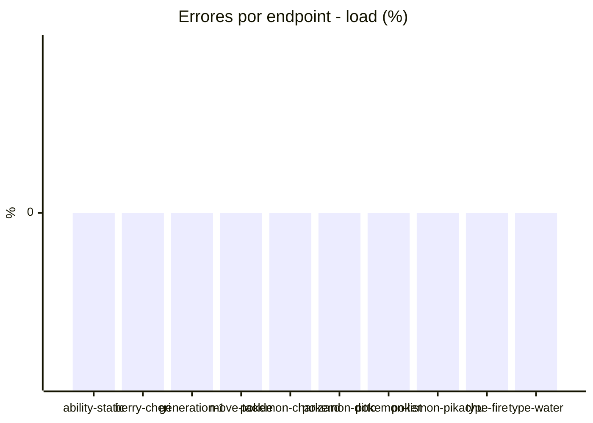
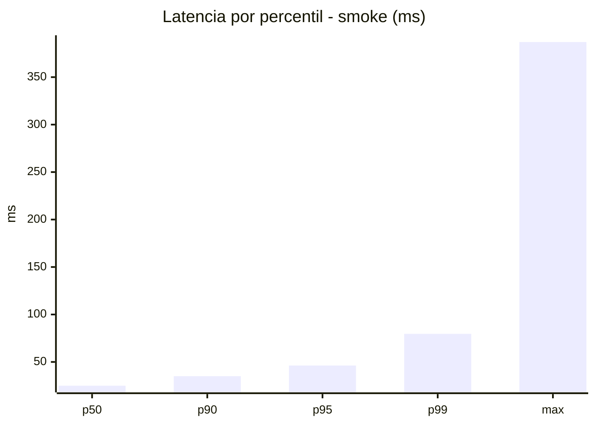
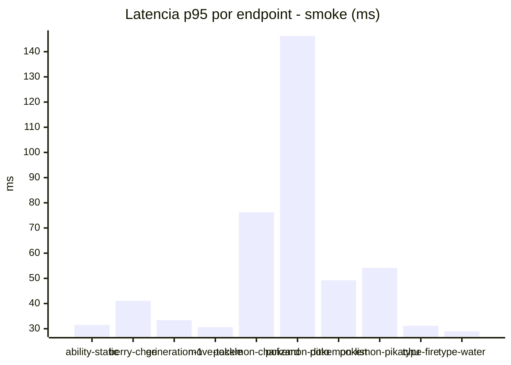
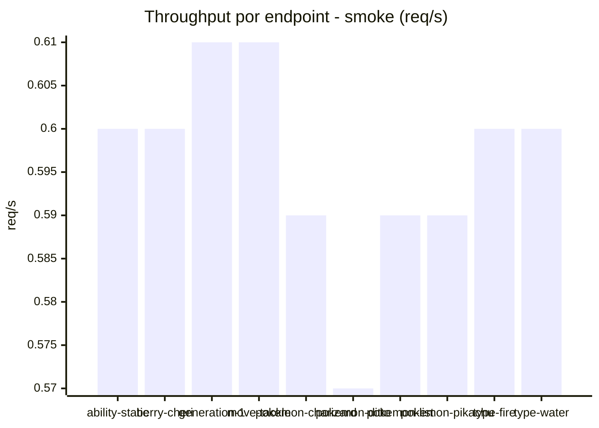

# Reporte de performance - PokeAPI

**Fecha:** 2026-09-25 17:47 UTC  
**Veredicto del agente:** `PASS`  
**Corrida:** [ver en GitHub Actions](https://github.com/lrbg/jmeter-pokeapi-lab/actions/runs/36169035659)  

## Validacion del agente de IA

PASS (fallback por umbrales)

- Error maximo: 0.0%
- p95 maximo: 46.2 ms

## Resultados

### Escenario: `load`

| Metrica | Valor |
| --- | --- |
| Muestras | 16084 |
| Errores | 0 (0.0%) |
| Latencia media | 26.8 ms |
| p50 / p90 / p95 / p99 | 25.0 / 33.0 / 37.0 / 58.0 ms |
| Min / Max | 18 / 269 ms |
| Throughput | 134.42 req/s |
| Duracion | 119.7 s |

Detalle por endpoint

| Endpoint | Muestras | Error % | avg | p95 | p99 | req/s |
| --- | --- | --- | --- | --- | --- | --- |
| ability-static | 1608 | 0.0% | 26.0 | 35.0 | 51.9 | 13.59 |
| berry-cheri | 1608 | 0.0% | 24.7 | 32.0 | 50.0 | 13.59 |
| generation-1 | 1608 | 0.0% | 27.0 | 37.0 | 59.0 | 13.62 |
| move-tackle | 1608 | 0.0% | 26.1 | 35.0 | 45.9 | 13.62 |
| pokemon-charizard | 1609 | 0.0% | 32.1 | 45.0 | 71.9 | 13.51 |
| pokemon-ditto | 1609 | 0.0% | 25.7 | 35.0 | 49.0 | 13.46 |
| pokemon-list | 1608 | 0.0% | 24.7 | 32.0 | 48.9 | 13.55 |
| pokemon-pikachu | 1609 | 0.0% | 30.6 | 43.0 | 65.0 | 13.51 |
| type-fire | 1609 | 0.0% | 26.1 | 35.0 | 48.8 | 13.58 |
| type-water | 1608 | 0.0% | 24.7 | 32.0 | 55.0 | 13.56 |

### Escenario: `smoke`

| Metrica | Valor |
| --- | --- |
| Muestras | 157 |
| Errores | 0 (0.0%) |
| Latencia media | 30.7 ms |
| p50 / p90 / p95 / p99 | 25.0 / 35.0 / 46.2 / 79.6 ms |
| Min / Max | 19 / 387 ms |
| Throughput | 5.39 req/s |
| Duracion | 29.1 s |

Detalle por endpoint

| Endpoint | Muestras | Error % | avg | p95 | p99 | req/s |
| --- | --- | --- | --- | --- | --- | --- |
| ability-static | 16 | 0.0% | 25.2 | 31.5 | 32.7 | 0.6 |
| berry-cheri | 15 | 0.0% | 24.7 | 41.1 | 45.0 | 0.6 |
| generation-1 | 15 | 0.0% | 26.4 | 33.4 | 43.5 | 0.61 |
| move-tackle | 15 | 0.0% | 25.5 | 30.6 | 31.7 | 0.61 |
| pokemon-charizard | 16 | 0.0% | 39.7 | 76.2 | 76.8 | 0.59 |
| pokemon-ditto | 16 | 0.0% | 50.5 | 146.2 | 338.8 | 0.57 |
| pokemon-list | 16 | 0.0% | 30.4 | 49.2 | 76.2 | 0.59 |
| pokemon-pikachu | 16 | 0.0% | 34.4 | 54.2 | 62.0 | 0.59 |
| type-fire | 16 | 0.0% | 25.4 | 31.2 | 34.2 | 0.6 |
| type-water | 16 | 0.0% | 23.8 | 29.0 | 29.0 | 0.6 |

