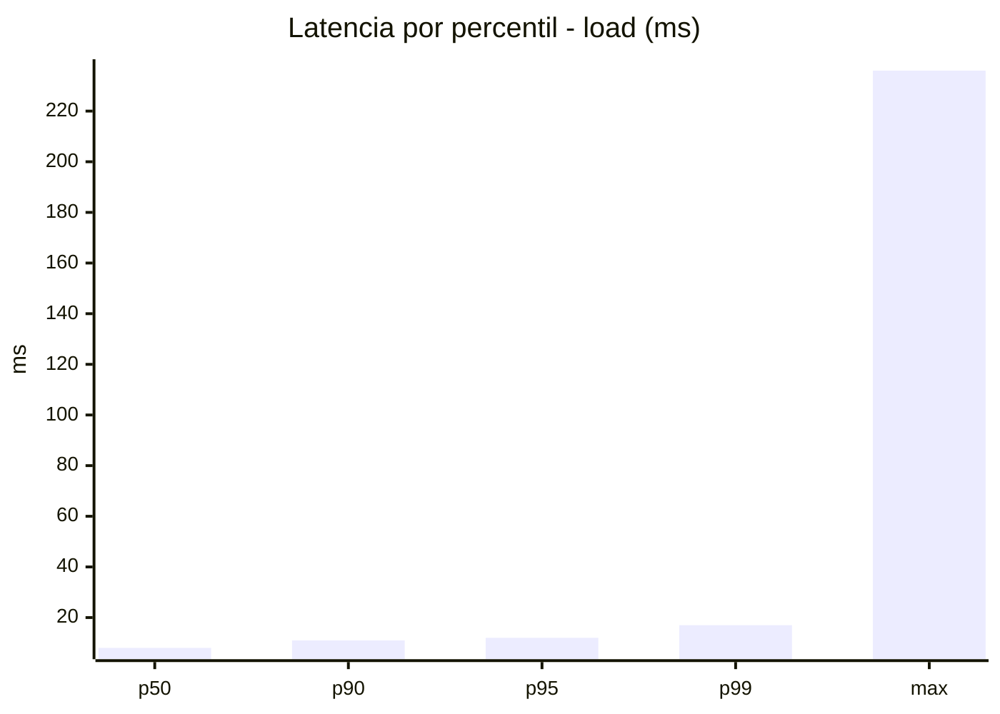
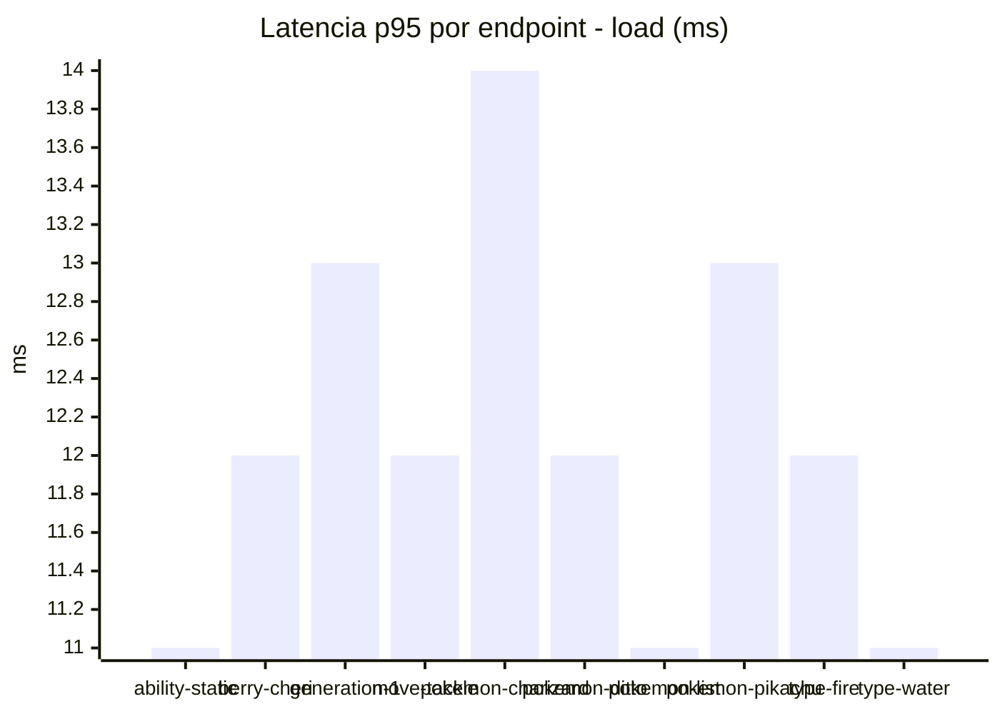
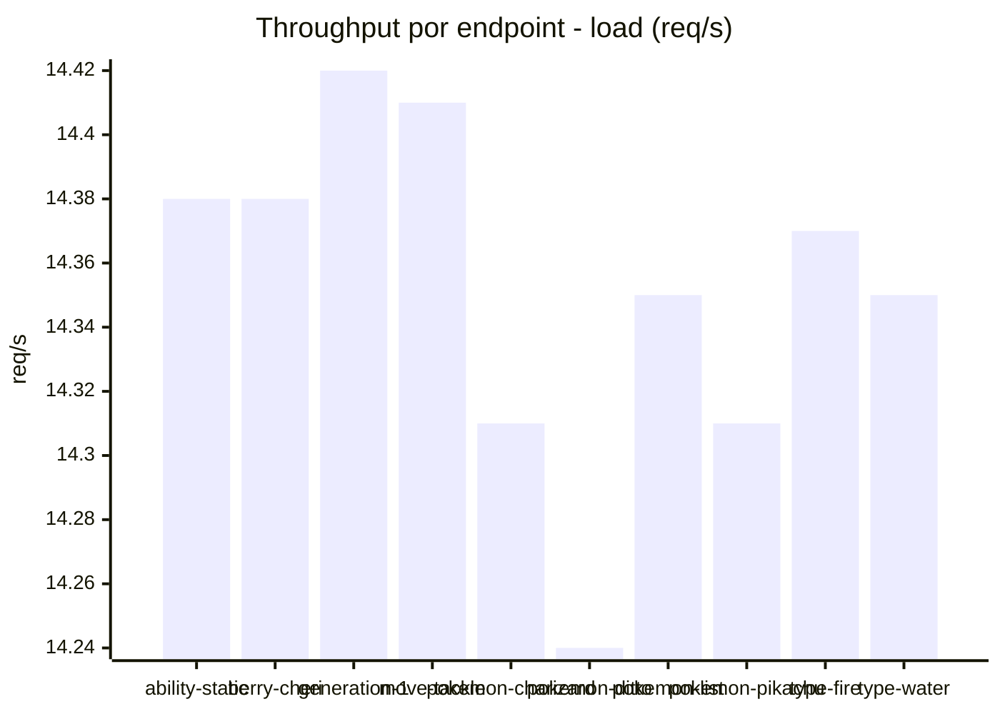
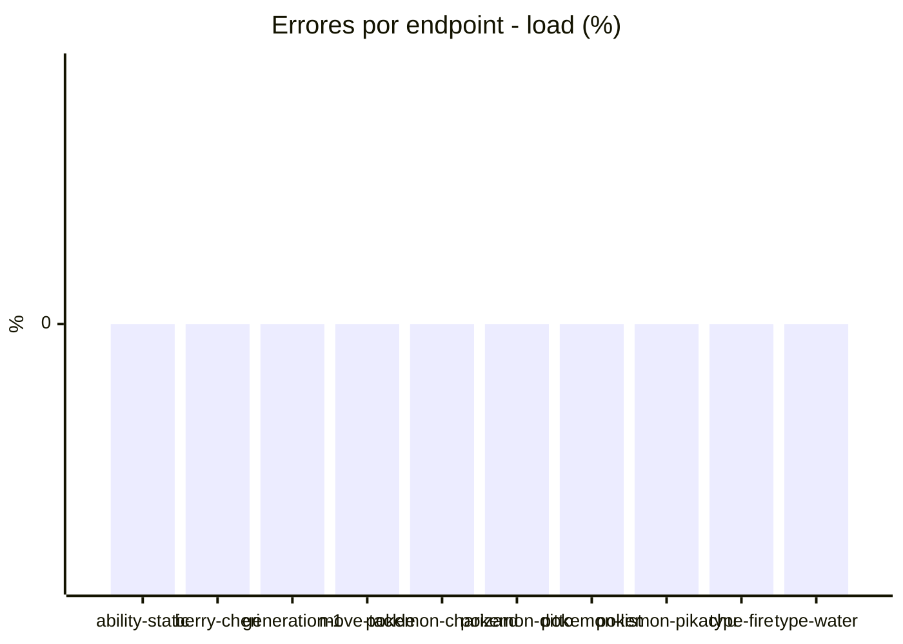
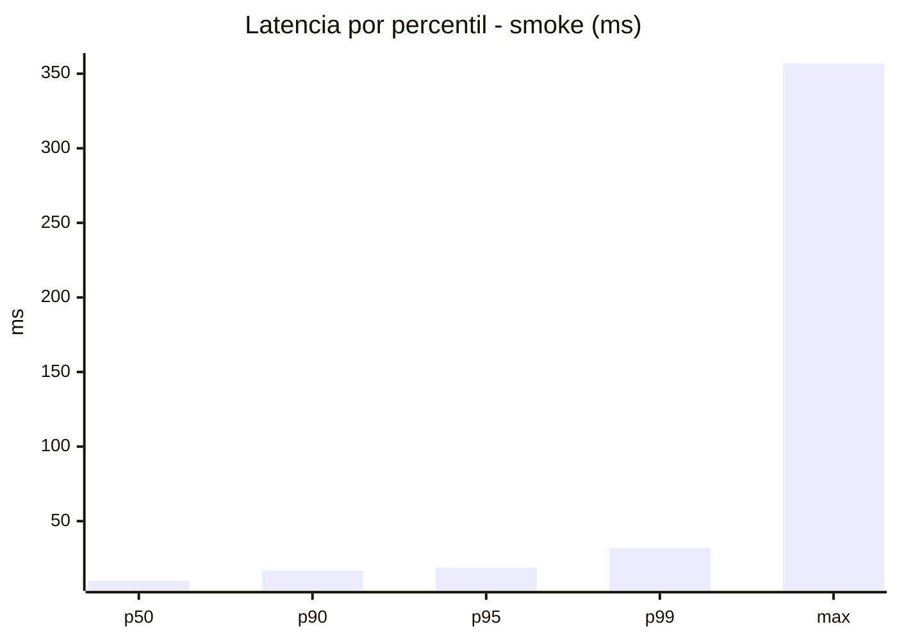
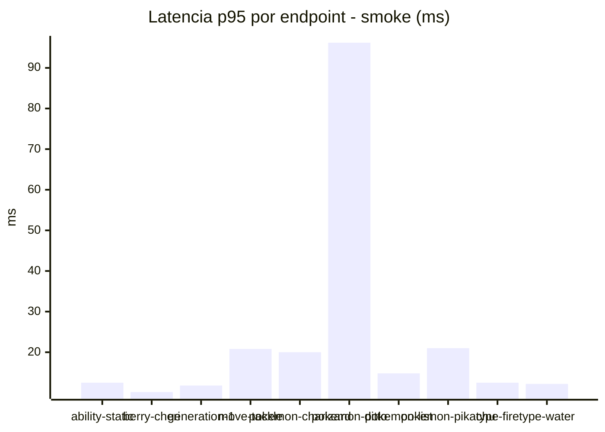
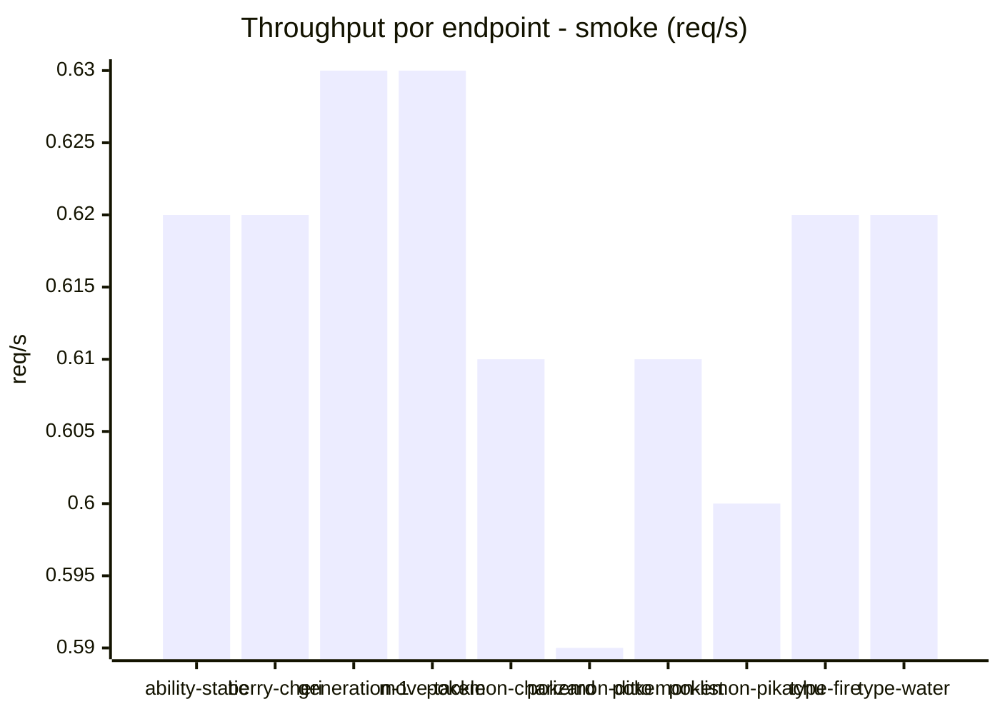

# Reporte de performance - PokeAPI

**Fecha:** 2026-09-26 16:54 UTC  
**Veredicto del agente:** `PASS`  
**Corrida:** [ver en GitHub Actions](https://github.com/lrbg/jmeter-pokeapi-lab/actions/runs/36256949422)  

## Validacion del agente de IA

PASS (fallback por umbrales)

- Error maximo: 0.0%
- p95 maximo: 19.0 ms

## Resultados

### Escenario: `load`

| Metrica | Valor |
| --- | --- |
| Muestras | 17028 |
| Errores | 0 (0.0%) |
| Latencia media | 8.6 ms |
| p50 / p90 / p95 / p99 | 8.0 / 11.0 / 12.0 / 17.0 ms |
| Min / Max | 5 / 236 ms |
| Throughput | 142.37 req/s |
| Duracion | 119.6 s |

Detalle por endpoint

| Endpoint | Muestras | Error % | avg | p95 | p99 | req/s |
| --- | --- | --- | --- | --- | --- | --- |
| ability-static | 1702 | 0.0% | 8.2 | 11.0 | 15.0 | 14.38 |
| berry-cheri | 1702 | 0.0% | 8.3 | 12.0 | 16.0 | 14.38 |
| generation-1 | 1702 | 0.0% | 8.6 | 13.0 | 17.0 | 14.42 |
| move-tackle | 1703 | 0.0% | 8.4 | 12.0 | 17.0 | 14.41 |
| pokemon-charizard | 1703 | 0.0% | 9.6 | 14.0 | 19.0 | 14.31 |
| pokemon-ditto | 1703 | 0.0% | 8.6 | 12.0 | 18.0 | 14.24 |
| pokemon-list | 1703 | 0.0% | 7.8 | 11.0 | 15.0 | 14.35 |
| pokemon-pikachu | 1704 | 0.0% | 9.2 | 13.0 | 23.0 | 14.31 |
| type-fire | 1703 | 0.0% | 8.5 | 12.0 | 18.0 | 14.37 |
| type-water | 1703 | 0.0% | 8.3 | 11.0 | 16.0 | 14.35 |

### Escenario: `smoke`

| Metrica | Valor |
| --- | --- |
| Muestras | 163 |
| Errores | 0 (0.0%) |
| Latencia media | 13.2 ms |
| p50 / p90 / p95 / p99 | 10.0 / 16.8 / 19.0 / 32.0 ms |
| Min / Max | 7 / 357 ms |
| Throughput | 5.57 req/s |
| Duracion | 29.2 s |

Detalle por endpoint

| Endpoint | Muestras | Error % | avg | p95 | p99 | req/s |
| --- | --- | --- | --- | --- | --- | --- |
| ability-static | 16 | 0.0% | 9.4 | 12.5 | 16.1 | 0.62 |
| berry-cheri | 16 | 0.0% | 8.5 | 10.2 | 10.8 | 0.62 |
| generation-1 | 16 | 0.0% | 9.8 | 11.8 | 13.5 | 0.63 |
| move-tackle | 16 | 0.0% | 12 | 20.8 | 29.7 | 0.63 |
| pokemon-charizard | 17 | 0.0% | 15.8 | 20.0 | 23.2 | 0.61 |
| pokemon-ditto | 17 | 0.0% | 31.3 | 96.2 | 304.8 | 0.59 |
| pokemon-list | 16 | 0.0% | 9.5 | 14.8 | 28.5 | 0.61 |
| pokemon-pikachu | 17 | 0.0% | 15.2 | 21.0 | 24.2 | 0.6 |
| type-fire | 16 | 0.0% | 9.6 | 12.5 | 18.5 | 0.62 |
| type-water | 16 | 0.0% | 9.3 | 12.2 | 12.8 | 0.62 |

