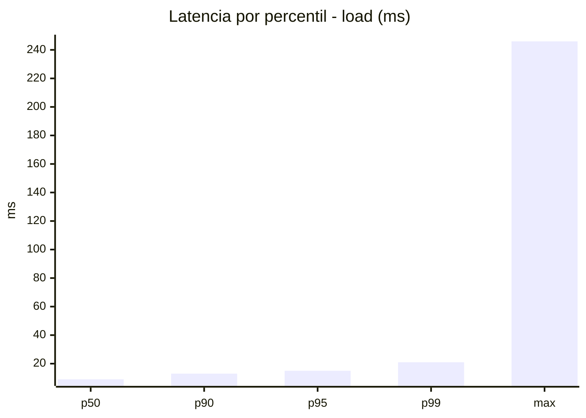
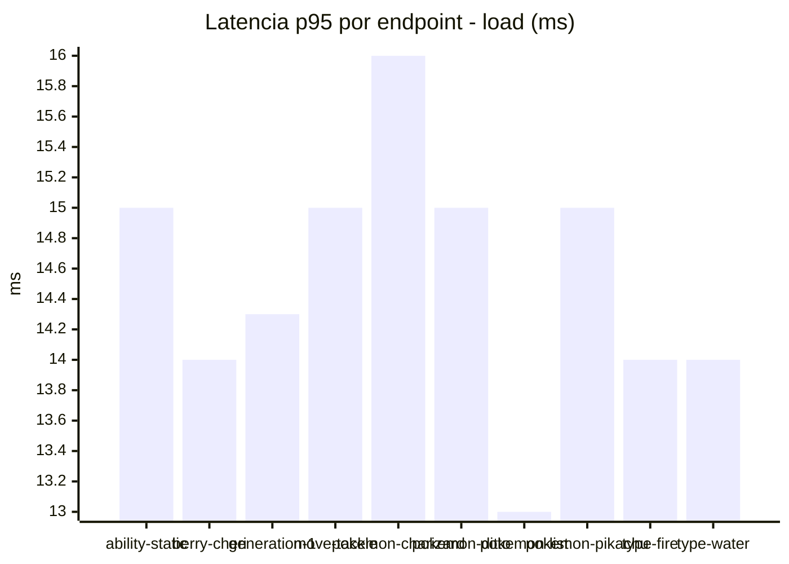
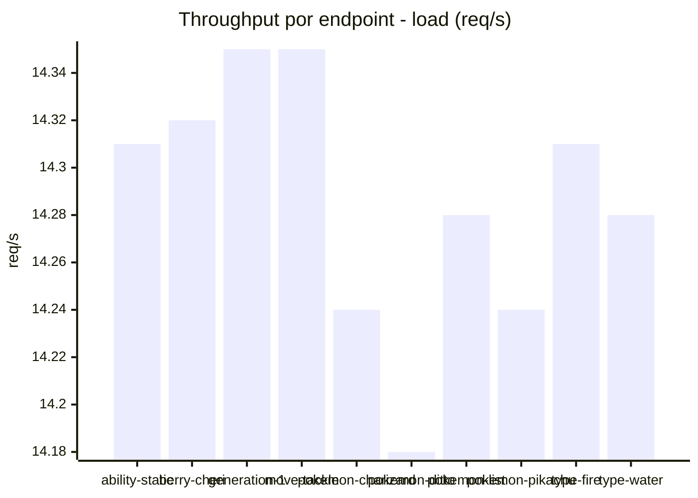
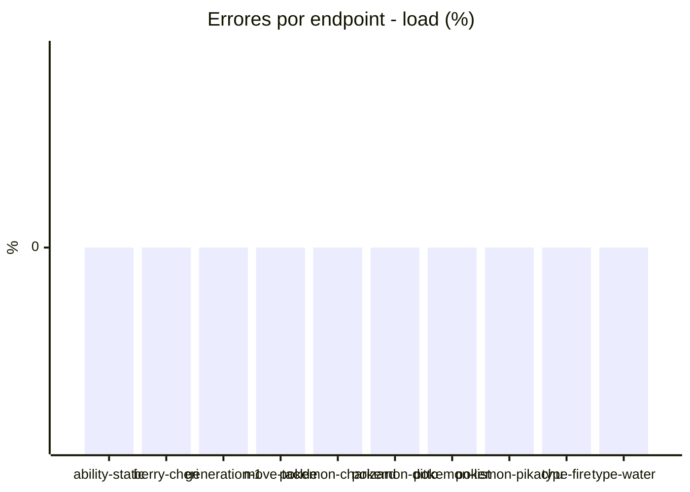
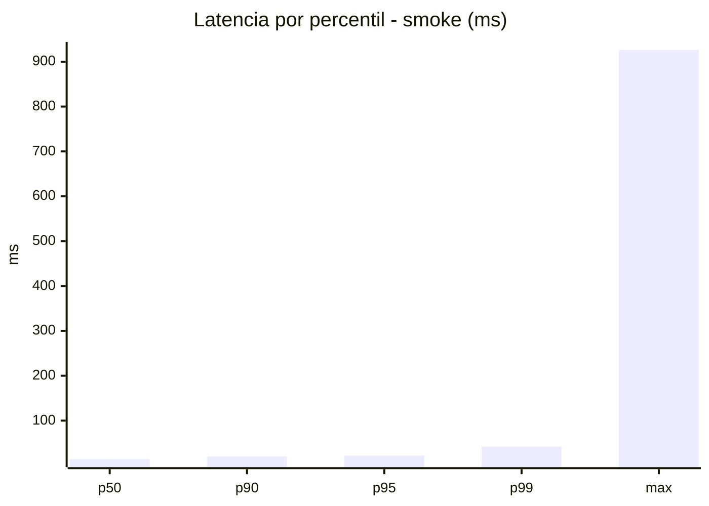
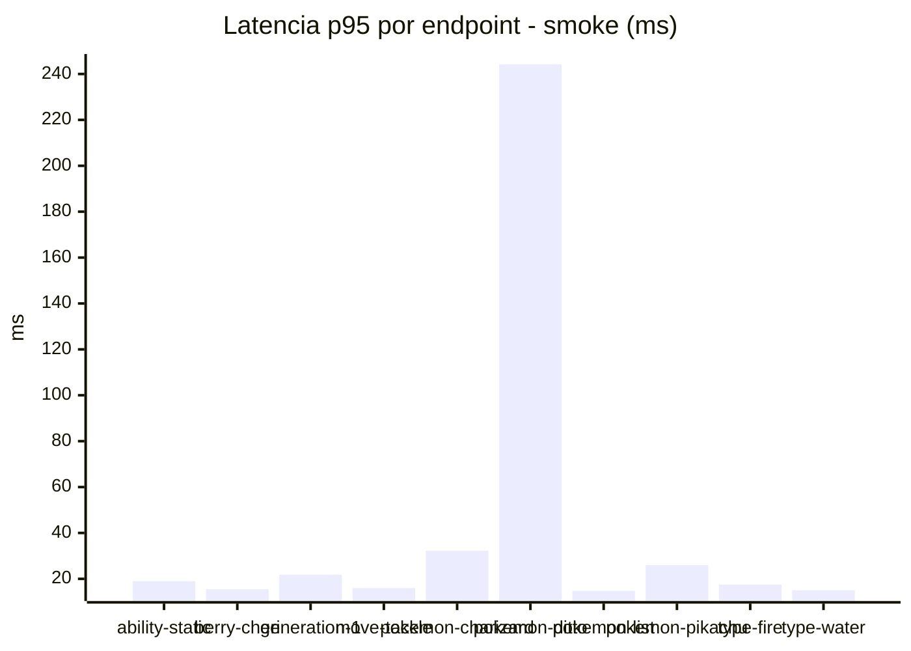
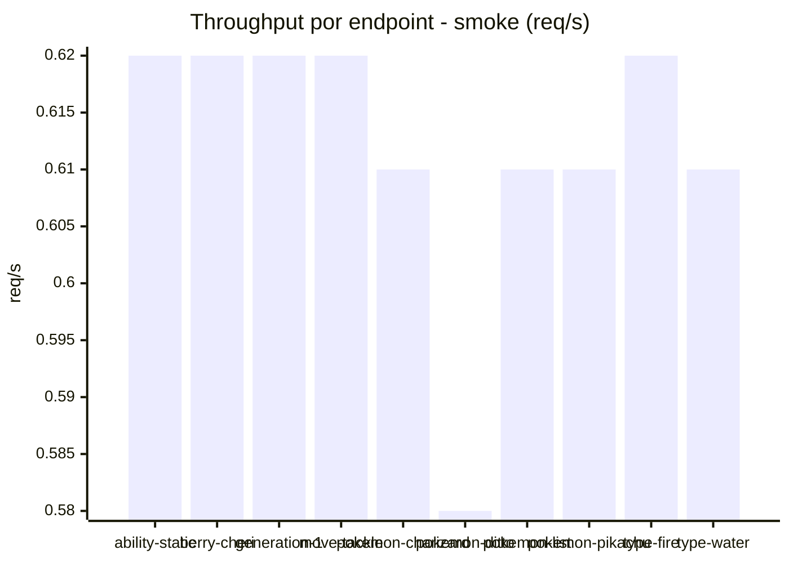

# Reporte de performance - PokeAPI

**Fecha:** 2026-09-27 17:29 UTC  
**Veredicto del agente:** `PASS`  
**Corrida:** [ver en GitHub Actions](https://github.com/lrbg/jmeter-pokeapi-lab/actions/runs/36336951691)  

## Validacion del agente de IA

PASS (fallback por umbrales)

- Error maximo: 0.0%
- p95 maximo: 22.0 ms

## Resultados

### Escenario: `load`

| Metrica | Valor |
| --- | --- |
| Muestras | 16949 |
| Errores | 0 (0.0%) |
| Latencia media | 10.0 ms |
| p50 / p90 / p95 / p99 | 9.0 / 13.0 / 15.0 / 21.0 ms |
| Min / Max | 5 / 246 ms |
| Throughput | 141.69 req/s |
| Duracion | 119.6 s |

Detalle por endpoint

| Endpoint | Muestras | Error % | avg | p95 | p99 | req/s |
| --- | --- | --- | --- | --- | --- | --- |
| ability-static | 1695 | 0.0% | 10.1 | 15.0 | 21.0 | 14.31 |
| berry-cheri | 1695 | 0.0% | 9.5 | 14.0 | 18.1 | 14.32 |
| generation-1 | 1694 | 0.0% | 9.9 | 14.3 | 21.0 | 14.35 |
| move-tackle | 1695 | 0.0% | 10.1 | 15.0 | 20.0 | 14.35 |
| pokemon-charizard | 1696 | 0.0% | 10.9 | 16.0 | 22.0 | 14.24 |
| pokemon-ditto | 1695 | 0.0% | 10.3 | 15.0 | 22.1 | 14.18 |
| pokemon-list | 1694 | 0.0% | 9.3 | 13.0 | 19.0 | 14.28 |
| pokemon-pikachu | 1696 | 0.0% | 10.6 | 15.0 | 23.0 | 14.24 |
| type-fire | 1695 | 0.0% | 9.6 | 14.0 | 20.0 | 14.31 |
| type-water | 1694 | 0.0% | 10.3 | 14.0 | 21.0 | 14.28 |

### Escenario: `smoke`

| Metrica | Valor |
| --- | --- |
| Muestras | 160 |
| Errores | 0 (0.0%) |
| Latencia media | 20.1 ms |
| p50 / p90 / p95 / p99 | 14.0 / 20.0 / 22.0 / 42.1 ms |
| Min / Max | 8 / 926 ms |
| Throughput | 5.52 req/s |
| Duracion | 29.0 s |

Detalle por endpoint

| Endpoint | Muestras | Error % | avg | p95 | p99 | req/s |
| --- | --- | --- | --- | --- | --- | --- |
| ability-static | 16 | 0.0% | 13.4 | 19.0 | 21.4 | 0.62 |
| berry-cheri | 16 | 0.0% | 11.2 | 15.5 | 16.7 | 0.62 |
| generation-1 | 16 | 0.0% | 13.9 | 21.8 | 30.7 | 0.62 |
| move-tackle | 16 | 0.0% | 12.9 | 16.0 | 16.0 | 0.62 |
| pokemon-charizard | 16 | 0.0% | 22.3 | 32.2 | 44.8 | 0.61 |
| pokemon-ditto | 16 | 0.0% | 71.1 | 244.2 | 789.6 | 0.58 |
| pokemon-list | 16 | 0.0% | 11.5 | 14.8 | 16.5 | 0.61 |
| pokemon-pikachu | 16 | 0.0% | 19.2 | 26.0 | 35.6 | 0.61 |
| type-fire | 16 | 0.0% | 13.4 | 17.5 | 21.1 | 0.62 |
| type-water | 16 | 0.0% | 12.2 | 15.0 | 15.0 | 0.61 |

