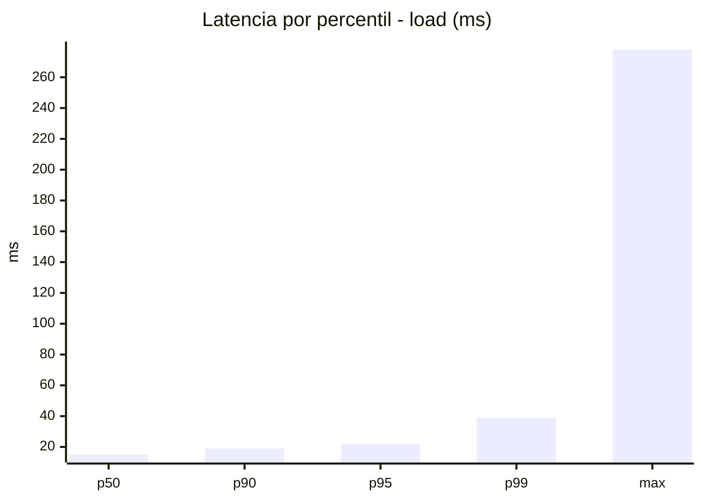
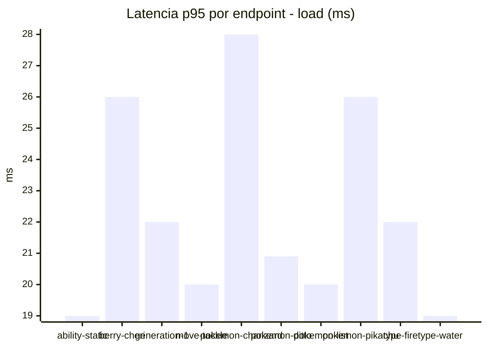
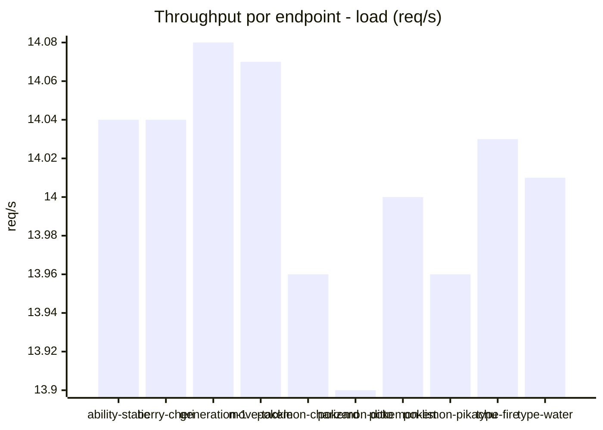
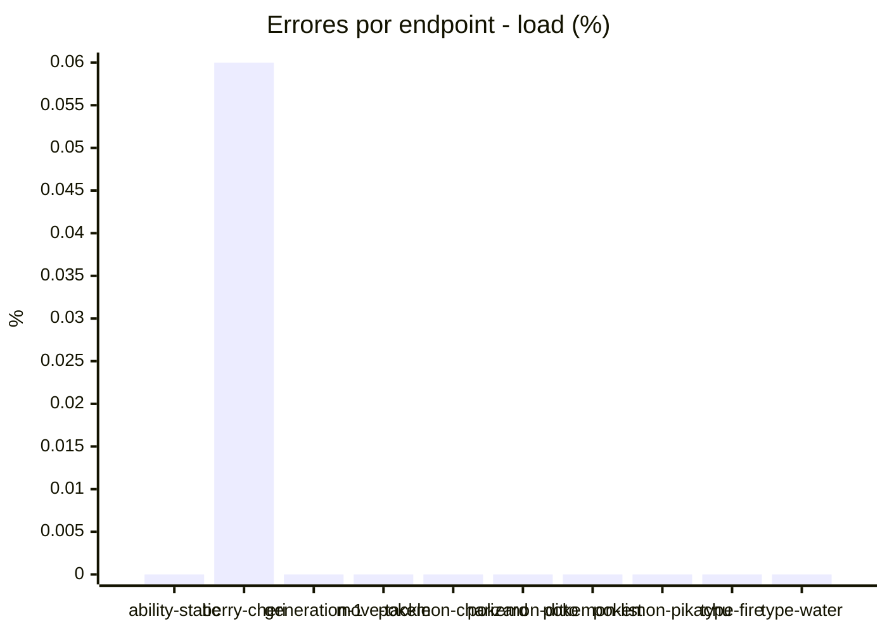
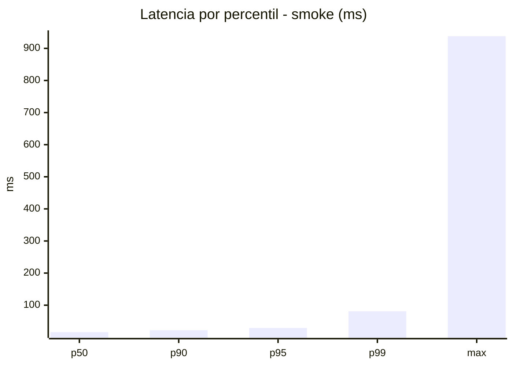
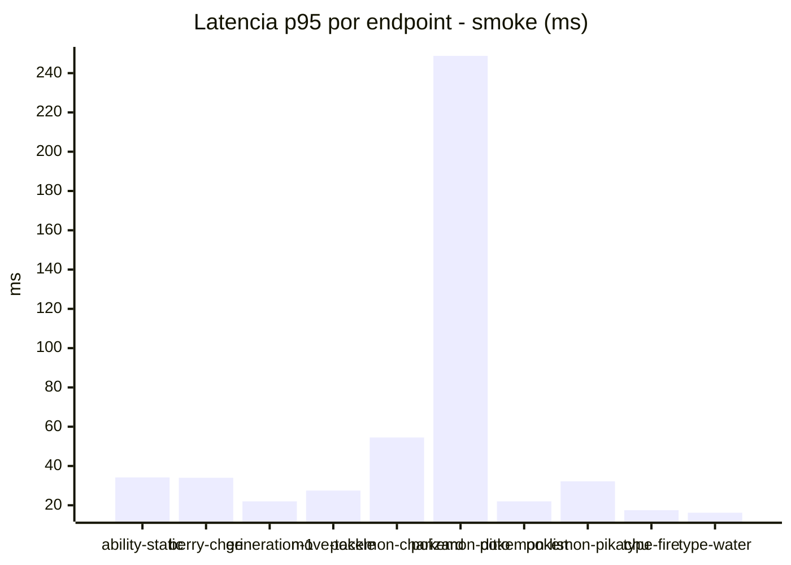
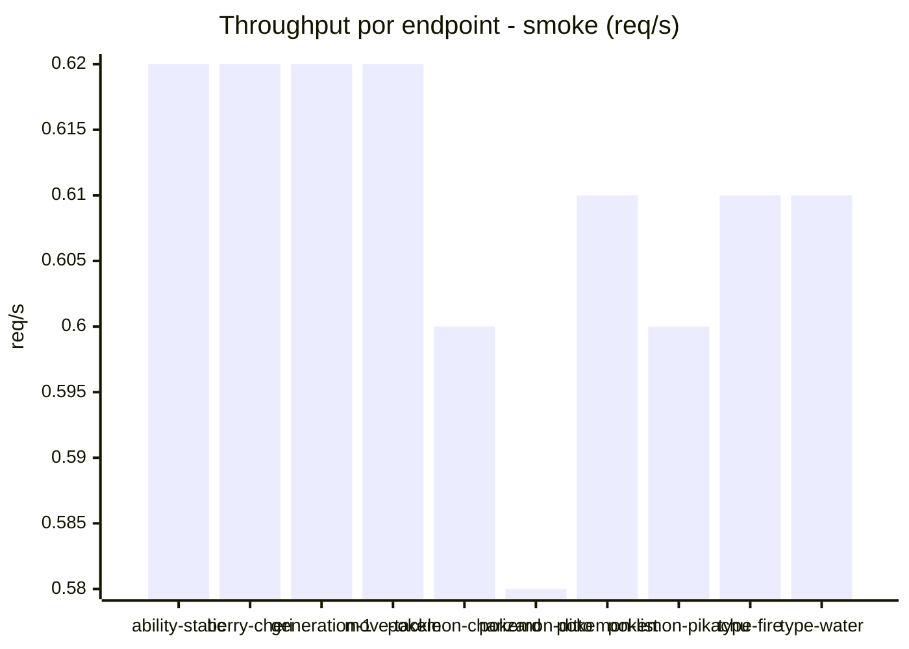
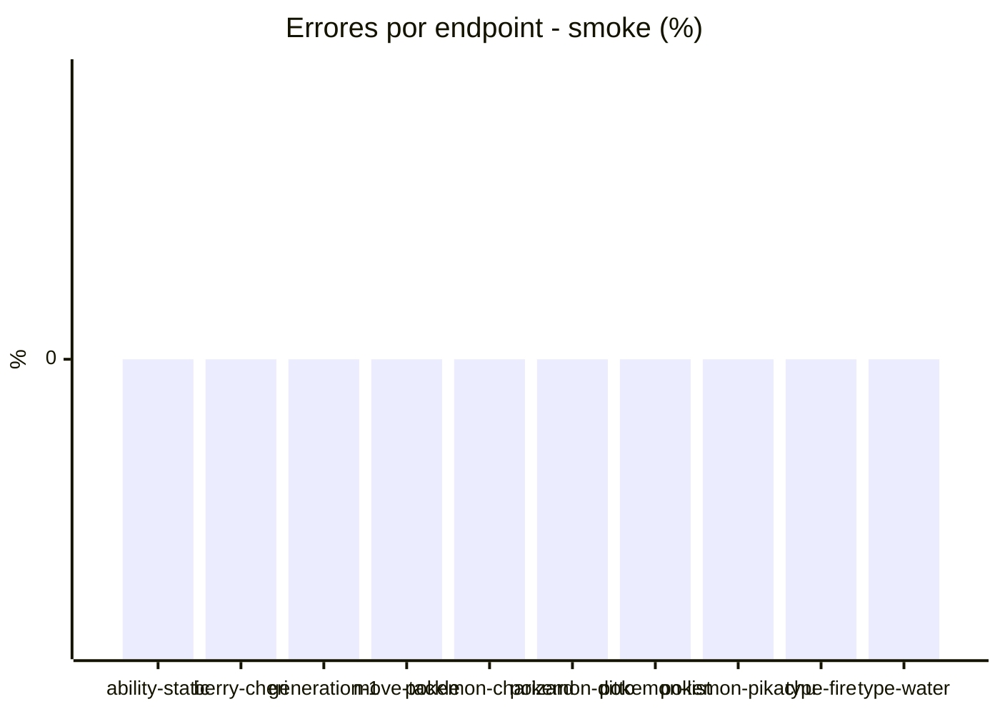

# Reporte de performance - PokeAPI

**Fecha:** 2026-09-28 20:00 UTC  
**Veredicto del agente:** `PASS`  
**Corrida:** [ver en GitHub Actions](https://github.com/lrbg/jmeter-pokeapi-lab/actions/runs/36475869957)  

## Validacion del agente de IA

PASS (fallback por umbrales)

- Error maximo: 0.01%
- p95 maximo: 29.1 ms

## Resultados

### Escenario: `load`

| Metrica | Valor |
| --- | --- |
| Muestras | 16614 |
| Errores | 1 (0.01%) |
| Latencia media | 16.3 ms |
| p50 / p90 / p95 / p99 | 15.0 / 19.0 / 22.0 / 39.0 ms |
| Min / Max | 6 / 278 ms |
| Throughput | 138.9 req/s |
| Duracion | 119.6 s |

Detalle por endpoint

| Endpoint | Muestras | Error % | avg | p95 | p99 | req/s |
| --- | --- | --- | --- | --- | --- | --- |
| ability-static | 1661 | 0.0% | 15.3 | 19.0 | 40.4 | 14.04 |
| berry-cheri | 1661 | 0.06% | 16.2 | 26.0 | 42.0 | 14.04 |
| generation-1 | 1661 | 0.0% | 15.9 | 22.0 | 37.4 | 14.08 |
| move-tackle | 1661 | 0.0% | 15.5 | 20.0 | 25.0 | 14.07 |
| pokemon-charizard | 1661 | 0.0% | 19.4 | 28.0 | 46.8 | 13.96 |
| pokemon-ditto | 1662 | 0.0% | 15.7 | 20.9 | 38.4 | 13.9 |
| pokemon-list | 1661 | 0.0% | 14.9 | 20.0 | 34.0 | 14.0 |
| pokemon-pikachu | 1663 | 0.0% | 18.5 | 26.0 | 47.5 | 13.96 |
| type-fire | 1661 | 0.0% | 16.0 | 22.0 | 37.4 | 14.03 |
| type-water | 1662 | 0.0% | 15.0 | 19.0 | 36.4 | 14.01 |

### Escenario: `smoke`

| Metrica | Valor |
| --- | --- |
| Muestras | 160 |
| Errores | 0 (0.0%) |
| Latencia media | 24.6 ms |
| p50 / p90 / p95 / p99 | 16.0 / 22.0 / 29.1 / 81.2 ms |
| Min / Max | 14 / 938 ms |
| Throughput | 5.48 req/s |
| Duracion | 29.2 s |

Detalle por endpoint

| Endpoint | Muestras | Error % | avg | p95 | p99 | req/s |
| --- | --- | --- | --- | --- | --- | --- |
| ability-static | 16 | 0.0% | 19.9 | 34.2 | 70.8 | 0.62 |
| berry-cheri | 16 | 0.0% | 20.1 | 34.0 | 70.0 | 0.62 |
| generation-1 | 16 | 0.0% | 17.2 | 22.0 | 29.2 | 0.62 |
| move-tackle | 16 | 0.0% | 18.6 | 27.5 | 47.9 | 0.62 |
| pokemon-charizard | 16 | 0.0% | 26.7 | 54.5 | 77.3 | 0.6 |
| pokemon-ditto | 16 | 0.0% | 73.6 | 248.8 | 800.1 | 0.58 |
| pokemon-list | 16 | 0.0% | 16.5 | 22.0 | 22.0 | 0.61 |
| pokemon-pikachu | 16 | 0.0% | 22.8 | 32.2 | 44.8 | 0.6 |
| type-fire | 16 | 0.0% | 15.6 | 17.5 | 18.7 | 0.61 |
| type-water | 16 | 0.0% | 14.9 | 16.2 | 16.9 | 0.61 |

