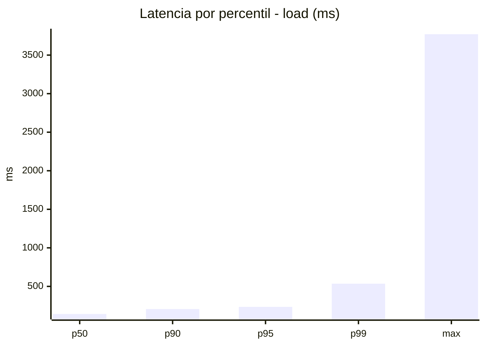
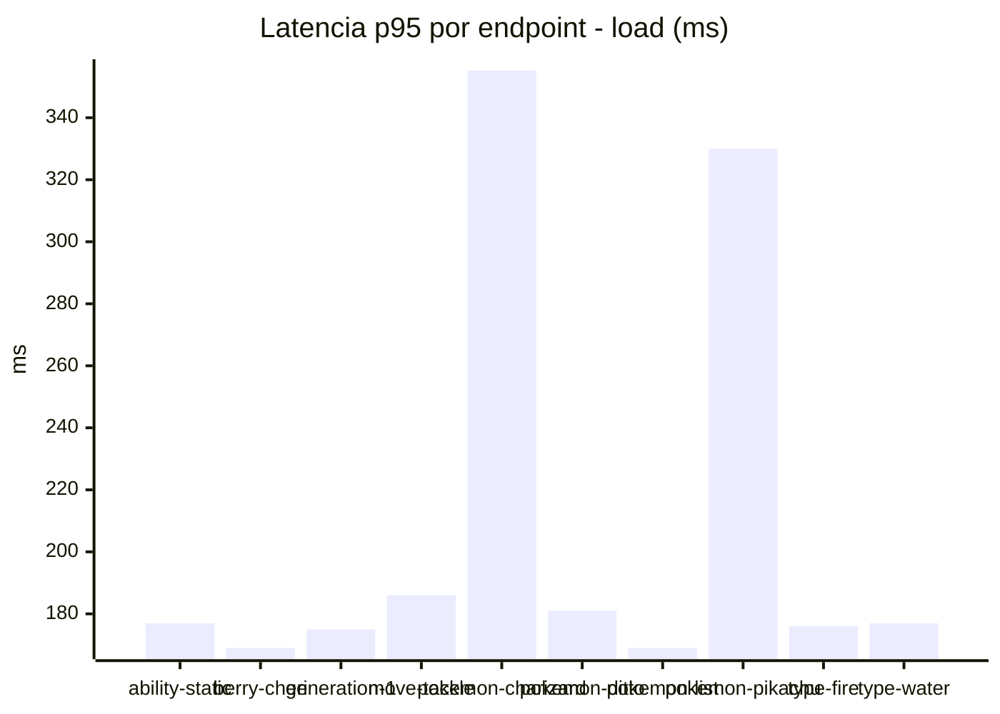
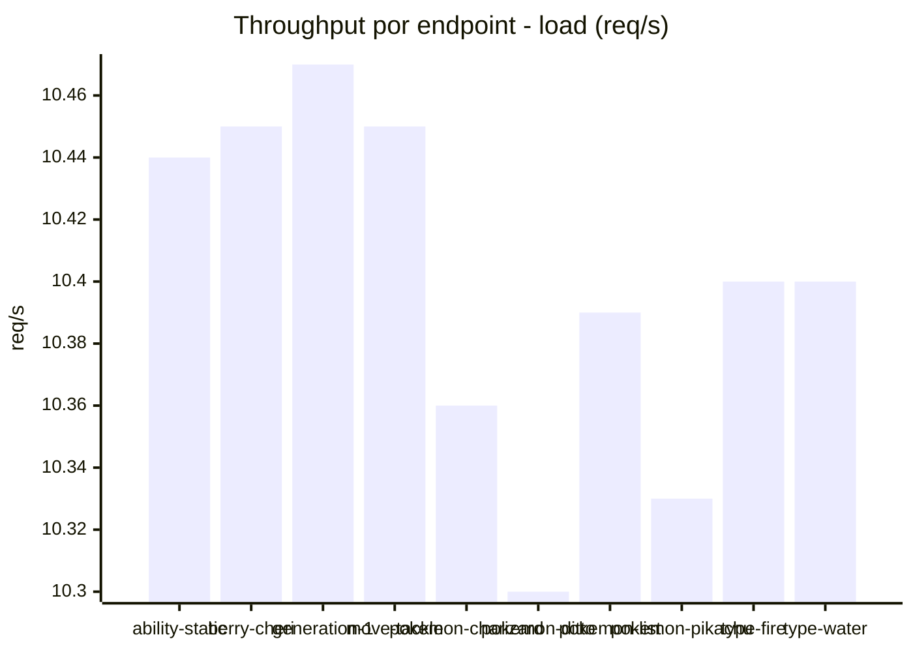
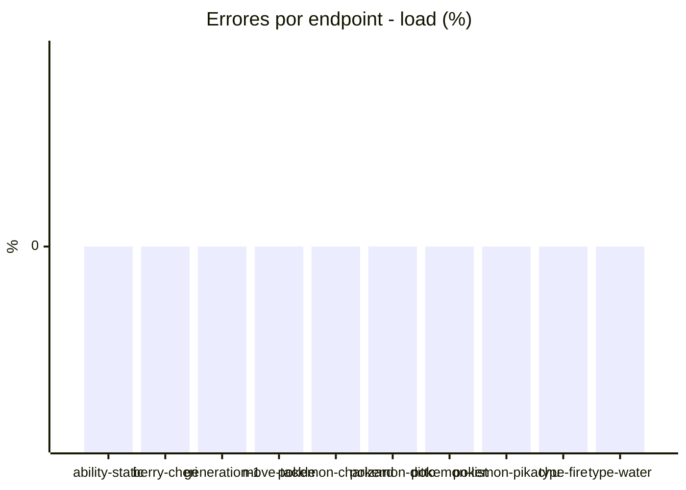
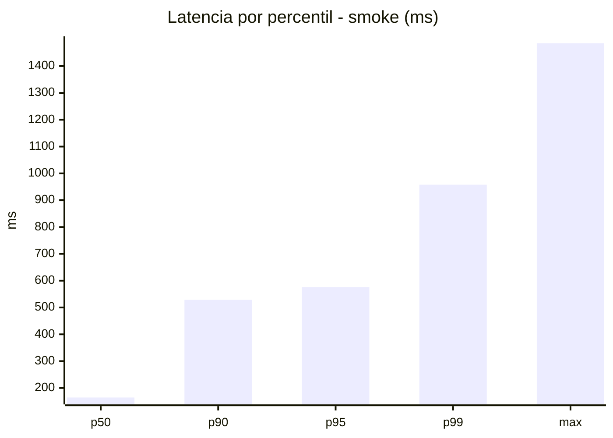
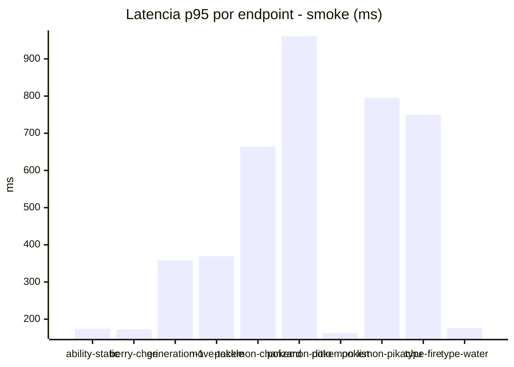
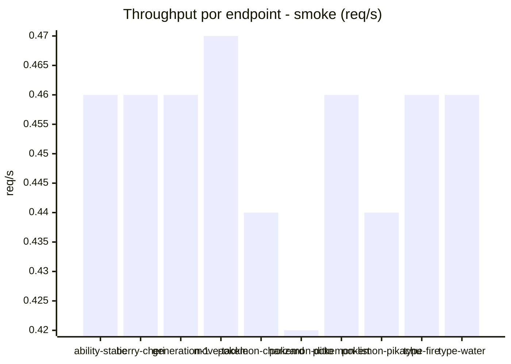

# Reporte de performance - PokeAPI

**Fecha:** 2026-09-29 18:29 UTC  
**Veredicto del agente:** `PASS`  
**Corrida:** [ver en GitHub Actions](https://github.com/lrbg/jmeter-pokeapi-lab/actions/runs/36612045335)  

## Validacion del agente de IA

PASS (fallback por umbrales)

- Error maximo: 0.0%
- p95 maximo: 576.4 ms

## Resultados

### Escenario: `load`

| Metrica | Valor |
| --- | --- |
| Muestras | 12317 |
| Errores | 0 (0.0%) |
| Latencia media | 126.9 ms |
| p50 / p90 / p95 / p99 | 142.0 / 206.0 / 234.0 / 535.0 ms |
| Min / Max | 21 / 3771 ms |
| Throughput | 102.65 req/s |
| Duracion | 120.0 s |

Detalle por endpoint

| Endpoint | Muestras | Error % | avg | p95 | p99 | req/s |
| --- | --- | --- | --- | --- | --- | --- |
| ability-static | 1231 | 0.0% | 118.6 | 177.0 | 530.1 | 10.44 |
| berry-cheri | 1231 | 0.0% | 107.6 | 169.0 | 481.5 | 10.45 |
| generation-1 | 1232 | 0.0% | 109.7 | 175.0 | 281.8 | 10.47 |
| move-tackle | 1231 | 0.0% | 117.2 | 186.0 | 508.1 | 10.45 |
| pokemon-charizard | 1232 | 0.0% | 184.2 | 355.2 | 652.1 | 10.36 |
| pokemon-ditto | 1233 | 0.0% | 120.5 | 181.0 | 507.5 | 10.3 |
| pokemon-list | 1232 | 0.0% | 109.4 | 169.0 | 417.4 | 10.39 |
| pokemon-pikachu | 1232 | 0.0% | 169.9 | 330.0 | 683.1 | 10.33 |
| type-fire | 1231 | 0.0% | 115.6 | 176.0 | 494.6 | 10.4 |
| type-water | 1232 | 0.0% | 116.0 | 177.0 | 474.4 | 10.4 |

### Escenario: `smoke`

| Metrica | Valor |
| --- | --- |
| Muestras | 114 |
| Errores | 0 (0.0%) |
| Latencia media | 232.9 ms |
| p50 / p90 / p95 / p99 | 164.5 / 528.5 / 576.4 / 957.9 ms |
| Min / Max | 144 / 1485 ms |
| Throughput | 3.89 req/s |
| Duracion | 29.3 s |

Detalle por endpoint

| Endpoint | Muestras | Error % | avg | p95 | p99 | req/s |
| --- | --- | --- | --- | --- | --- | --- |
| ability-static | 11 | 0.0% | 160.6 | 174.0 | 176.4 | 0.46 |
| berry-cheri | 11 | 0.0% | 154.1 | 172.0 | 174.4 | 0.46 |
| generation-1 | 11 | 0.0% | 195.8 | 358.5 | 502.1 | 0.46 |
| move-tackle | 11 | 0.0% | 205 | 369.5 | 497.9 | 0.47 |
| pokemon-charizard | 12 | 0.0% | 339.2 | 664.2 | 745.7 | 0.44 |
| pokemon-ditto | 12 | 0.0% | 331.7 | 960.8 | 1380.2 | 0.42 |
| pokemon-list | 12 | 0.0% | 151.9 | 162.7 | 165.3 | 0.46 |
| pokemon-pikachu | 12 | 0.0% | 346.1 | 795.2 | 876.7 | 0.44 |
| type-fire | 11 | 0.0% | 265.9 | 750.0 | 923.6 | 0.46 |
| type-water | 11 | 0.0% | 157.3 | 176.5 | 180.9 | 0.46 |

