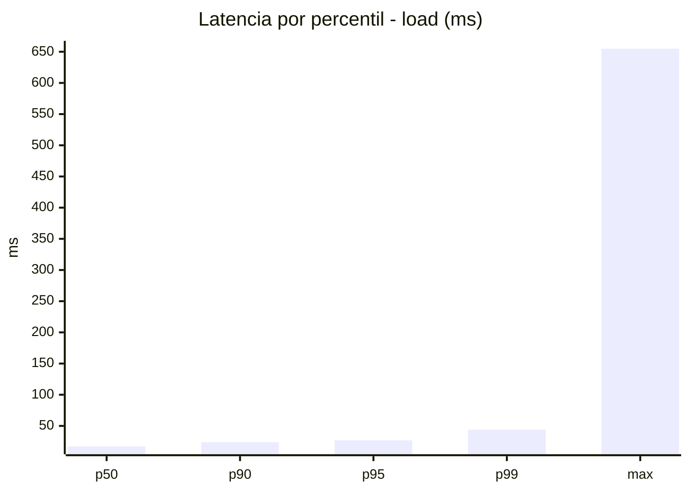
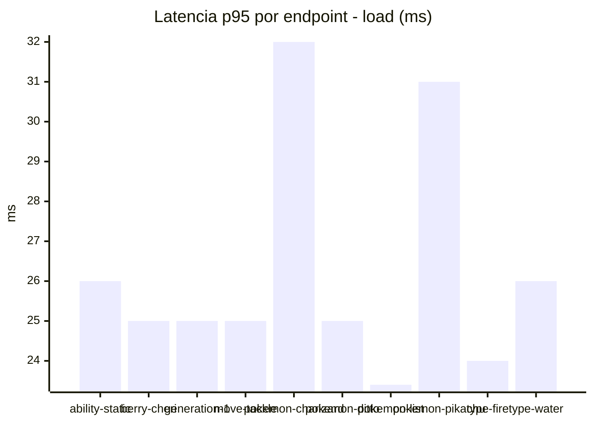
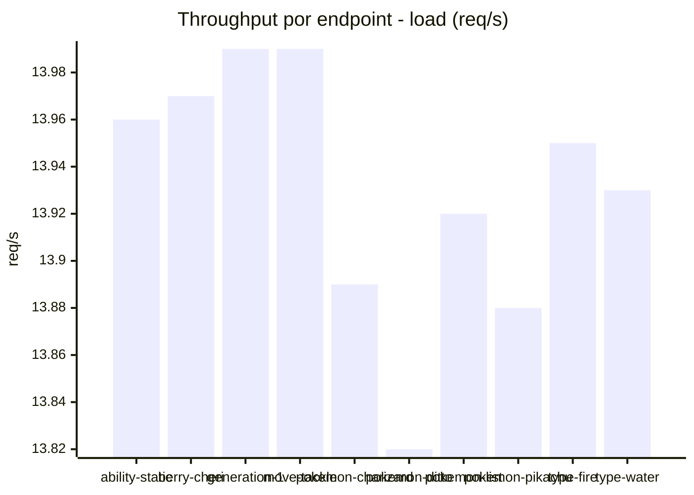
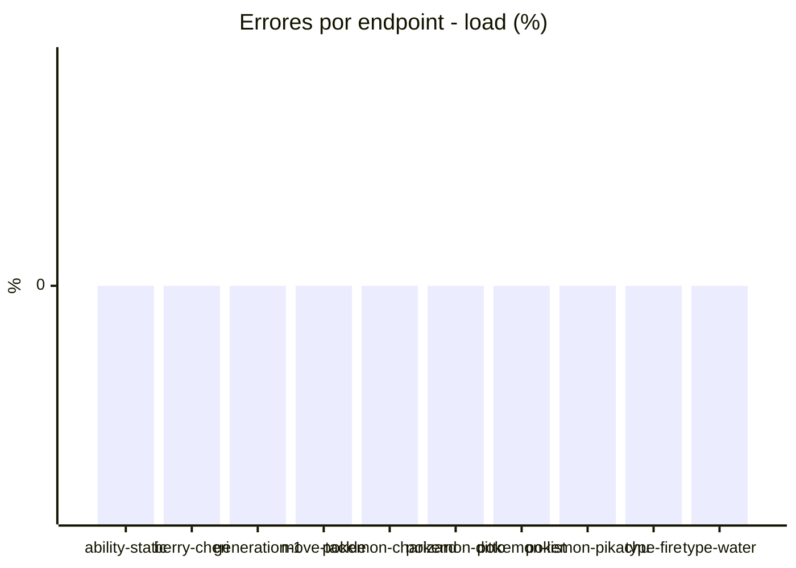
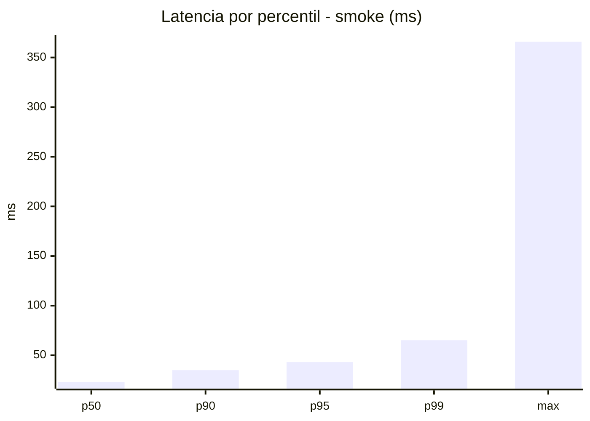
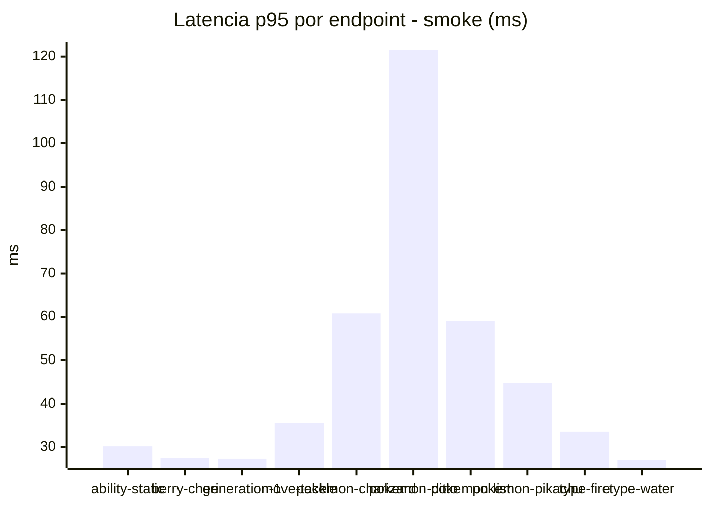
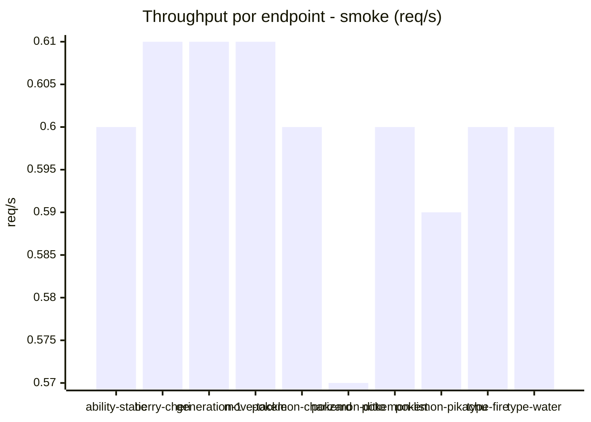

# Reporte de performance - PokeAPI

**Fecha:** 2026-09-30 18:17 UTC  
**Veredicto del agente:** `PASS`  
**Corrida:** [ver en GitHub Actions](https://github.com/lrbg/jmeter-pokeapi-lab/actions/runs/36757236075)  

## Validacion del agente de IA

PASS (fallback por umbrales)

- Error maximo: 0.0%
- p95 maximo: 43.1 ms

## Resultados

### Escenario: `load`

| Metrica | Valor |
| --- | --- |
| Muestras | 16520 |
| Errores | 0 (0.0%) |
| Latencia media | 18.1 ms |
| p50 / p90 / p95 / p99 | 17.0 / 24.0 / 27.0 / 44.0 ms |
| Min / Max | 9 / 655 ms |
| Throughput | 138.13 req/s |
| Duracion | 119.6 s |

Detalle por endpoint

| Endpoint | Muestras | Error % | avg | p95 | p99 | req/s |
| --- | --- | --- | --- | --- | --- | --- |
| ability-static | 1652 | 0.0% | 17.6 | 26.0 | 39.0 | 13.96 |
| berry-cheri | 1652 | 0.0% | 17.5 | 25.0 | 36.0 | 13.97 |
| generation-1 | 1652 | 0.0% | 17.3 | 25.0 | 35.0 | 13.99 |
| move-tackle | 1652 | 0.0% | 17.3 | 25.0 | 36.0 | 13.99 |
| pokemon-charizard | 1652 | 0.0% | 20.2 | 32.0 | 55.5 | 13.89 |
| pokemon-ditto | 1652 | 0.0% | 17.3 | 25.0 | 39.5 | 13.82 |
| pokemon-list | 1652 | 0.0% | 16.2 | 23.4 | 35.0 | 13.92 |
| pokemon-pikachu | 1652 | 0.0% | 19.2 | 31.0 | 50.0 | 13.88 |
| type-fire | 1652 | 0.0% | 17.1 | 24.0 | 35.0 | 13.95 |
| type-water | 1652 | 0.0% | 21.2 | 26.0 | 210.5 | 13.93 |

### Escenario: `smoke`

| Metrica | Valor |
| --- | --- |
| Muestras | 159 |
| Errores | 0 (0.0%) |
| Latencia media | 26.6 ms |
| p50 / p90 / p95 / p99 | 23.0 / 35.0 / 43.1 / 65.1 ms |
| Min / Max | 12 / 366 ms |
| Throughput | 5.45 req/s |
| Duracion | 29.2 s |

Detalle por endpoint

| Endpoint | Muestras | Error % | avg | p95 | p99 | req/s |
| --- | --- | --- | --- | --- | --- | --- |
| ability-static | 16 | 0.0% | 22.3 | 30.2 | 33.2 | 0.6 |
| berry-cheri | 16 | 0.0% | 21.4 | 27.5 | 28.7 | 0.61 |
| generation-1 | 15 | 0.0% | 22.3 | 27.3 | 27.9 | 0.61 |
| move-tackle | 16 | 0.0% | 22.1 | 35.5 | 36.7 | 0.61 |
| pokemon-charizard | 16 | 0.0% | 34.6 | 60.8 | 62.5 | 0.6 |
| pokemon-ditto | 16 | 0.0% | 43.9 | 121.5 | 317.1 | 0.57 |
| pokemon-list | 16 | 0.0% | 24.8 | 59.0 | 66.2 | 0.6 |
| pokemon-pikachu | 16 | 0.0% | 28.7 | 44.8 | 58.5 | 0.59 |
| type-fire | 16 | 0.0% | 23.6 | 33.5 | 41.9 | 0.6 |
| type-water | 16 | 0.0% | 21.8 | 27.0 | 27.0 | 0.6 |

