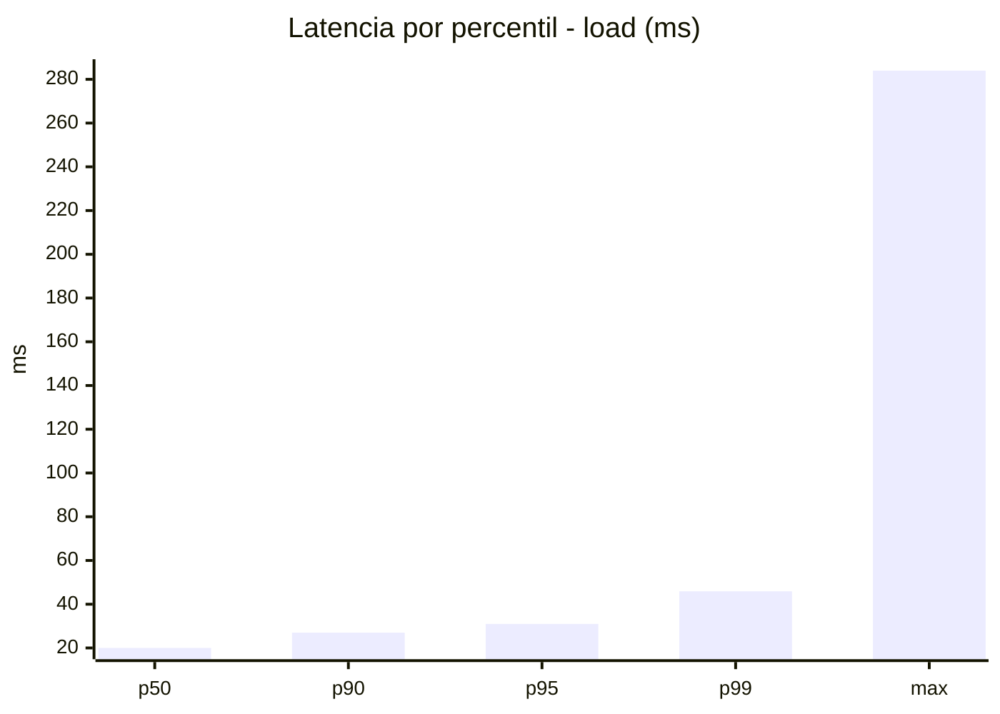
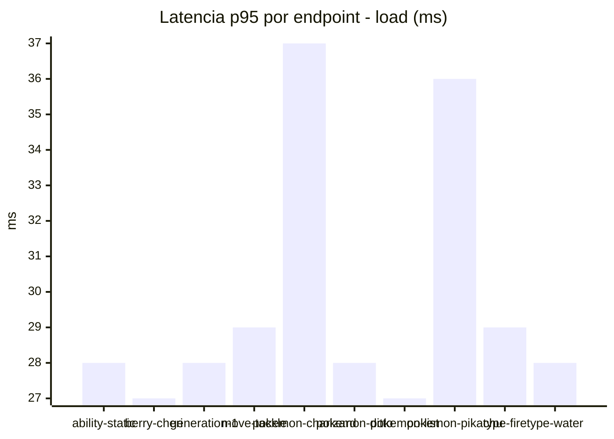
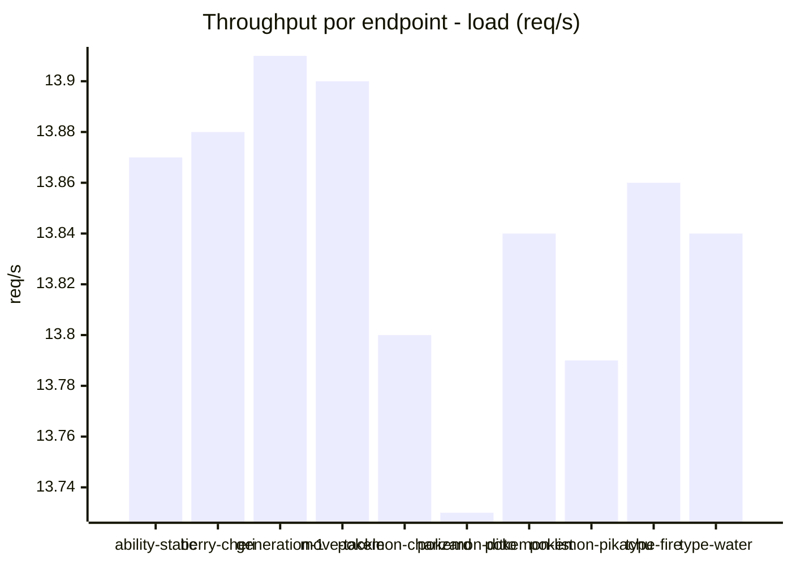
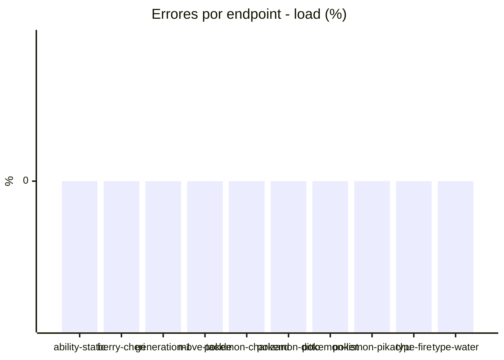
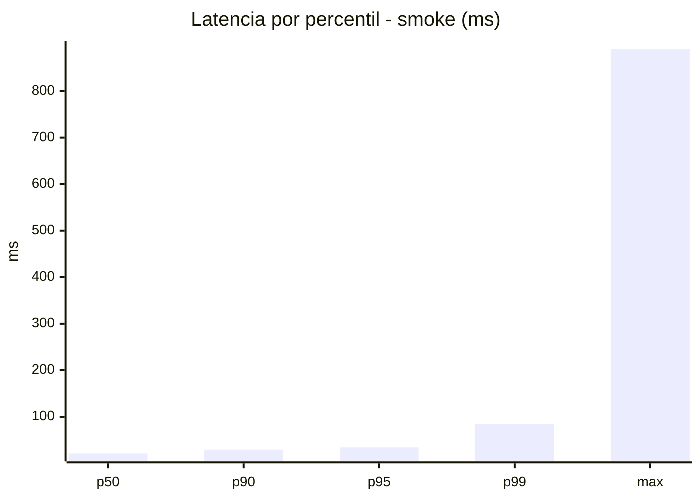
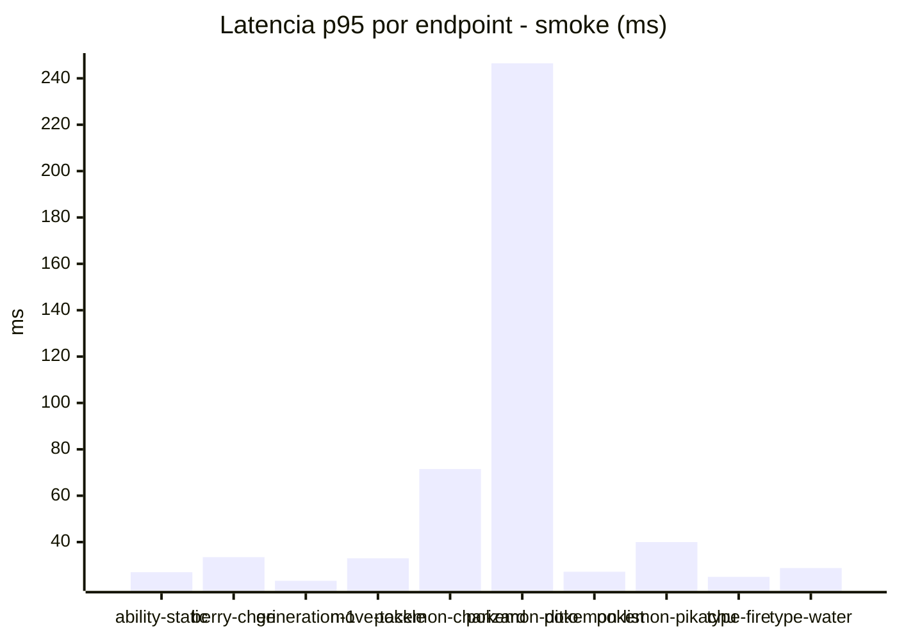
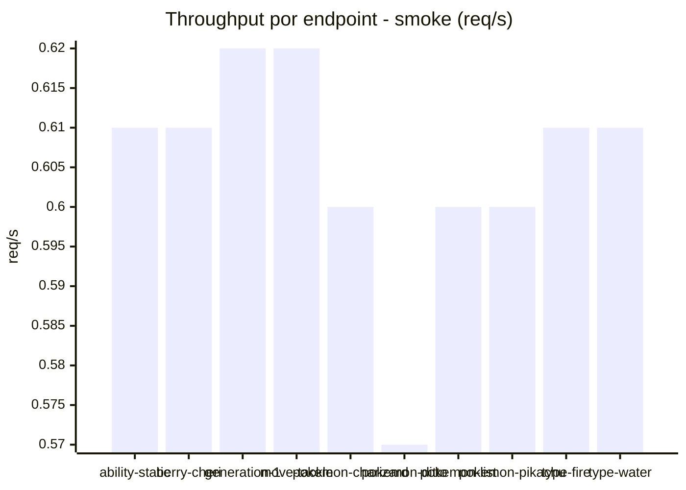

# Reporte de performance - PokeAPI

**Fecha:** 2026-10-01 18:43 UTC  
**Veredicto del agente:** `PASS`  
**Corrida:** [ver en GitHub Actions](https://github.com/lrbg/jmeter-pokeapi-lab/actions/runs/36908582848)  

## Validacion del agente de IA

PASS (fallback por umbrales)

- Error maximo: 0.0%
- p95 maximo: 34.1 ms

## Resultados

### Escenario: `load`

| Metrica | Valor |
| --- | --- |
| Muestras | 16415 |
| Errores | 0 (0.0%) |
| Latencia media | 20.1 ms |
| p50 / p90 / p95 / p99 | 20.0 / 27.0 / 31.0 / 45.9 ms |
| Min / Max | 6 / 284 ms |
| Throughput | 137.23 req/s |
| Duracion | 119.6 s |

Detalle por endpoint

| Endpoint | Muestras | Error % | avg | p95 | p99 | req/s |
| --- | --- | --- | --- | --- | --- | --- |
| ability-static | 1642 | 0.0% | 19.7 | 28.0 | 42.6 | 13.87 |
| berry-cheri | 1641 | 0.0% | 19.3 | 27.0 | 39.6 | 13.88 |
| generation-1 | 1641 | 0.0% | 19.6 | 28.0 | 40.0 | 13.91 |
| move-tackle | 1641 | 0.0% | 20.0 | 29.0 | 42.6 | 13.9 |
| pokemon-charizard | 1642 | 0.0% | 22.9 | 37.0 | 56.8 | 13.8 |
| pokemon-ditto | 1642 | 0.0% | 19.7 | 28.0 | 40.0 | 13.73 |
| pokemon-list | 1642 | 0.0% | 18.9 | 27.0 | 41.6 | 13.84 |
| pokemon-pikachu | 1642 | 0.0% | 22.0 | 36.0 | 67.4 | 13.79 |
| type-fire | 1641 | 0.0% | 19.6 | 29.0 | 40.0 | 13.86 |
| type-water | 1641 | 0.0% | 19.5 | 28.0 | 41.0 | 13.84 |

### Escenario: `smoke`

| Metrica | Valor |
| --- | --- |
| Muestras | 158 |
| Errores | 0 (0.0%) |
| Latencia media | 27.1 ms |
| p50 / p90 / p95 / p99 | 21.0 / 29.3 / 34.1 / 84.1 ms |
| Min / Max | 9 / 890 ms |
| Throughput | 5.43 req/s |
| Duracion | 29.1 s |

Detalle por endpoint

| Endpoint | Muestras | Error % | avg | p95 | p99 | req/s |
| --- | --- | --- | --- | --- | --- | --- |
| ability-static | 16 | 0.0% | 19.1 | 27.0 | 29.4 | 0.61 |
| berry-cheri | 16 | 0.0% | 20.1 | 33.5 | 41.9 | 0.61 |
| generation-1 | 15 | 0.0% | 19 | 23.3 | 23.9 | 0.62 |
| move-tackle | 15 | 0.0% | 21.7 | 33.0 | 38.6 | 0.62 |
| pokemon-charizard | 16 | 0.0% | 32.8 | 71.5 | 113.5 | 0.6 |
| pokemon-ditto | 16 | 0.0% | 74.4 | 246.5 | 761.3 | 0.57 |
| pokemon-list | 16 | 0.0% | 18.9 | 27.2 | 37.4 | 0.6 |
| pokemon-pikachu | 16 | 0.0% | 24.8 | 40.0 | 40.0 | 0.6 |
| type-fire | 16 | 0.0% | 18.7 | 25.0 | 27.4 | 0.61 |
| type-water | 16 | 0.0% | 20.6 | 28.8 | 30.5 | 0.61 |

