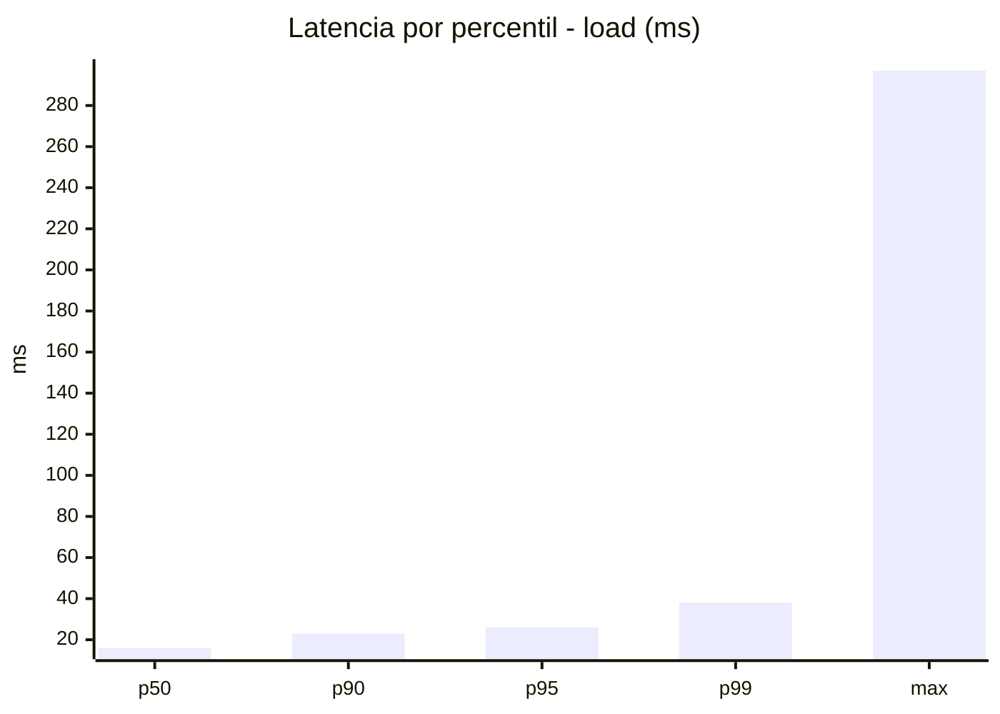
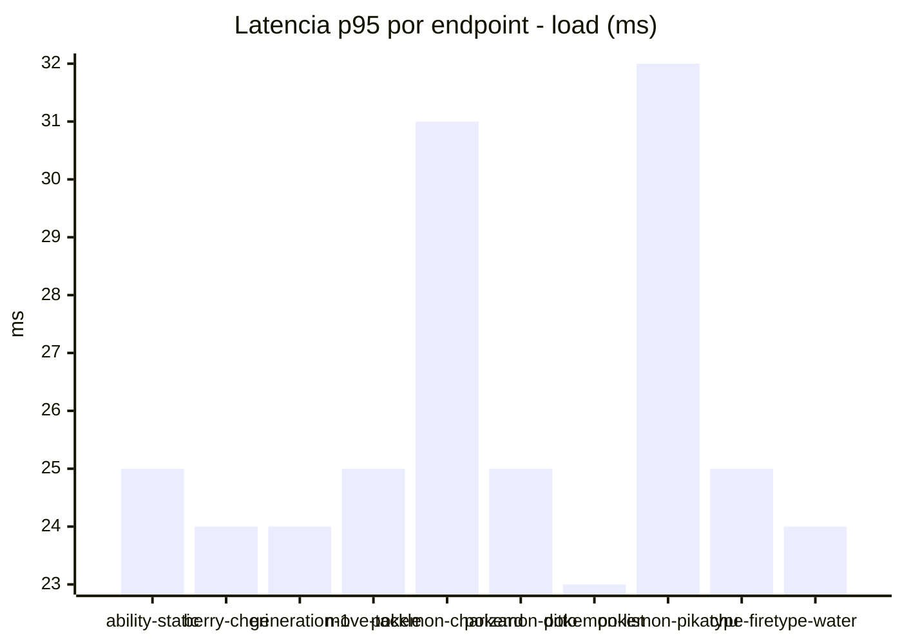
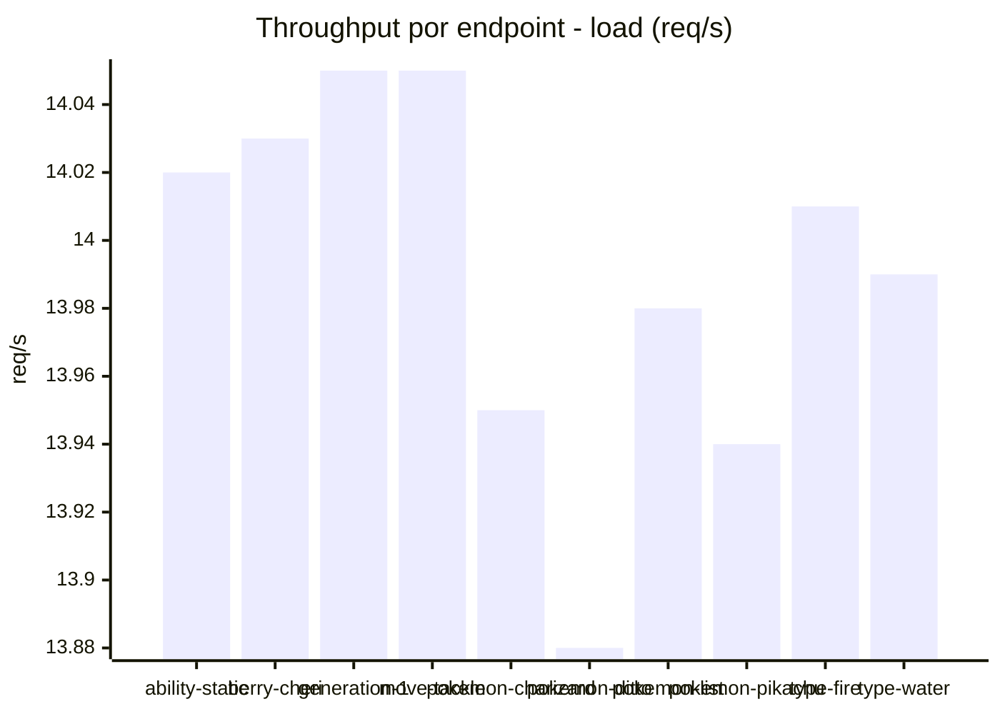
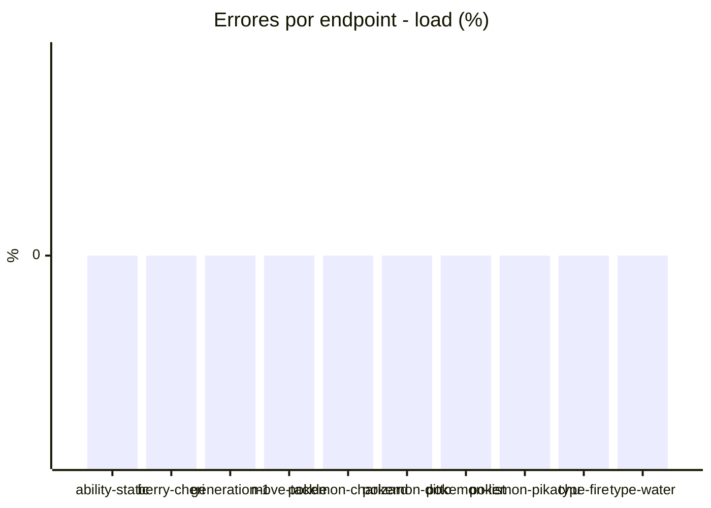
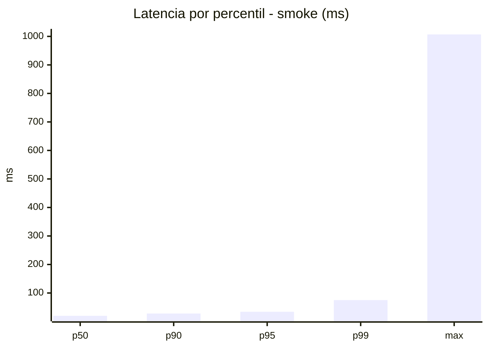
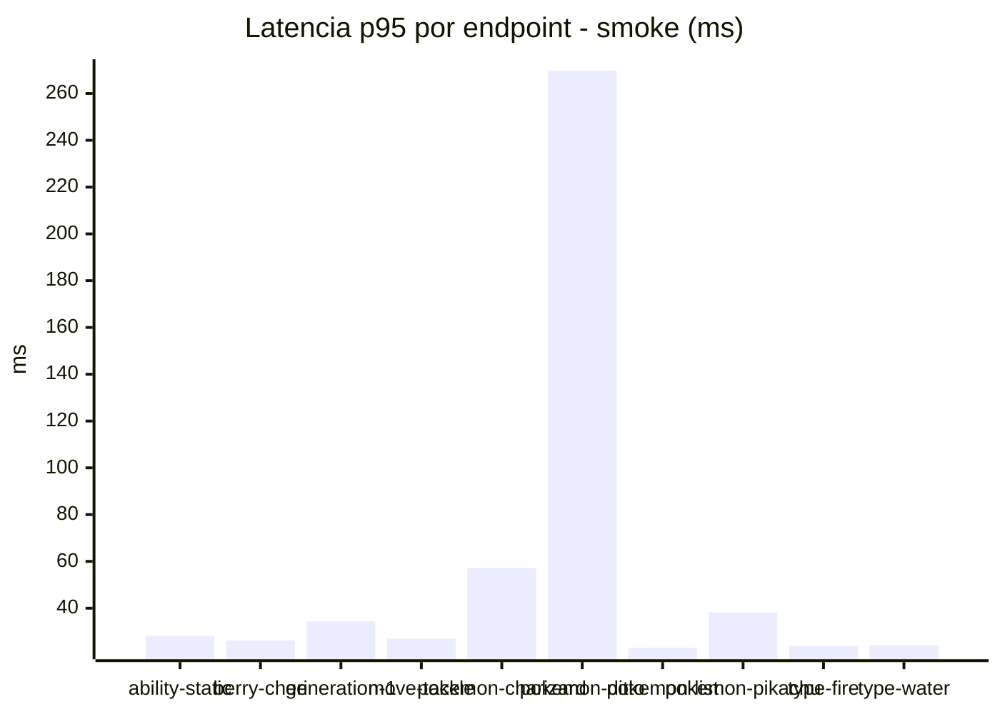
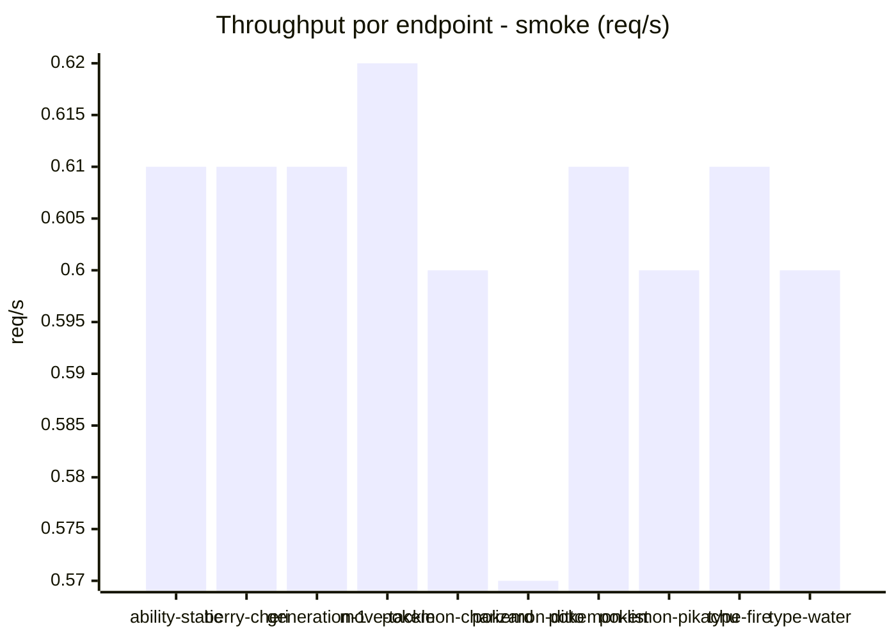

# Reporte de performance - PokeAPI

**Fecha:** 2026-10-02 18:13 UTC  
**Veredicto del agente:** `PASS`  
**Corrida:** [ver en GitHub Actions](https://github.com/lrbg/jmeter-pokeapi-lab/actions/runs/37045727353)  

## Validacion del agente de IA

PASS (fallback por umbrales)

- Error maximo: 0.0%
- p95 maximo: 34.2 ms

## Resultados

### Escenario: `load`

| Metrica | Valor |
| --- | --- |
| Muestras | 16597 |
| Errores | 0 (0.0%) |
| Latencia media | 16.7 ms |
| p50 / p90 / p95 / p99 | 16.0 / 23.0 / 26.0 / 38.0 ms |
| Min / Max | 5 / 297 ms |
| Throughput | 138.74 req/s |
| Duracion | 119.6 s |

Detalle por endpoint

| Endpoint | Muestras | Error % | avg | p95 | p99 | req/s |
| --- | --- | --- | --- | --- | --- | --- |
| ability-static | 1660 | 0.0% | 16.4 | 25.0 | 33.0 | 14.02 |
| berry-cheri | 1660 | 0.0% | 16.2 | 24.0 | 32.0 | 14.03 |
| generation-1 | 1659 | 0.0% | 16.3 | 24.0 | 31.4 | 14.05 |
| move-tackle | 1660 | 0.0% | 16.4 | 25.0 | 33.0 | 14.05 |
| pokemon-charizard | 1660 | 0.0% | 19.2 | 31.0 | 48.2 | 13.95 |
| pokemon-ditto | 1660 | 0.0% | 16.3 | 25.0 | 33.4 | 13.88 |
| pokemon-list | 1659 | 0.0% | 15.3 | 23.0 | 35.0 | 13.98 |
| pokemon-pikachu | 1660 | 0.0% | 18.0 | 32.0 | 52.8 | 13.94 |
| type-fire | 1660 | 0.0% | 16.4 | 25.0 | 38.0 | 14.01 |
| type-water | 1659 | 0.0% | 16.2 | 24.0 | 34.4 | 13.99 |

### Escenario: `smoke`

| Metrica | Valor |
| --- | --- |
| Muestras | 158 |
| Errores | 0 (0.0%) |
| Latencia media | 27.8 ms |
| p50 / p90 / p95 / p99 | 20.0 / 28.0 / 34.2 / 75.1 ms |
| Min / Max | 14 / 1007 ms |
| Throughput | 5.42 req/s |
| Duracion | 29.2 s |

Detalle por endpoint

| Endpoint | Muestras | Error % | avg | p95 | p99 | req/s |
| --- | --- | --- | --- | --- | --- | --- |
| ability-static | 16 | 0.0% | 20.2 | 28.2 | 31.2 | 0.61 |
| berry-cheri | 16 | 0.0% | 19.1 | 26.2 | 26.9 | 0.61 |
| generation-1 | 15 | 0.0% | 21 | 34.4 | 50.1 | 0.61 |
| move-tackle | 15 | 0.0% | 20.7 | 27.0 | 32.6 | 0.62 |
| pokemon-charizard | 16 | 0.0% | 31.6 | 57.2 | 93.8 | 0.6 |
| pokemon-ditto | 16 | 0.0% | 80 | 269.8 | 859.5 | 0.57 |
| pokemon-list | 16 | 0.0% | 17.8 | 23.0 | 23.0 | 0.61 |
| pokemon-pikachu | 16 | 0.0% | 26.9 | 38.2 | 46.0 | 0.6 |
| type-fire | 16 | 0.0% | 19.7 | 23.8 | 25.5 | 0.61 |
| type-water | 16 | 0.0% | 20.2 | 24.2 | 24.9 | 0.6 |

