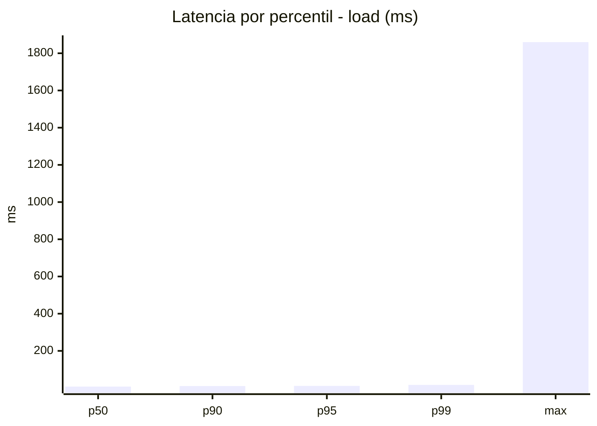
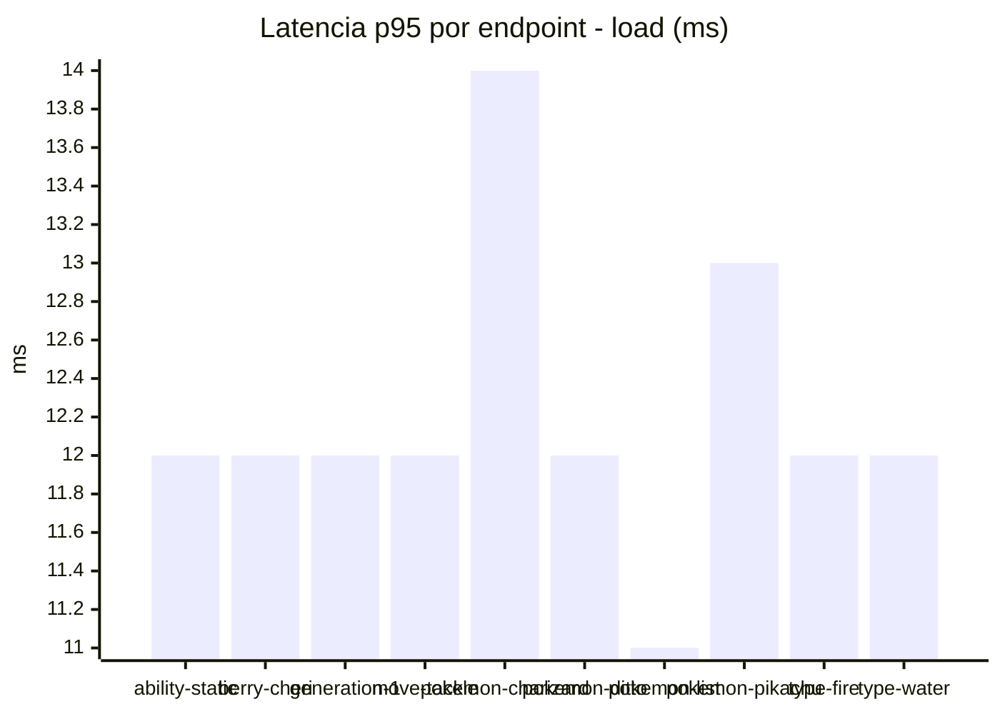
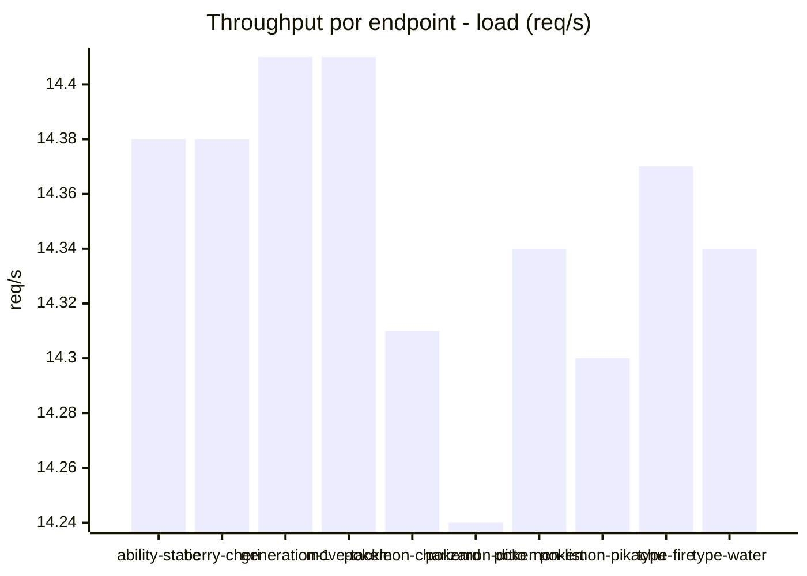
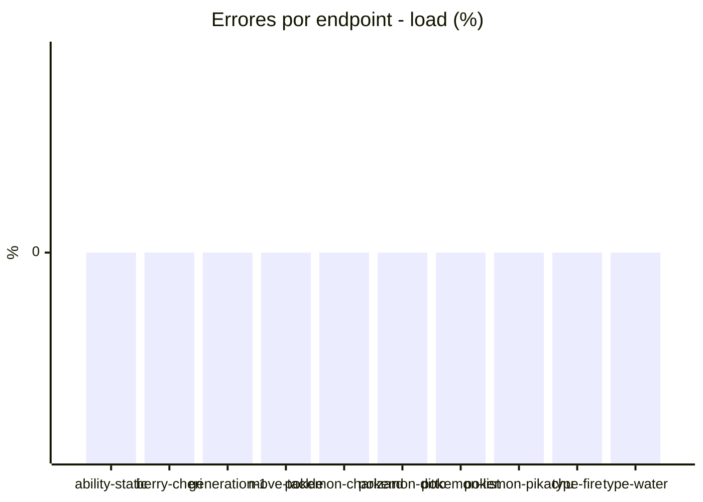
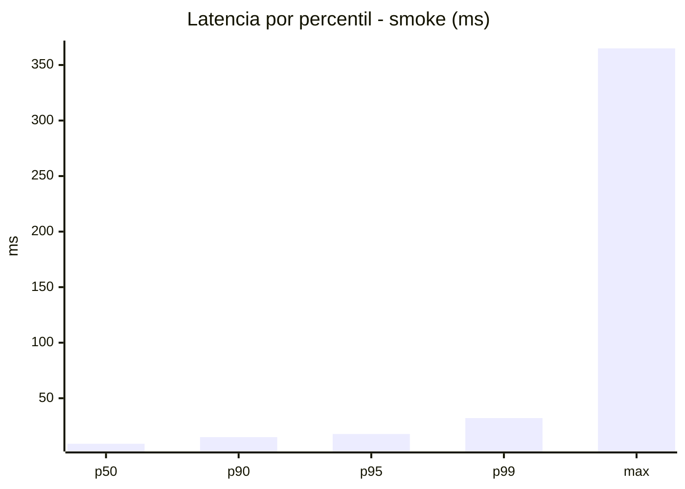
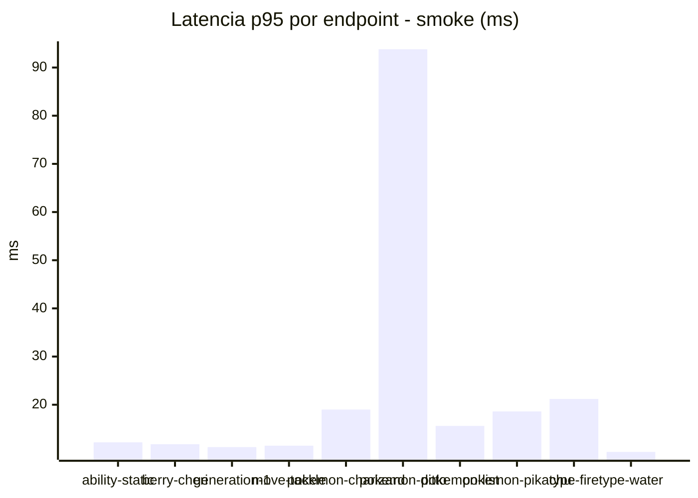
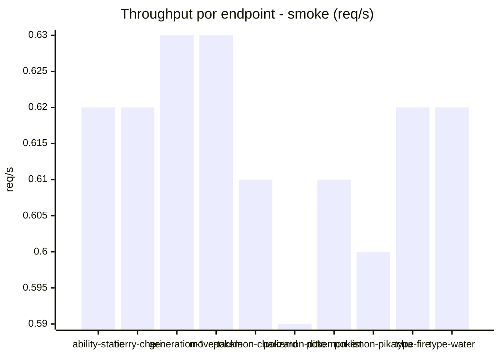

# Reporte de performance - PokeAPI

**Fecha:** 2026-10-03 16:59 UTC  
**Veredicto del agente:** `PASS`  
**Corrida:** [ver en GitHub Actions](https://github.com/lrbg/jmeter-pokeapi-lab/actions/runs/37138717410)  

## Validacion del agente de IA

PASS (fallback por umbrales)

- Error maximo: 0.0%
- p95 maximo: 17.8 ms

## Resultados

### Escenario: `load`

| Metrica | Valor |
| --- | --- |
| Muestras | 17031 |
| Errores | 0 (0.0%) |
| Latencia media | 8.6 ms |
| p50 / p90 / p95 / p99 | 8.0 / 11.0 / 12.0 / 17.0 ms |
| Min / Max | 5 / 1860 ms |
| Throughput | 142.36 req/s |
| Duracion | 119.6 s |

Detalle por endpoint

| Endpoint | Muestras | Error % | avg | p95 | p99 | req/s |
| --- | --- | --- | --- | --- | --- | --- |
| ability-static | 1703 | 0.0% | 8.3 | 12.0 | 16.0 | 14.38 |
| berry-cheri | 1703 | 0.0% | 9.3 | 12.0 | 16.0 | 14.38 |
| generation-1 | 1701 | 0.0% | 8.4 | 12.0 | 16.0 | 14.41 |
| move-tackle | 1703 | 0.0% | 8.4 | 12.0 | 16.0 | 14.41 |
| pokemon-charizard | 1704 | 0.0% | 9.4 | 14.0 | 18.0 | 14.31 |
| pokemon-ditto | 1703 | 0.0% | 8.4 | 12.0 | 16.0 | 14.24 |
| pokemon-list | 1704 | 0.0% | 7.9 | 11.0 | 16.0 | 14.34 |
| pokemon-pikachu | 1704 | 0.0% | 9.2 | 13.0 | 18.0 | 14.3 |
| type-fire | 1703 | 0.0% | 8.3 | 12.0 | 17.0 | 14.37 |
| type-water | 1703 | 0.0% | 8.2 | 12.0 | 16.0 | 14.34 |

### Escenario: `smoke`

| Metrica | Valor |
| --- | --- |
| Muestras | 164 |
| Errores | 0 (0.0%) |
| Latencia media | 12.7 ms |
| p50 / p90 / p95 / p99 | 9.0 / 15.0 / 17.8 / 32.1 ms |
| Min / Max | 7 / 365 ms |
| Throughput | 5.6 req/s |
| Duracion | 29.3 s |

Detalle por endpoint

| Endpoint | Muestras | Error % | avg | p95 | p99 | req/s |
| --- | --- | --- | --- | --- | --- | --- |
| ability-static | 16 | 0.0% | 9.5 | 12.2 | 12.8 | 0.62 |
| berry-cheri | 16 | 0.0% | 8.8 | 11.8 | 13.5 | 0.62 |
| generation-1 | 16 | 0.0% | 9.1 | 11.2 | 11.8 | 0.63 |
| move-tackle | 16 | 0.0% | 9 | 11.5 | 12.7 | 0.63 |
| pokemon-charizard | 17 | 0.0% | 14.4 | 19.0 | 19.0 | 0.61 |
| pokemon-ditto | 17 | 0.0% | 30.9 | 93.8 | 310.8 | 0.59 |
| pokemon-list | 17 | 0.0% | 10 | 15.6 | 30.3 | 0.61 |
| pokemon-pikachu | 17 | 0.0% | 14.1 | 18.6 | 23.7 | 0.6 |
| type-fire | 16 | 0.0% | 10.8 | 21.2 | 29.0 | 0.62 |
| type-water | 16 | 0.0% | 9.1 | 10.2 | 10.8 | 0.62 |

