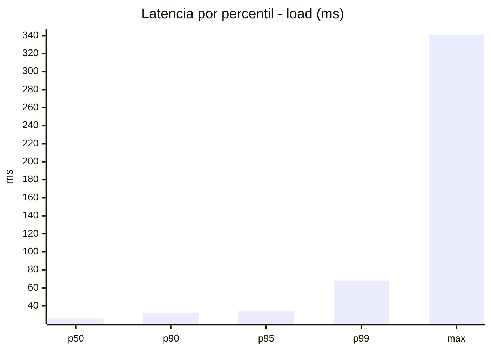
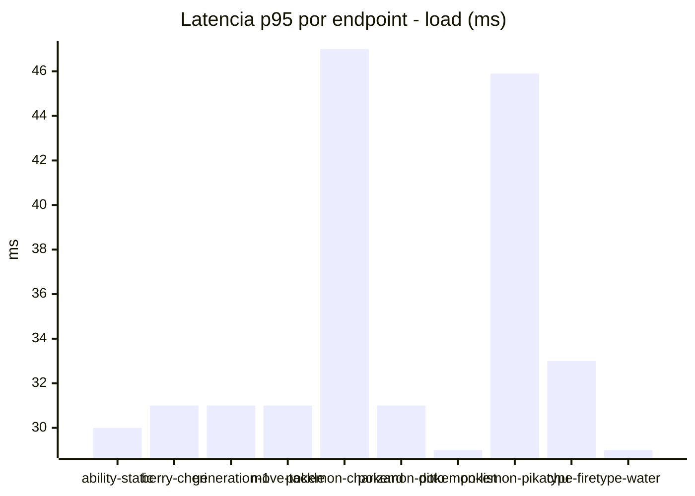
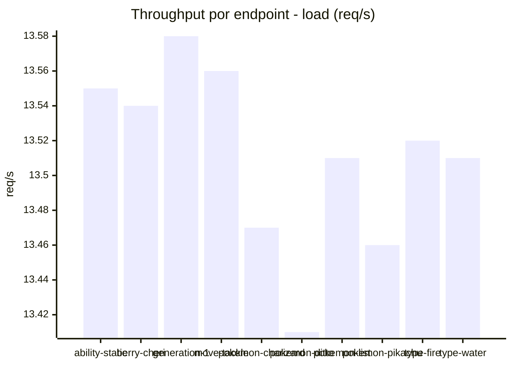
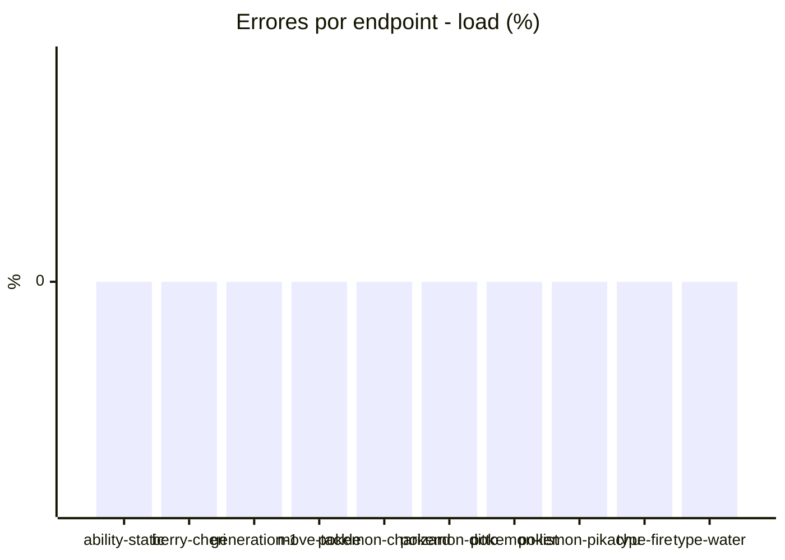
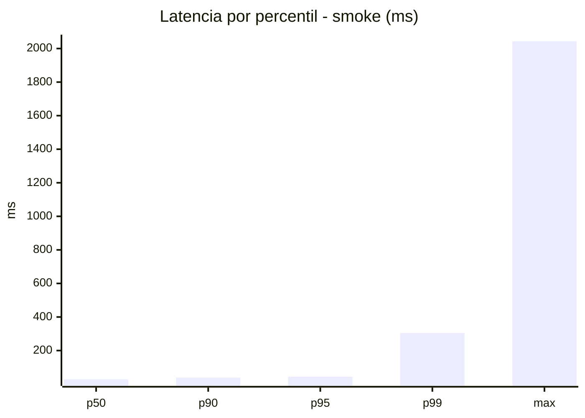
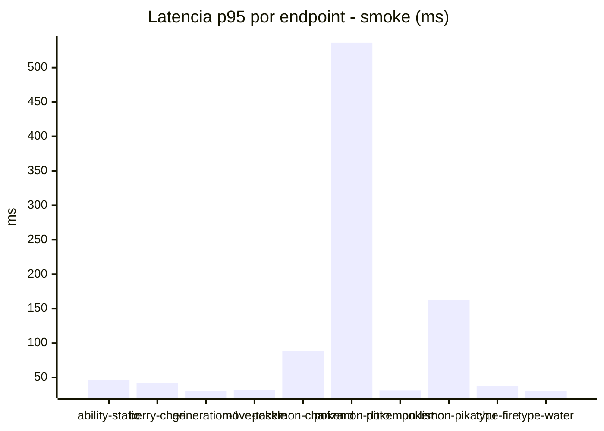
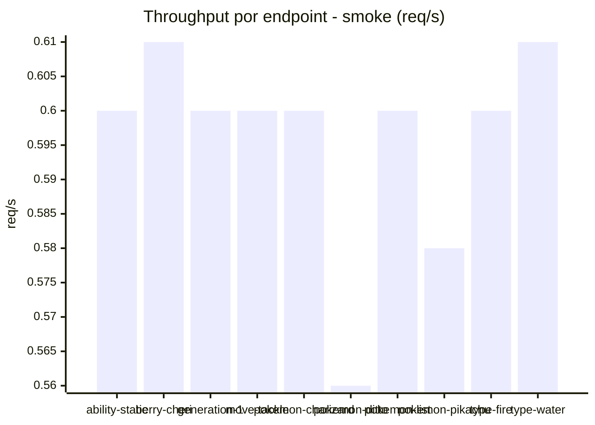

# Reporte de performance - PokeAPI

**Fecha:** 2026-10-04 17:18 UTC  
**Veredicto del agente:** `PASS`  
**Corrida:** [ver en GitHub Actions](https://github.com/lrbg/jmeter-pokeapi-lab/actions/runs/37219835596)  

## Validacion del agente de IA

PASS (fallback por umbrales)

- Error maximo: 0.0%
- p95 maximo: 44.4 ms

## Resultados

### Escenario: `load`

| Metrica | Valor |
| --- | --- |
| Muestras | 16021 |
| Errores | 0 (0.0%) |
| Latencia media | 28.0 ms |
| p50 / p90 / p95 / p99 | 26.0 / 32.0 / 34.0 / 68.0 ms |
| Min / Max | 21 / 341 ms |
| Throughput | 133.93 req/s |
| Duracion | 119.6 s |

Detalle por endpoint

| Endpoint | Muestras | Error % | avg | p95 | p99 | req/s |
| --- | --- | --- | --- | --- | --- | --- |
| ability-static | 1602 | 0.0% | 26.0 | 30.0 | 34.0 | 13.55 |
| berry-cheri | 1601 | 0.0% | 26.4 | 31.0 | 35.0 | 13.54 |
| generation-1 | 1602 | 0.0% | 26.7 | 31.0 | 42.0 | 13.58 |
| move-tackle | 1601 | 0.0% | 27.4 | 31.0 | 41.0 | 13.56 |
| pokemon-charizard | 1603 | 0.0% | 34.8 | 47.0 | 81.0 | 13.47 |
| pokemon-ditto | 1603 | 0.0% | 26.9 | 31.0 | 43.0 | 13.41 |
| pokemon-list | 1602 | 0.0% | 25.1 | 29.0 | 34.0 | 13.51 |
| pokemon-pikachu | 1603 | 0.0% | 33.4 | 45.9 | 119.0 | 13.46 |
| type-fire | 1602 | 0.0% | 27.6 | 33.0 | 69.0 | 13.52 |
| type-water | 1602 | 0.0% | 25.7 | 29.0 | 33.0 | 13.51 |

### Escenario: `smoke`

| Metrica | Valor |
| --- | --- |
| Muestras | 152 |
| Errores | 0 (0.0%) |
| Latencia media | 47.7 ms |
| p50 / p90 / p95 / p99 | 28.5 / 38.9 / 44.4 / 304.7 ms |
| Min / Max | 24 / 2043 ms |
| Throughput | 5.22 req/s |
| Duracion | 29.1 s |

Detalle por endpoint

| Endpoint | Muestras | Error % | avg | p95 | p99 | req/s |
| --- | --- | --- | --- | --- | --- | --- |
| ability-static | 15 | 0.0% | 31.4 | 46.3 | 74.9 | 0.6 |
| berry-cheri | 15 | 0.0% | 30.2 | 42.3 | 59.7 | 0.61 |
| generation-1 | 15 | 0.0% | 27.5 | 30.3 | 30.9 | 0.6 |
| move-tackle | 15 | 0.0% | 28.2 | 31.3 | 31.9 | 0.6 |
| pokemon-charizard | 15 | 0.0% | 45.8 | 88.5 | 91.3 | 0.6 |
| pokemon-ditto | 16 | 0.0% | 154.2 | 536.2 | 1741.6 | 0.56 |
| pokemon-list | 15 | 0.0% | 27.8 | 31.0 | 31.0 | 0.6 |
| pokemon-pikachu | 16 | 0.0% | 66.8 | 163.0 | 453.4 | 0.58 |
| type-fire | 15 | 0.0% | 29.9 | 38.0 | 38.0 | 0.6 |
| type-water | 15 | 0.0% | 27.3 | 30.3 | 30.9 | 0.61 |

