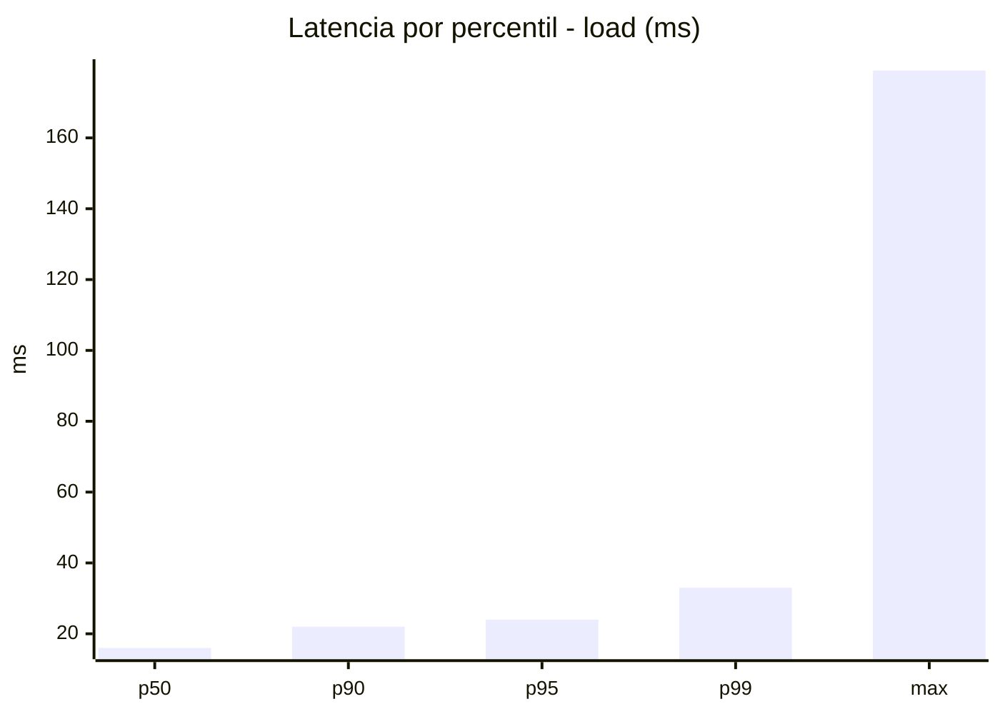
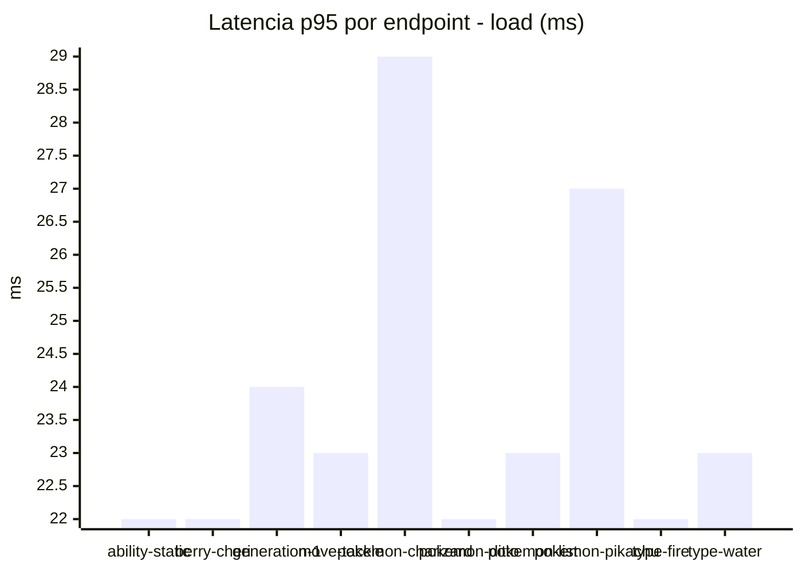
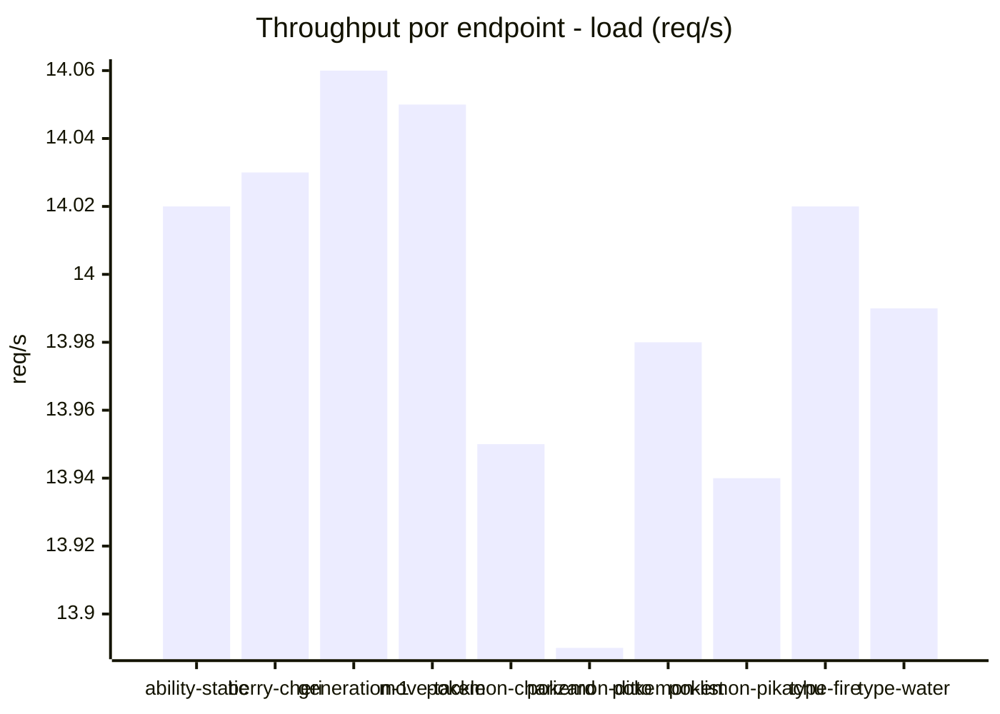
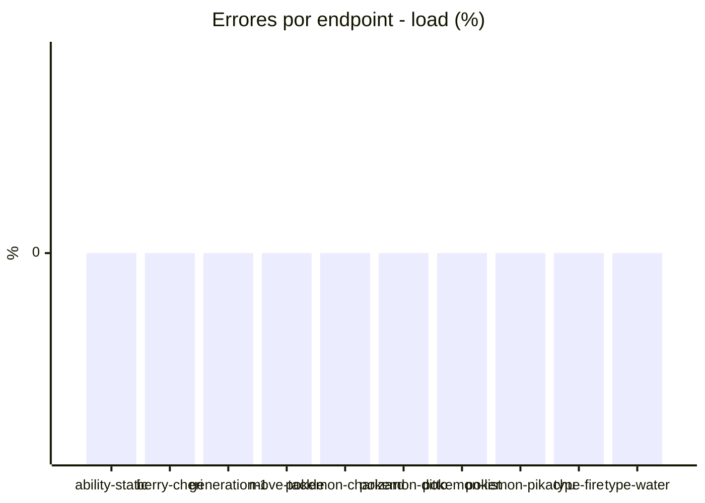
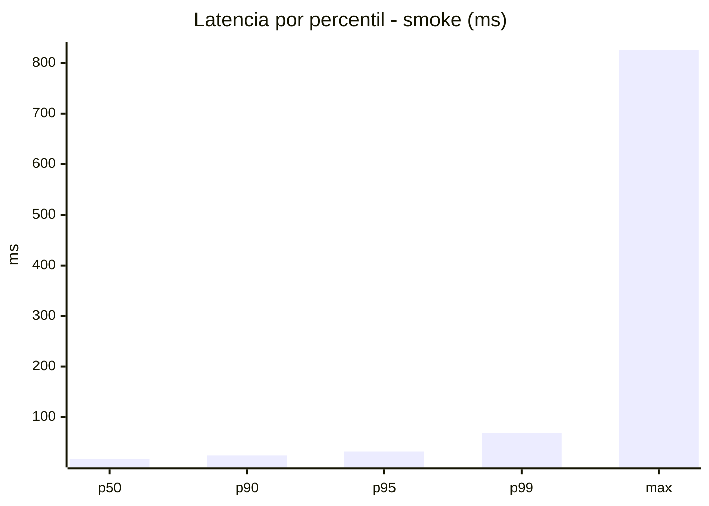
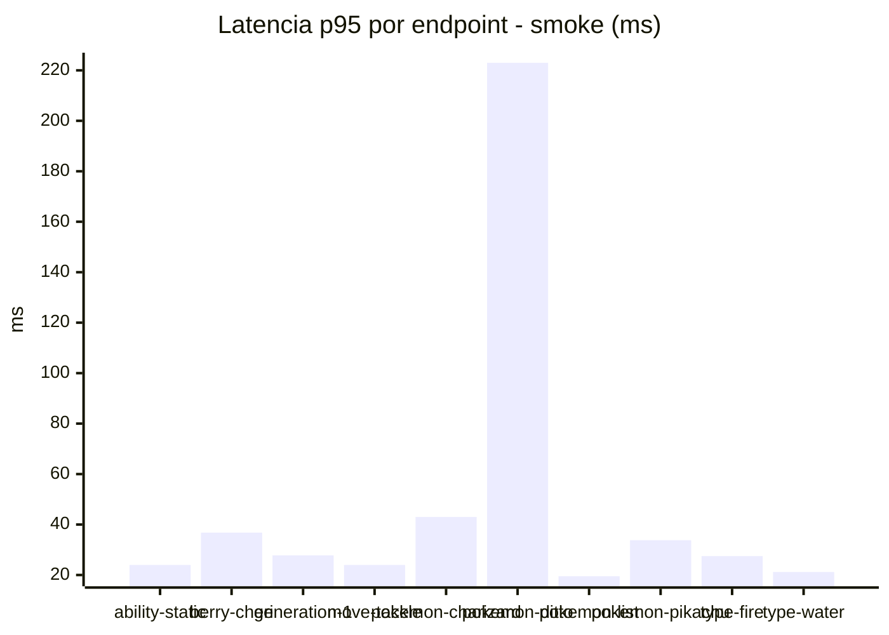
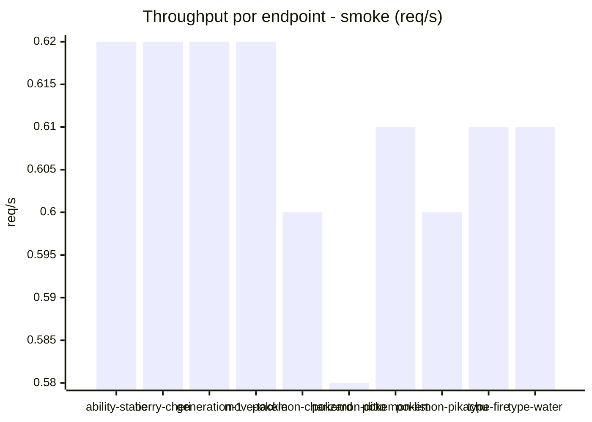

# Reporte de performance - PokeAPI

**Fecha:** 2026-10-05 20:59 UTC  
**Veredicto del agente:** `PASS`  
**Corrida:** [ver en GitHub Actions](https://github.com/lrbg/jmeter-pokeapi-lab/actions/runs/37372793777)  

## Validacion del agente de IA

PASS (fallback por umbrales)

- Error maximo: 0.0%
- p95 maximo: 32.0 ms

## Resultados

### Escenario: `load`

| Metrica | Valor |
| --- | --- |
| Muestras | 16601 |
| Errores | 0 (0.0%) |
| Latencia media | 16.6 ms |
| p50 / p90 / p95 / p99 | 16.0 / 22.0 / 24.0 / 33.0 ms |
| Min / Max | 9 / 179 ms |
| Throughput | 138.79 req/s |
| Duracion | 119.6 s |

Detalle por endpoint

| Endpoint | Muestras | Error % | avg | p95 | p99 | req/s |
| --- | --- | --- | --- | --- | --- | --- |
| ability-static | 1660 | 0.0% | 16.4 | 22.0 | 29.4 | 14.02 |
| berry-cheri | 1660 | 0.0% | 15.4 | 22.0 | 28.4 | 14.03 |
| generation-1 | 1660 | 0.0% | 16.8 | 24.0 | 31.0 | 14.06 |
| move-tackle | 1660 | 0.0% | 16.3 | 23.0 | 29.0 | 14.05 |
| pokemon-charizard | 1660 | 0.0% | 20.0 | 29.0 | 45.0 | 13.95 |
| pokemon-ditto | 1661 | 0.0% | 15.8 | 22.0 | 30.0 | 13.89 |
| pokemon-list | 1660 | 0.0% | 15.1 | 23.0 | 32.0 | 13.98 |
| pokemon-pikachu | 1660 | 0.0% | 18.3 | 27.0 | 50.0 | 13.94 |
| type-fire | 1660 | 0.0% | 15.9 | 22.0 | 29.4 | 14.02 |
| type-water | 1660 | 0.0% | 15.8 | 23.0 | 32.4 | 13.99 |

### Escenario: `smoke`

| Metrica | Valor |
| --- | --- |
| Muestras | 160 |
| Errores | 0 (0.0%) |
| Latencia media | 23.5 ms |
| p50 / p90 / p95 / p99 | 17.0 / 24.1 / 32.0 / 69.4 ms |
| Min / Max | 11 / 826 ms |
| Throughput | 5.48 req/s |
| Duracion | 29.2 s |

Detalle por endpoint

| Endpoint | Muestras | Error % | avg | p95 | p99 | req/s |
| --- | --- | --- | --- | --- | --- | --- |
| ability-static | 16 | 0.0% | 17.2 | 24.0 | 26.4 | 0.62 |
| berry-cheri | 16 | 0.0% | 19.9 | 36.8 | 62.5 | 0.62 |
| generation-1 | 16 | 0.0% | 18.8 | 27.8 | 41.5 | 0.62 |
| move-tackle | 16 | 0.0% | 18.1 | 24.0 | 24.0 | 0.62 |
| pokemon-charizard | 16 | 0.0% | 24.5 | 43.0 | 64.6 | 0.6 |
| pokemon-ditto | 16 | 0.0% | 65.8 | 223.0 | 705.4 | 0.58 |
| pokemon-list | 16 | 0.0% | 15.8 | 19.5 | 20.7 | 0.61 |
| pokemon-pikachu | 16 | 0.0% | 21.1 | 33.8 | 35.5 | 0.6 |
| type-fire | 16 | 0.0% | 17.8 | 27.5 | 38.3 | 0.61 |
| type-water | 16 | 0.0% | 16.4 | 21.2 | 24.2 | 0.61 |

