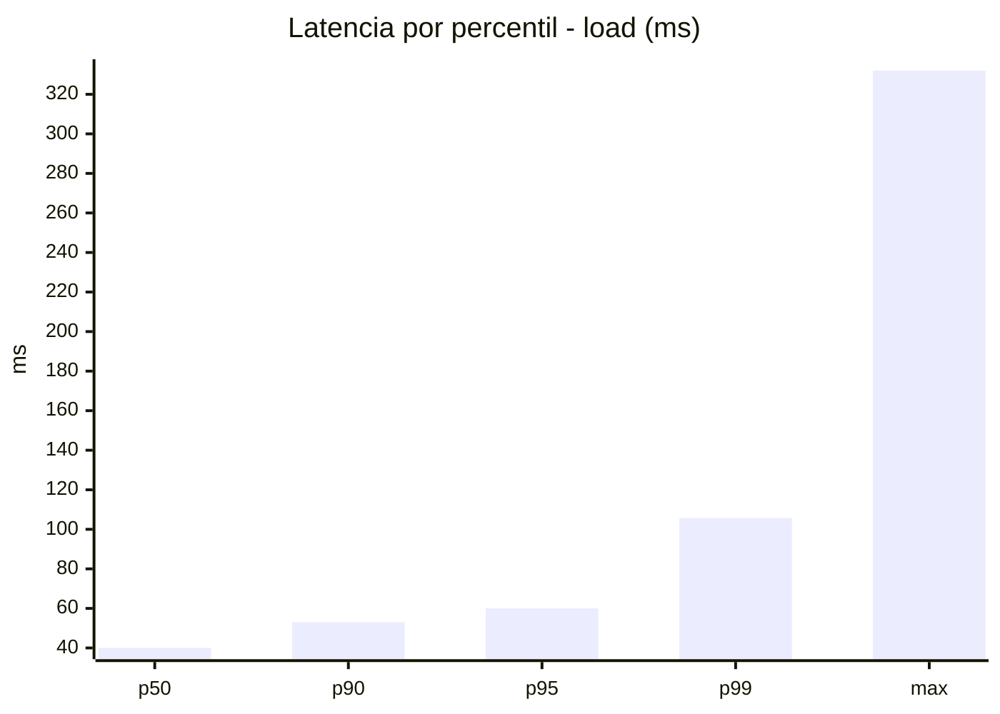
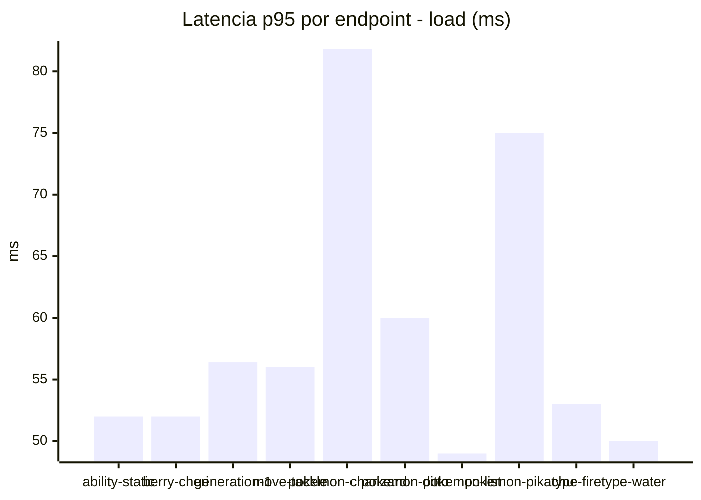
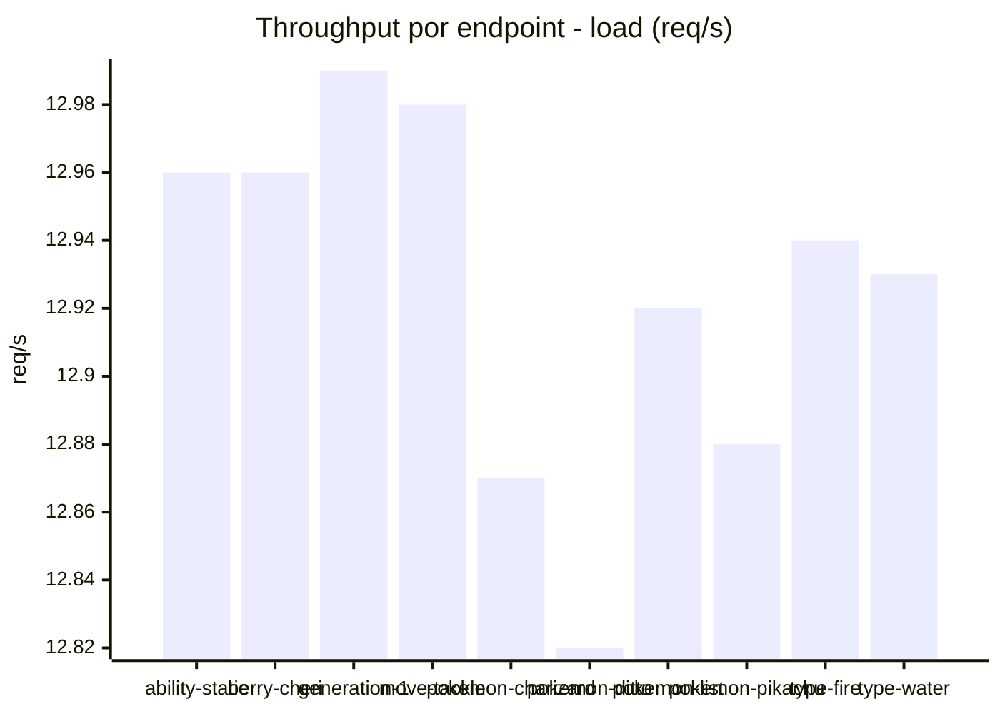
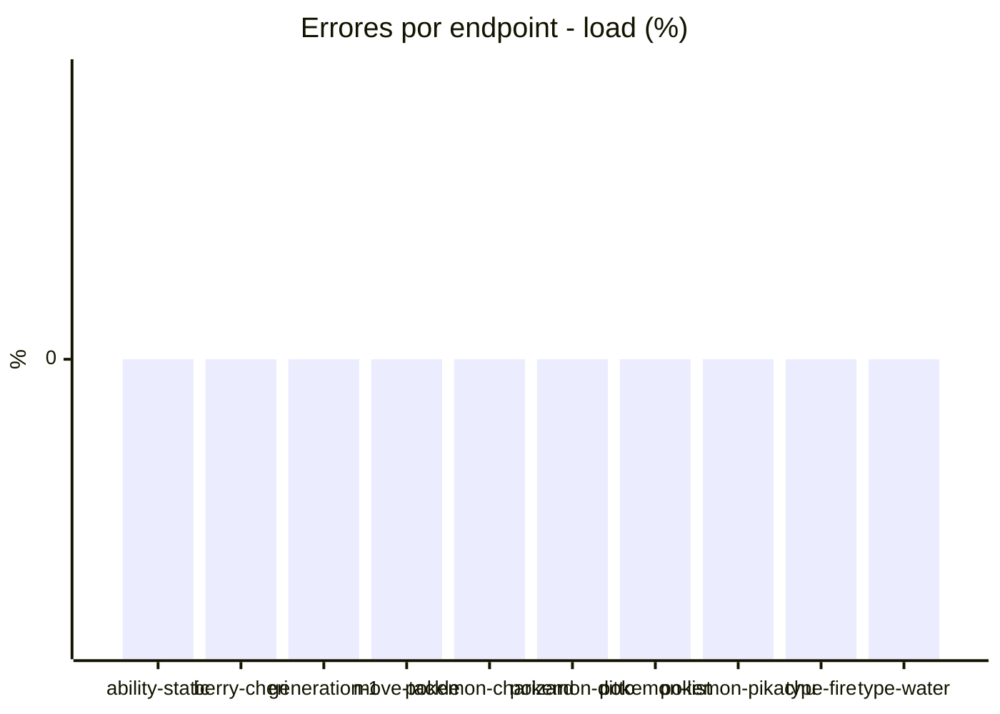
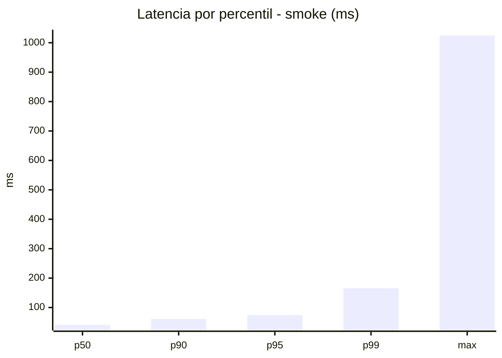
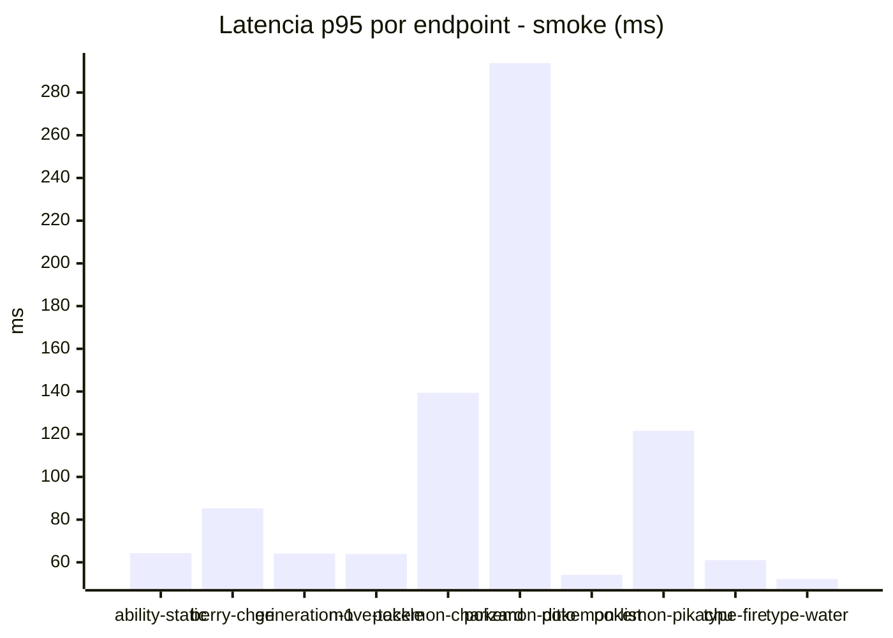
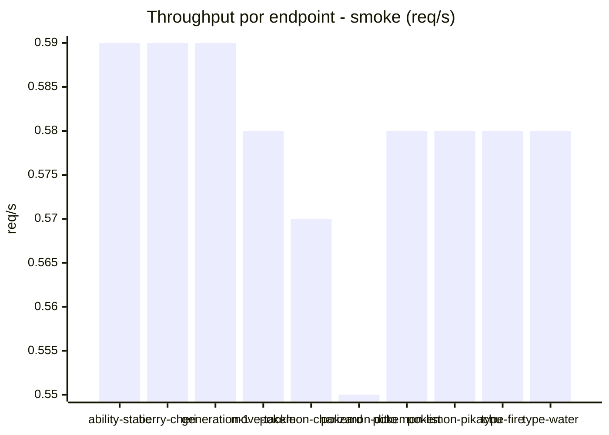

# Reporte de performance - PokeAPI

**Fecha:** 2026-10-06 18:47 UTC  
**Veredicto del agente:** `PASS`  
**Corrida:** [ver en GitHub Actions](https://github.com/lrbg/jmeter-pokeapi-lab/actions/runs/37513684127)  

## Validacion del agente de IA

PASS (fallback por umbrales)

- Error maximo: 0.0%
- p95 maximo: 74.5 ms

## Resultados

### Escenario: `load`

| Metrica | Valor |
| --- | --- |
| Muestras | 15330 |
| Errores | 0 (0.0%) |
| Latencia media | 42.9 ms |
| p50 / p90 / p95 / p99 | 40.0 / 53.0 / 60.0 / 105.7 ms |
| Min / Max | 23 / 332 ms |
| Throughput | 128.12 req/s |
| Duracion | 119.7 s |

Detalle por endpoint

| Endpoint | Muestras | Error % | avg | p95 | p99 | req/s |
| --- | --- | --- | --- | --- | --- | --- |
| ability-static | 1533 | 0.0% | 40.4 | 52.0 | 63.4 | 12.96 |
| berry-cheri | 1533 | 0.0% | 40.0 | 52.0 | 92.8 | 12.96 |
| generation-1 | 1533 | 0.0% | 41.1 | 56.4 | 67.7 | 12.99 |
| move-tackle | 1533 | 0.0% | 42.1 | 56.0 | 65.7 | 12.98 |
| pokemon-charizard | 1533 | 0.0% | 54.5 | 81.8 | 154.4 | 12.87 |
| pokemon-ditto | 1533 | 0.0% | 41.3 | 60.0 | 94.7 | 12.82 |
| pokemon-list | 1533 | 0.0% | 38.4 | 49.0 | 70.8 | 12.92 |
| pokemon-pikachu | 1533 | 0.0% | 50.3 | 75.0 | 120.1 | 12.88 |
| type-fire | 1533 | 0.0% | 40.7 | 53.0 | 81.5 | 12.94 |
| type-water | 1533 | 0.0% | 40.0 | 50.0 | 90.4 | 12.93 |

### Escenario: `smoke`

| Metrica | Valor |
| --- | --- |
| Muestras | 151 |
| Errores | 0 (0.0%) |
| Latencia media | 54 ms |
| p50 / p90 / p95 / p99 | 41.0 / 61.0 / 74.5 / 165.5 ms |
| Min / Max | 34 / 1025 ms |
| Throughput | 5.18 req/s |
| Duracion | 29.2 s |

Detalle por endpoint

| Endpoint | Muestras | Error % | avg | p95 | p99 | req/s |
| --- | --- | --- | --- | --- | --- | --- |
| ability-static | 15 | 0.0% | 43.6 | 64.3 | 70.5 | 0.59 |
| berry-cheri | 15 | 0.0% | 46.3 | 85.3 | 113.9 | 0.59 |
| generation-1 | 15 | 0.0% | 42.3 | 64.1 | 73.6 | 0.59 |
| move-tackle | 15 | 0.0% | 44.3 | 63.9 | 71.2 | 0.58 |
| pokemon-charizard | 15 | 0.0% | 69.1 | 139.4 | 194.3 | 0.57 |
| pokemon-ditto | 16 | 0.0% | 101.4 | 293.8 | 878.7 | 0.55 |
| pokemon-list | 15 | 0.0% | 40.7 | 54.2 | 56.4 | 0.58 |
| pokemon-pikachu | 15 | 0.0% | 61.8 | 121.6 | 122.7 | 0.58 |
| type-fire | 15 | 0.0% | 46.3 | 61.0 | 66.6 | 0.58 |
| type-water | 15 | 0.0% | 41.1 | 52.2 | 54.4 | 0.58 |

