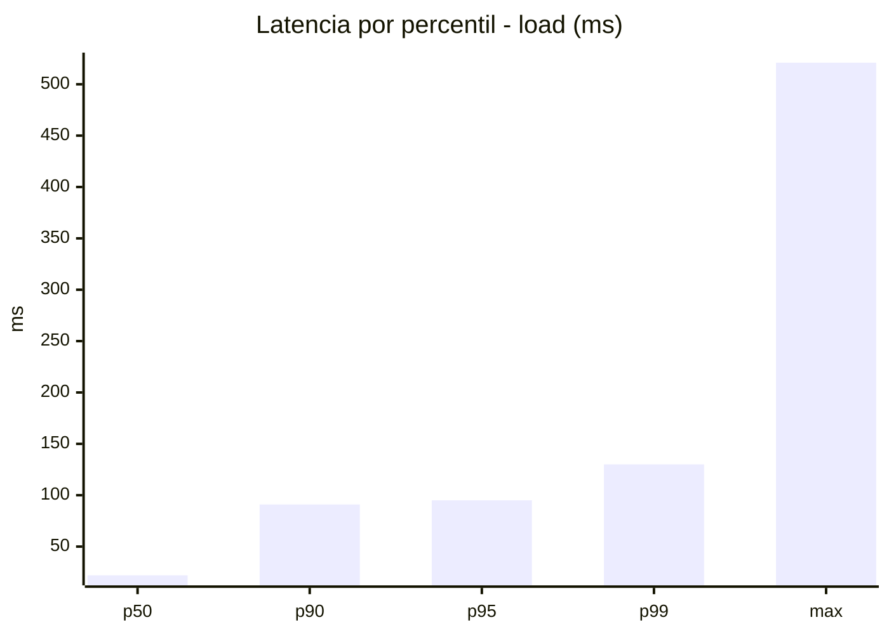
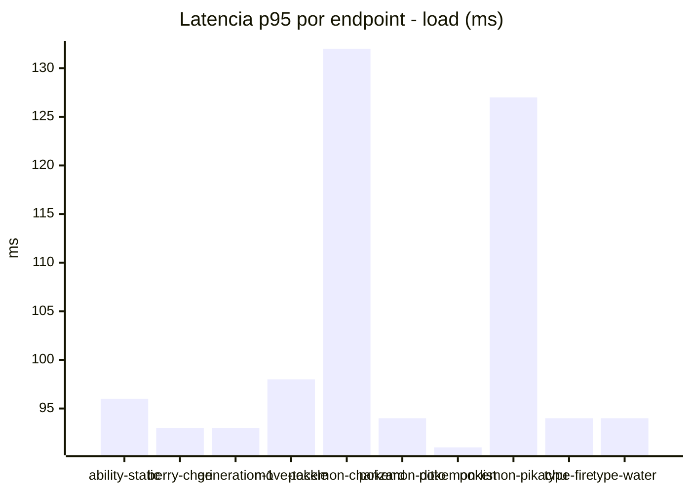
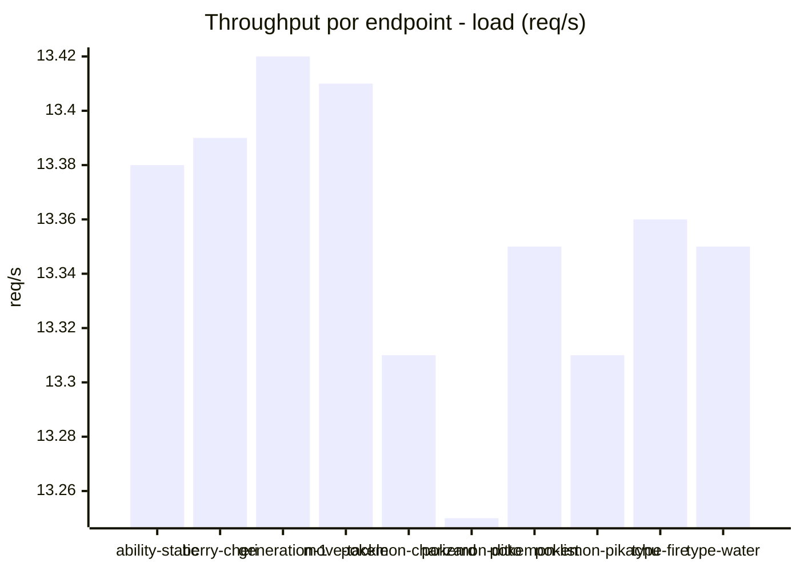
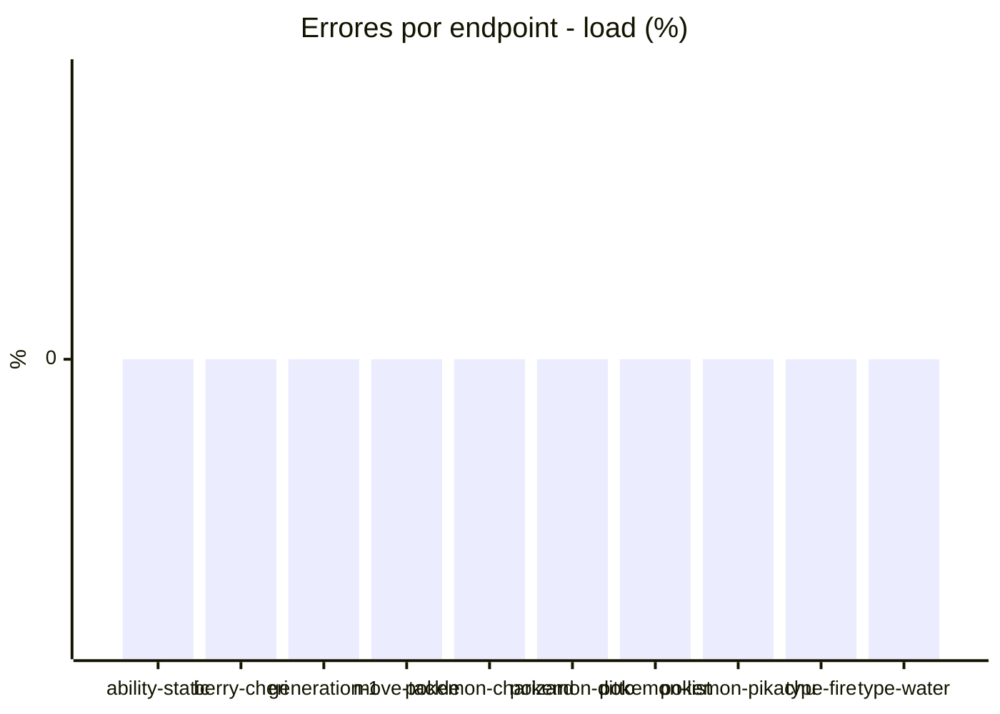
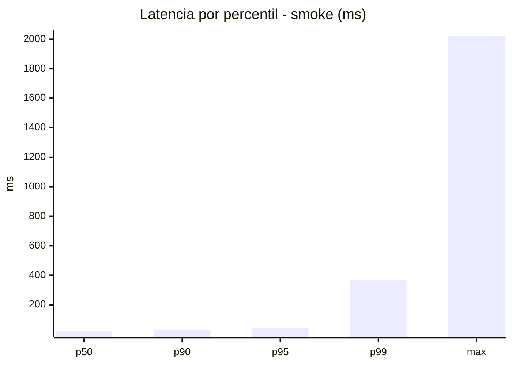
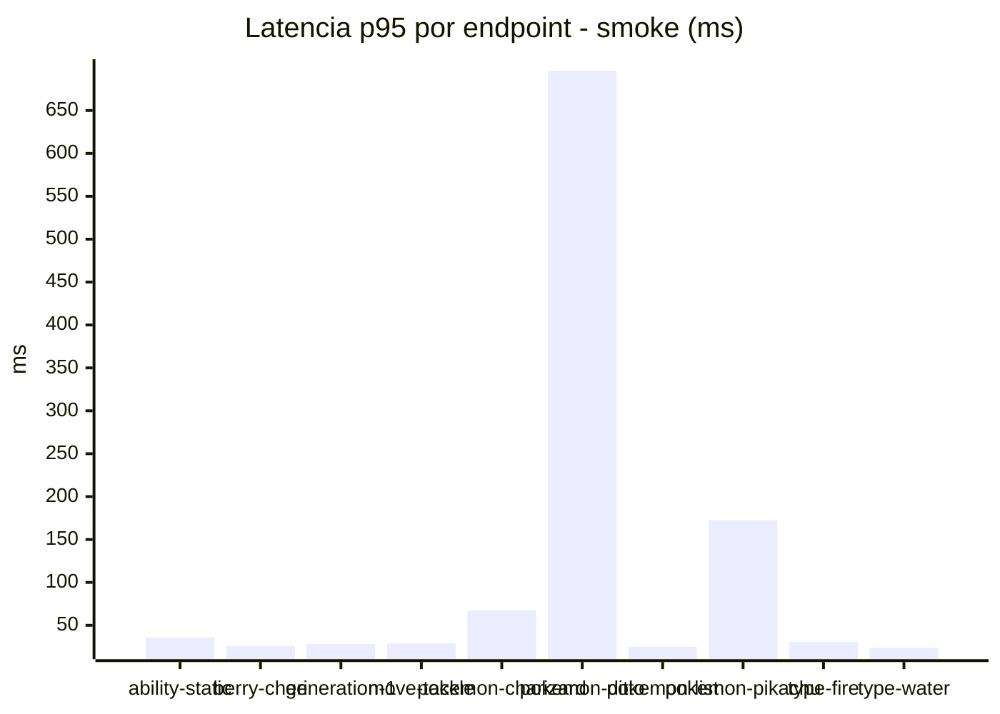
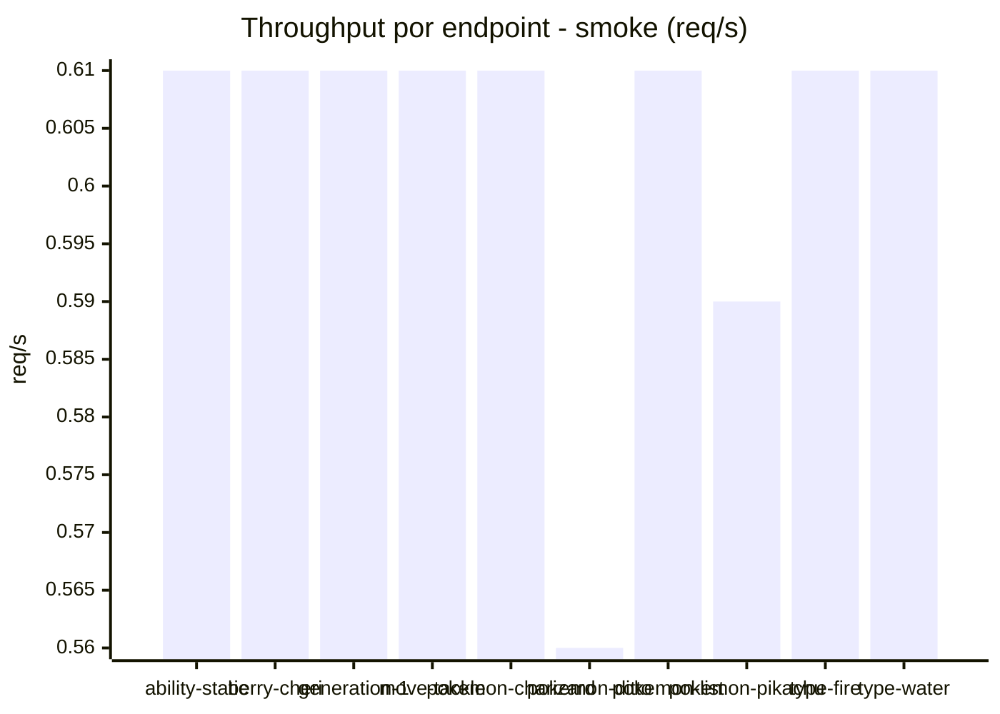

# Reporte de performance - PokeAPI

**Fecha:** 2026-10-07 19:13 UTC  
**Veredicto del agente:** `PASS`  
**Corrida:** [ver en GitHub Actions](https://github.com/lrbg/jmeter-pokeapi-lab/actions/runs/37672534809)  

## Validacion del agente de IA

PASS (fallback por umbrales)

- Error maximo: 0.0%
- p95 maximo: 95.0 ms

## Resultados

### Escenario: `load`

| Metrica | Valor |
| --- | --- |
| Muestras | 15841 |
| Errores | 0 (0.0%) |
| Latencia media | 31.7 ms |
| p50 / p90 / p95 / p99 | 22.0 / 91.0 / 95.0 / 130.0 ms |
| Min / Max | 12 / 521 ms |
| Throughput | 132.34 req/s |
| Duracion | 119.7 s |

Detalle por endpoint

| Endpoint | Muestras | Error % | avg | p95 | p99 | req/s |
| --- | --- | --- | --- | --- | --- | --- |
| ability-static | 1584 | 0.0% | 33.2 | 96.0 | 99.2 | 13.38 |
| berry-cheri | 1584 | 0.0% | 30.3 | 93.0 | 98.0 | 13.39 |
| generation-1 | 1583 | 0.0% | 28.6 | 93.0 | 98.0 | 13.42 |
| move-tackle | 1583 | 0.0% | 31.1 | 98.0 | 102.0 | 13.41 |
| pokemon-charizard | 1584 | 0.0% | 37.6 | 132.0 | 152.7 | 13.31 |
| pokemon-ditto | 1585 | 0.0% | 27.6 | 94.0 | 99.0 | 13.25 |
| pokemon-list | 1584 | 0.0% | 29.8 | 91.0 | 95.0 | 13.35 |
| pokemon-pikachu | 1585 | 0.0% | 36.1 | 127.0 | 145.0 | 13.31 |
| type-fire | 1584 | 0.0% | 32.5 | 94.0 | 98.0 | 13.36 |
| type-water | 1585 | 0.0% | 30.7 | 94.0 | 99.2 | 13.35 |

### Escenario: `smoke`

| Metrica | Valor |
| --- | --- |
| Muestras | 151 |
| Errores | 0 (0.0%) |
| Latencia media | 40.8 ms |
| p50 / p90 / p95 / p99 | 21.0 / 33.0 / 41.0 / 367.5 ms |
| Min / Max | 14 / 2021 ms |
| Throughput | 5.3 req/s |
| Duracion | 28.5 s |

Detalle por endpoint

| Endpoint | Muestras | Error % | avg | p95 | p99 | req/s |
| --- | --- | --- | --- | --- | --- | --- |
| ability-static | 15 | 0.0% | 22.9 | 35.8 | 50.4 | 0.61 |
| berry-cheri | 15 | 0.0% | 19.5 | 25.9 | 27.6 | 0.61 |
| generation-1 | 15 | 0.0% | 20.8 | 28.1 | 32.0 | 0.61 |
| move-tackle | 15 | 0.0% | 20.8 | 29.0 | 29.0 | 0.61 |
| pokemon-charizard | 15 | 0.0% | 35.3 | 67.3 | 107.1 | 0.61 |
| pokemon-ditto | 16 | 0.0% | 159.4 | 696.5 | 1756.1 | 0.56 |
| pokemon-list | 15 | 0.0% | 20.1 | 25.0 | 25.0 | 0.61 |
| pokemon-pikachu | 15 | 0.0% | 59.4 | 172.7 | 418.5 | 0.59 |
| type-fire | 15 | 0.0% | 21.7 | 30.8 | 39.8 | 0.61 |
| type-water | 15 | 0.0% | 20.4 | 23.6 | 24.7 | 0.61 |

