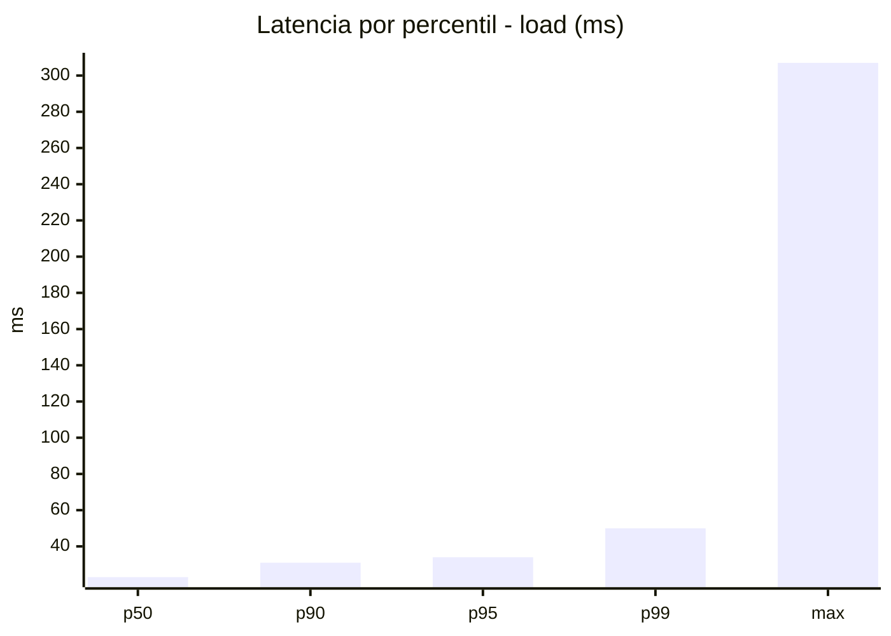
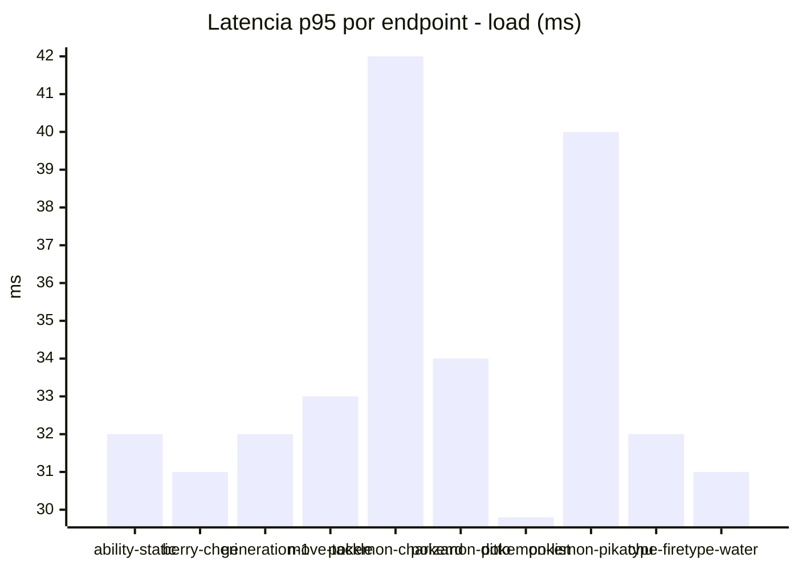
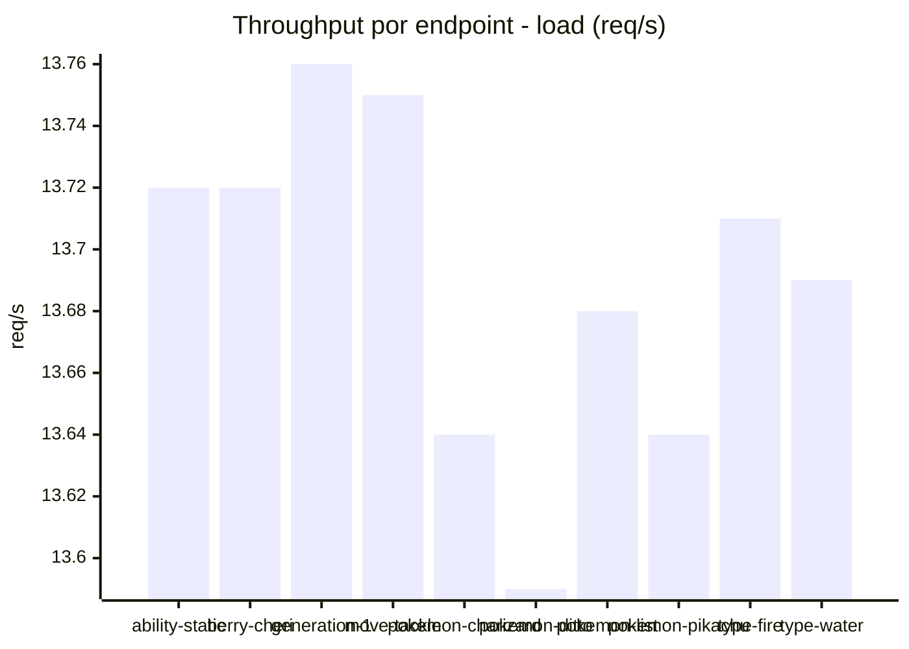
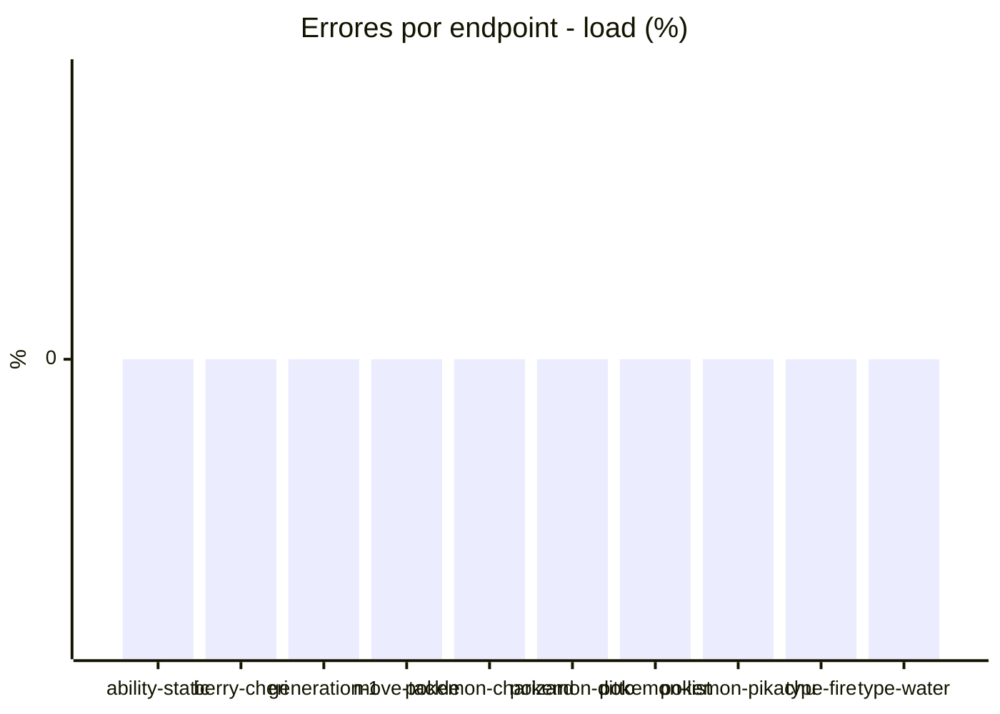
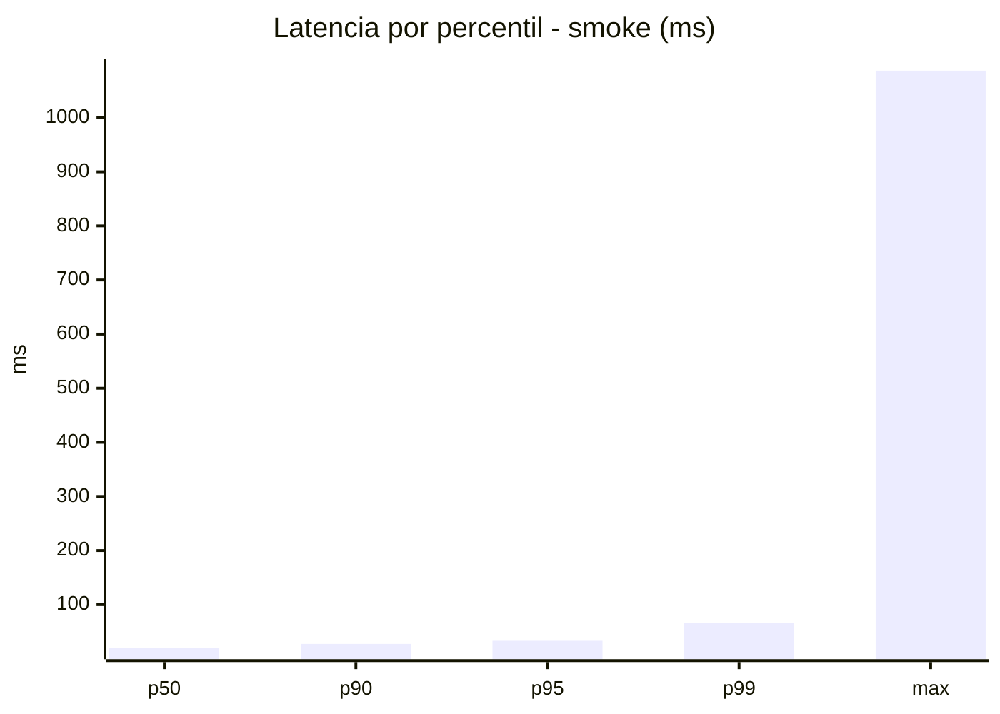
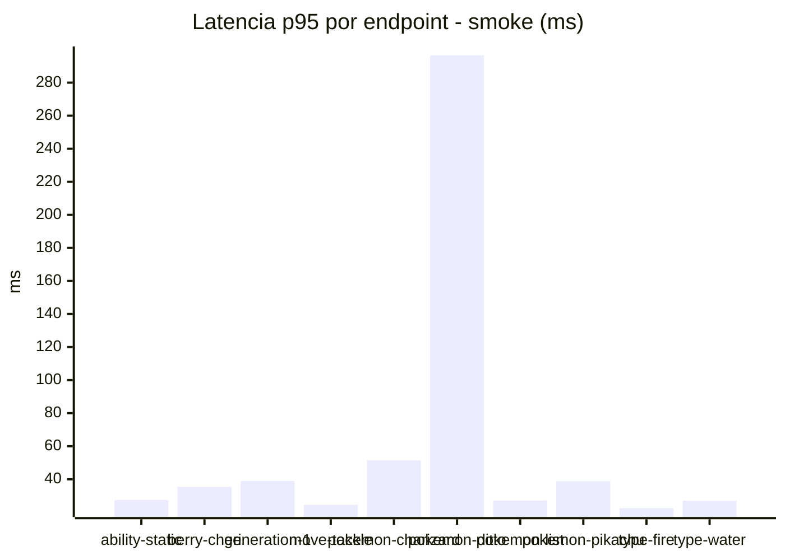
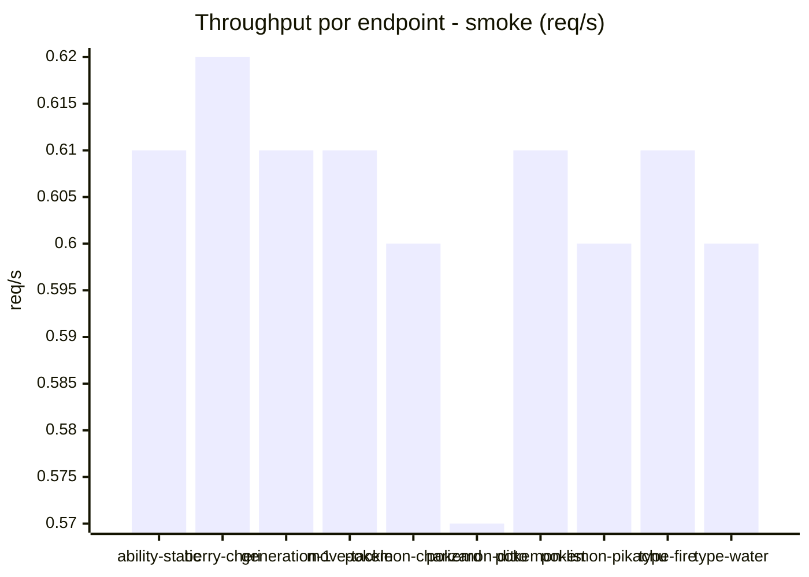

# Reporte de performance - PokeAPI

**Fecha:** 2026-10-08 19:10 UTC  
**Veredicto del agente:** `PASS`  
**Corrida:** [ver en GitHub Actions](https://github.com/lrbg/jmeter-pokeapi-lab/actions/runs/37829564609)  

## Validacion del agente de IA

PASS (fallback por umbrales)

- Error maximo: 0.0%
- p95 maximo: 34.0 ms

## Resultados

### Escenario: `load`

| Metrica | Valor |
| --- | --- |
| Muestras | 16241 |
| Errores | 0 (0.0%) |
| Latencia media | 23.5 ms |
| p50 / p90 / p95 / p99 | 23.0 / 31.0 / 34.0 / 50.0 ms |
| Min / Max | 12 / 307 ms |
| Throughput | 135.78 req/s |
| Duracion | 119.6 s |

Detalle por endpoint

| Endpoint | Muestras | Error % | avg | p95 | p99 | req/s |
| --- | --- | --- | --- | --- | --- | --- |
| ability-static | 1624 | 0.0% | 23.1 | 32.0 | 42.0 | 13.72 |
| berry-cheri | 1624 | 0.0% | 22.9 | 31.0 | 47.8 | 13.72 |
| generation-1 | 1624 | 0.0% | 22.8 | 32.0 | 43.0 | 13.76 |
| move-tackle | 1624 | 0.0% | 23.3 | 33.0 | 45.0 | 13.75 |
| pokemon-charizard | 1624 | 0.0% | 27.3 | 42.0 | 70.8 | 13.64 |
| pokemon-ditto | 1625 | 0.0% | 23.2 | 34.0 | 43.5 | 13.59 |
| pokemon-list | 1624 | 0.0% | 21.7 | 29.8 | 40.0 | 13.68 |
| pokemon-pikachu | 1624 | 0.0% | 25.3 | 40.0 | 61.8 | 13.64 |
| type-fire | 1624 | 0.0% | 23.2 | 32.0 | 42.0 | 13.71 |
| type-water | 1624 | 0.0% | 22.6 | 31.0 | 44.0 | 13.69 |

### Escenario: `smoke`

| Metrica | Valor |
| --- | --- |
| Muestras | 157 |
| Errores | 0 (0.0%) |
| Latencia media | 28.6 ms |
| p50 / p90 / p95 / p99 | 20.0 / 27.4 / 33.2 / 66.0 ms |
| Min / Max | 14 / 1087 ms |
| Throughput | 5.41 req/s |
| Duracion | 29.0 s |

Detalle por endpoint

| Endpoint | Muestras | Error % | avg | p95 | p99 | req/s |
| --- | --- | --- | --- | --- | --- | --- |
| ability-static | 16 | 0.0% | 20.3 | 27.5 | 31.1 | 0.61 |
| berry-cheri | 15 | 0.0% | 22.8 | 35.4 | 56.7 | 0.62 |
| generation-1 | 15 | 0.0% | 22 | 39.0 | 50.2 | 0.61 |
| move-tackle | 15 | 0.0% | 19.5 | 24.6 | 25.7 | 0.61 |
| pokemon-charizard | 16 | 0.0% | 29.5 | 51.5 | 55.1 | 0.6 |
| pokemon-ditto | 16 | 0.0% | 86.8 | 296.5 | 928.9 | 0.57 |
| pokemon-list | 16 | 0.0% | 19.6 | 27.2 | 32.6 | 0.61 |
| pokemon-pikachu | 16 | 0.0% | 25.2 | 38.8 | 64.5 | 0.6 |
| type-fire | 16 | 0.0% | 19.2 | 22.5 | 23.7 | 0.61 |
| type-water | 16 | 0.0% | 19.9 | 27.0 | 27.0 | 0.6 |

