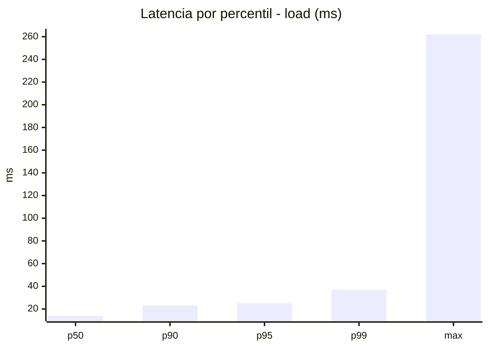
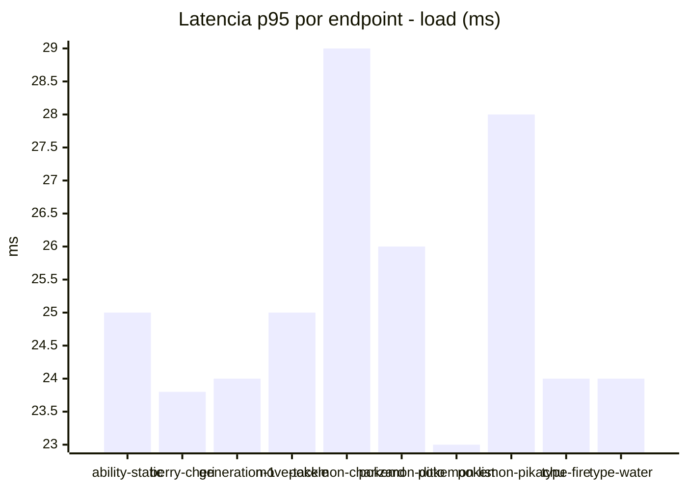
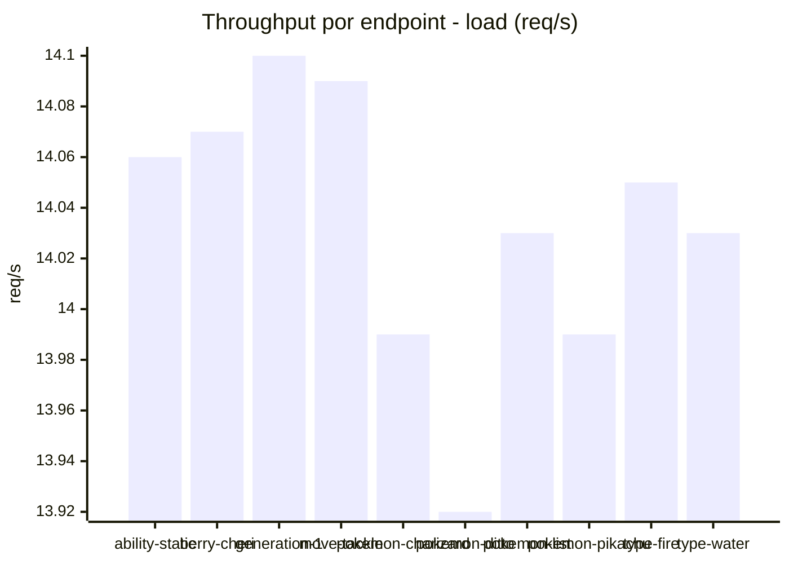
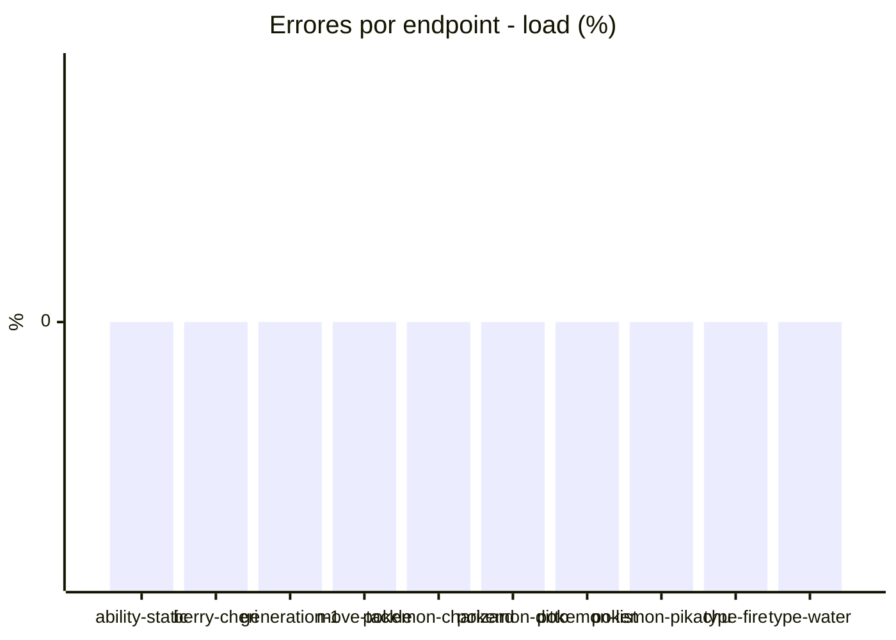
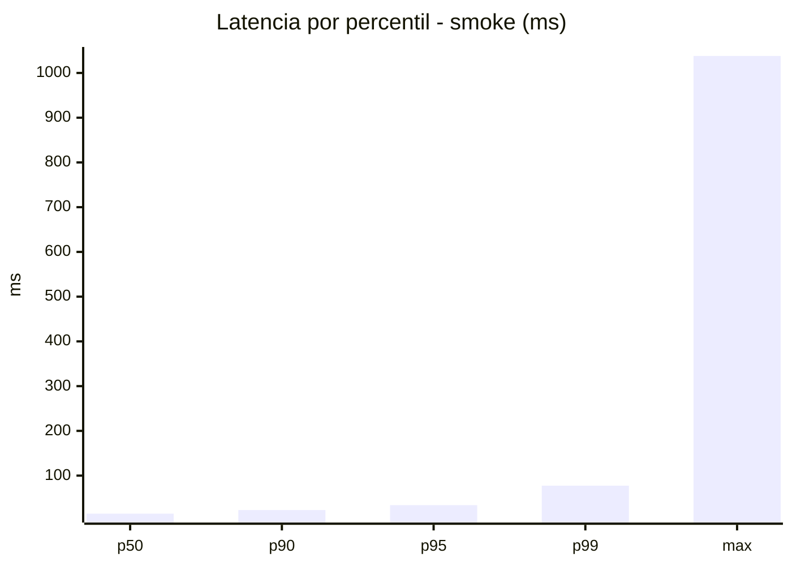
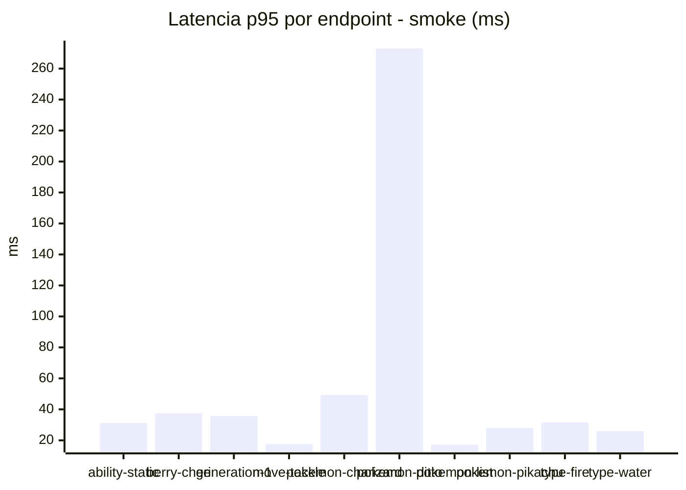
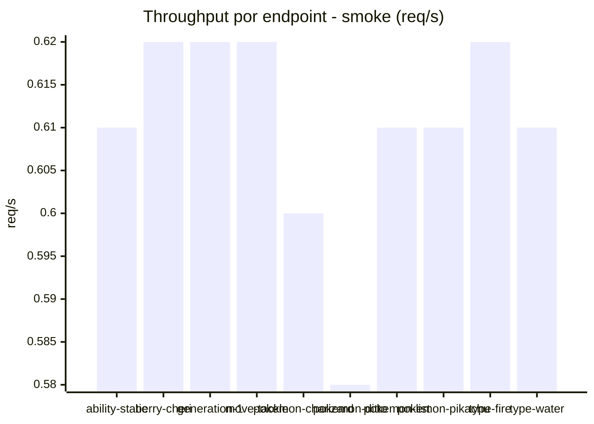

# Reporte de performance - PokeAPI

**Fecha:** 2026-10-09 18:40 UTC  
**Veredicto del agente:** `PASS`  
**Corrida:** [ver en GitHub Actions](https://github.com/lrbg/jmeter-pokeapi-lab/actions/runs/37974620993)  

## Validacion del agente de IA

PASS (fallback por umbrales)

- Error maximo: 0.0%
- p95 maximo: 34.0 ms

## Resultados

### Escenario: `load`

| Metrica | Valor |
| --- | --- |
| Muestras | 16649 |
| Errores | 0 (0.0%) |
| Latencia media | 15.6 ms |
| p50 / p90 / p95 / p99 | 14.0 / 23.0 / 25.0 / 37.0 ms |
| Min / Max | 6 / 262 ms |
| Throughput | 139.16 req/s |
| Duracion | 119.6 s |

Detalle por endpoint

| Endpoint | Muestras | Error % | avg | p95 | p99 | req/s |
| --- | --- | --- | --- | --- | --- | --- |
| ability-static | 1665 | 0.0% | 15.9 | 25.0 | 34.0 | 14.06 |
| berry-cheri | 1665 | 0.0% | 15.0 | 23.8 | 32.0 | 14.07 |
| generation-1 | 1664 | 0.0% | 15.3 | 24.0 | 34.4 | 14.1 |
| move-tackle | 1664 | 0.0% | 15.8 | 25.0 | 33.0 | 14.09 |
| pokemon-charizard | 1665 | 0.0% | 17.4 | 29.0 | 43.7 | 13.99 |
| pokemon-ditto | 1666 | 0.0% | 15.9 | 26.0 | 41.0 | 13.92 |
| pokemon-list | 1665 | 0.0% | 14.4 | 23.0 | 31.4 | 14.03 |
| pokemon-pikachu | 1665 | 0.0% | 16.3 | 28.0 | 42.4 | 13.99 |
| type-fire | 1665 | 0.0% | 14.7 | 24.0 | 34.4 | 14.05 |
| type-water | 1665 | 0.0% | 15.4 | 24.0 | 33.0 | 14.03 |

### Escenario: `smoke`

| Metrica | Valor |
| --- | --- |
| Muestras | 159 |
| Errores | 0 (0.0%) |
| Latencia media | 23.6 ms |
| p50 / p90 / p95 / p99 | 15.0 / 23.0 / 34.0 / 77.5 ms |
| Min / Max | 9 / 1038 ms |
| Throughput | 5.48 req/s |
| Duracion | 29.0 s |

Detalle por endpoint

| Endpoint | Muestras | Error % | avg | p95 | p99 | req/s |
| --- | --- | --- | --- | --- | --- | --- |
| ability-static | 16 | 0.0% | 17.8 | 31.2 | 63.0 | 0.61 |
| berry-cheri | 16 | 0.0% | 18.8 | 37.5 | 72.3 | 0.62 |
| generation-1 | 15 | 0.0% | 15.7 | 35.8 | 39.2 | 0.62 |
| move-tackle | 16 | 0.0% | 14.7 | 17.5 | 18.7 | 0.62 |
| pokemon-charizard | 16 | 0.0% | 24.6 | 49.2 | 59.4 | 0.6 |
| pokemon-ditto | 16 | 0.0% | 78.5 | 273.0 | 885.0 | 0.58 |
| pokemon-list | 16 | 0.0% | 12.6 | 17.2 | 17.9 | 0.61 |
| pokemon-pikachu | 16 | 0.0% | 19.8 | 28.0 | 32.8 | 0.61 |
| type-fire | 16 | 0.0% | 15.8 | 31.5 | 66.3 | 0.62 |
| type-water | 16 | 0.0% | 16.9 | 25.8 | 32.3 | 0.61 |

