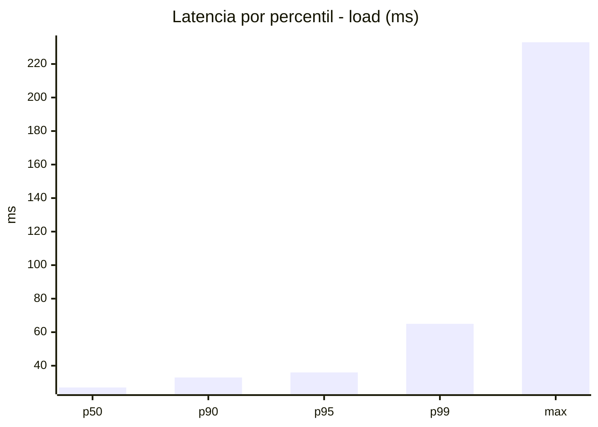
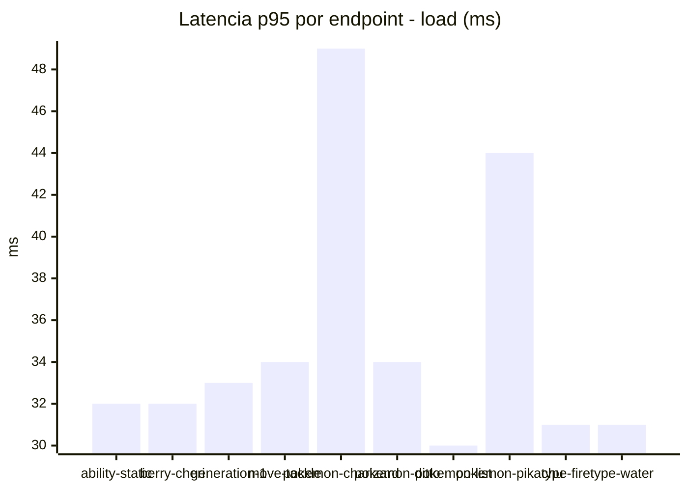
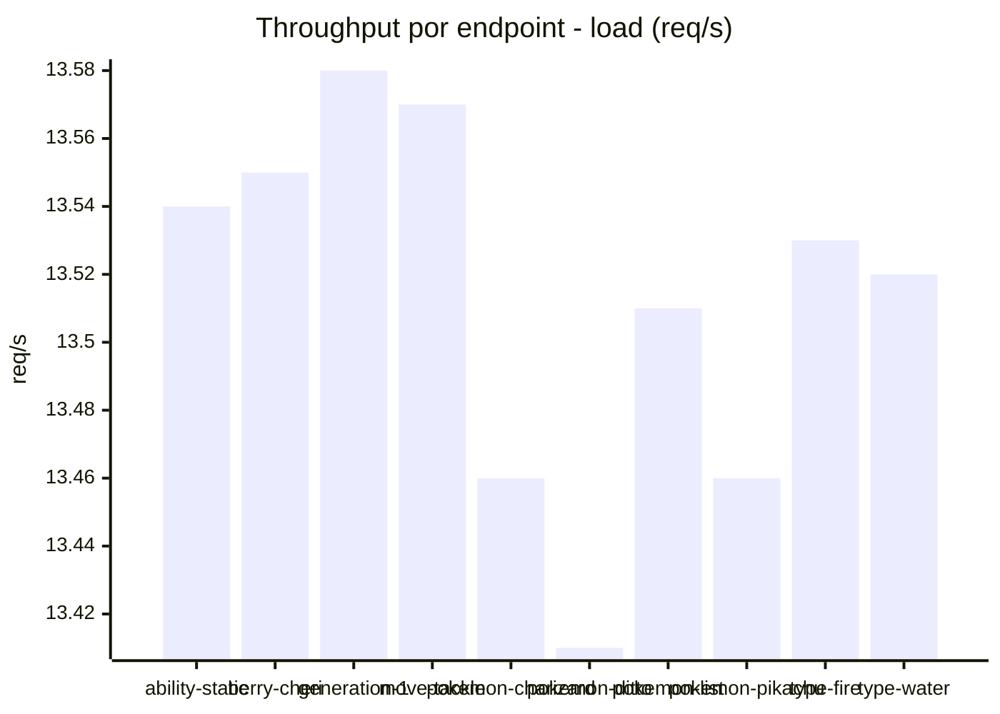
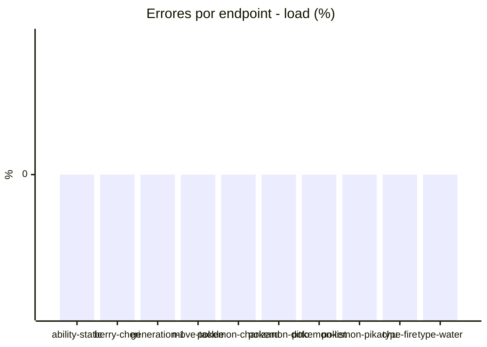
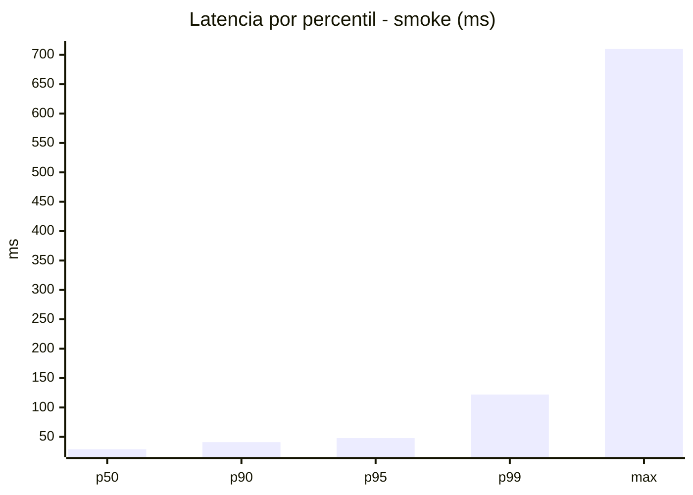
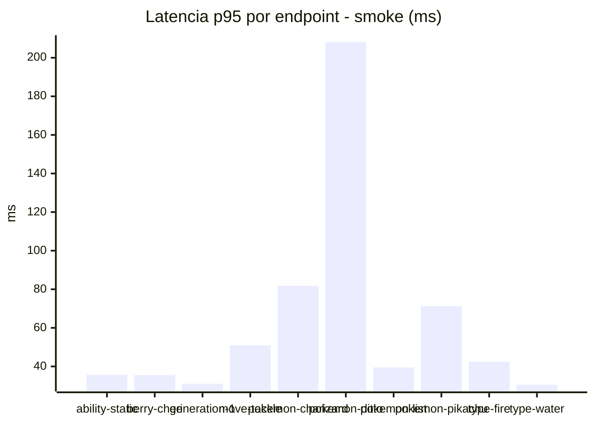
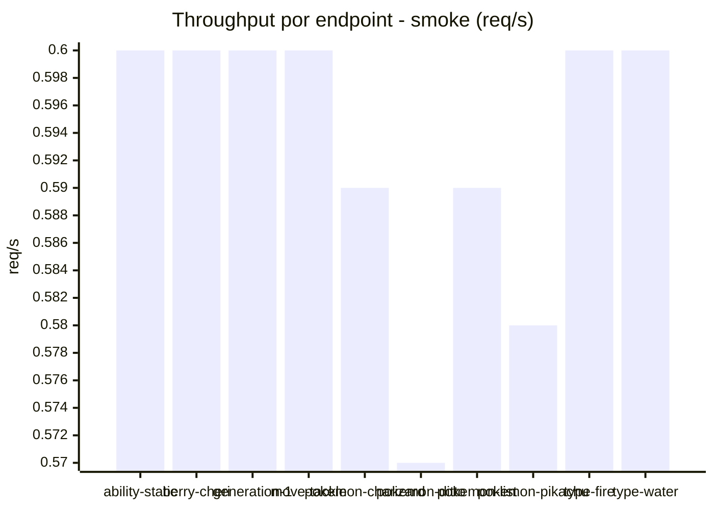

# Reporte de performance - PokeAPI

**Fecha:** 2026-10-10 17:39 UTC  
**Veredicto del agente:** `PASS`  
**Corrida:** [ver en GitHub Actions](https://github.com/lrbg/jmeter-pokeapi-lab/actions/runs/38072476648)  

## Validacion del agente de IA

PASS (fallback por umbrales)

- Error maximo: 0.0%
- p95 maximo: 48.0 ms

## Resultados

### Escenario: `load`

| Metrica | Valor |
| --- | --- |
| Muestras | 16030 |
| Errores | 0 (0.0%) |
| Latencia media | 27.9 ms |
| p50 / p90 / p95 / p99 | 27.0 / 33.0 / 36.0 / 65.0 ms |
| Min / Max | 20 / 233 ms |
| Throughput | 133.96 req/s |
| Duracion | 119.7 s |

Detalle por endpoint

| Endpoint | Muestras | Error % | avg | p95 | p99 | req/s |
| --- | --- | --- | --- | --- | --- | --- |
| ability-static | 1603 | 0.0% | 26.7 | 32.0 | 39.0 | 13.54 |
| berry-cheri | 1602 | 0.0% | 26.3 | 32.0 | 38.0 | 13.55 |
| generation-1 | 1604 | 0.0% | 26.8 | 33.0 | 37.0 | 13.58 |
| move-tackle | 1602 | 0.0% | 27.6 | 34.0 | 39.0 | 13.57 |
| pokemon-charizard | 1603 | 0.0% | 35.2 | 49.0 | 94.0 | 13.46 |
| pokemon-ditto | 1603 | 0.0% | 27.2 | 34.0 | 40.0 | 13.41 |
| pokemon-list | 1603 | 0.0% | 24.7 | 30.0 | 41.0 | 13.51 |
| pokemon-pikachu | 1603 | 0.0% | 32.6 | 44.0 | 83.9 | 13.46 |
| type-fire | 1603 | 0.0% | 26.0 | 31.0 | 37.0 | 13.53 |
| type-water | 1604 | 0.0% | 25.8 | 31.0 | 38.0 | 13.52 |

### Escenario: `smoke`

| Metrica | Valor |
| --- | --- |
| Muestras | 155 |
| Errores | 0 (0.0%) |
| Latencia media | 37.0 ms |
| p50 / p90 / p95 / p99 | 29.0 / 41.0 / 48.0 / 122.0 ms |
| Min / Max | 23 / 710 ms |
| Throughput | 5.32 req/s |
| Duracion | 29.1 s |

Detalle por endpoint

| Endpoint | Muestras | Error % | avg | p95 | p99 | req/s |
| --- | --- | --- | --- | --- | --- | --- |
| ability-static | 15 | 0.0% | 28.7 | 35.7 | 40.7 | 0.6 |
| berry-cheri | 15 | 0.0% | 29.3 | 35.5 | 43.9 | 0.6 |
| generation-1 | 15 | 0.0% | 27.9 | 31.0 | 31.0 | 0.6 |
| move-tackle | 15 | 0.0% | 33.1 | 51.0 | 84.6 | 0.6 |
| pokemon-charizard | 16 | 0.0% | 46.8 | 81.8 | 141.1 | 0.59 |
| pokemon-ditto | 16 | 0.0% | 72.2 | 208.2 | 609.6 | 0.57 |
| pokemon-list | 16 | 0.0% | 29.2 | 39.5 | 47.9 | 0.59 |
| pokemon-pikachu | 16 | 0.0% | 43.1 | 71.2 | 88.6 | 0.58 |
| type-fire | 15 | 0.0% | 29.5 | 42.4 | 46.9 | 0.6 |
| type-water | 16 | 0.0% | 27.5 | 30.5 | 31.7 | 0.6 |

